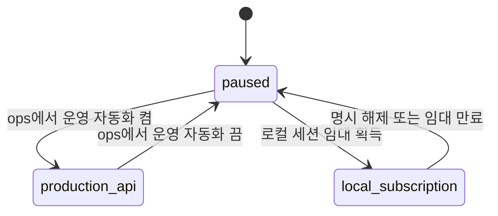

# 딥분석 실행 모드 제어 설계

> 결정일: 2026-08-05
> 상태: 구현 기준
> 범위: 22축 딥분석과 Kordoc 빠른 작성 선분석의 유료 실행 권한

## 1. 의도

운영 API 자동화와 로컬 구독 분석을 동시에 상시 실행하지 않는다.

- 운영 자동화가 켜져 있으면 Cloud Run만 새 유료 분석을 시작한다.
- 운영 자동화가 꺼져 있을 때만 로컬 분석실이 구독 모델 분석 권한을 임대한다.
- 어느 경로에서 실행했든 같은 원문·같은 분석 계약의 결과를 중복 작업으로 만들지 않는다.
- 수집, 첨부 보관·변환, 입력 준비, serving 검증은 모델 과금과 분리해 계속 운영할 수 있다.

## 2. 제어 정본

Scheduler on/off나 각 컨테이너의 환경변수를 제어 정본으로 삼지 않는다. Scheduler는 정해진 주기로 호출하되, DB의 singleton runtime control을 읽은 worker만 새 작업을 시작한다.

환경변수는 상한선이다. DB가 운영 자동화를 허용해도 배포 환경의 `observe_only`를 넘어서 active가 될 수 없다. 반대로 환경이 active여도 DB 모드가 허용하지 않으면 enqueue·claim·유료 호출을 하지 않는다.

## 3. 세 모드

| 내부 모드 | 운영 API | 로컬 구독 | 의미 |
|---|---:|---:|---|
| `paused` | 차단 | 차단 | 안전 기본값. 진행 중 작업은 종료시키지 않고 신규 착수만 막는다. |
| `production_api` | 허용 | 차단 | 운영 22축과 운영 Kordoc worker가 자동 처리한다. |
| `local_subscription` | 차단 | 임대 소유자만 허용 | 특정 로컬 분석실 세션만 구독 모델을 쓴다. |

ops UI는 “운영 딥분석 자동화 켬/끔”으로 표현한다. 끔 상태에서 로컬 분석실이 임대를 획득하면 내부 모드는 `local_subscription`이 된다.

## 4. 상태 전이



금지 전이는 다음과 같다.

- `production_api`에서 로컬 임대를 직접 획득할 수 없다.
- 유효한 로컬 임대가 있는 동안 운영 자동화를 켤 수 없다.
- 다른 owner가 가진 로컬 임대를 빼앗거나 갱신할 수 없다.

## 5. 임대 계약

로컬 분석은 브라우저 탭이나 dev 서버가 예고 없이 사라질 수 있으므로 영구 토글이 아니라 lease로 제어한다.

- 로컬 세션은 임의 UUID owner ID로 임대를 획득한다.
- 임대는 짧은 TTL을 갖고 실행 중 주기적으로 갱신한다.
- 만료된 `local_subscription`은 판정 시 `paused`로 취급한다.
- 임대 만료는 운영 자동화를 자동으로 켜지 않는다.
- 중단·완료 시 owner가 임대를 해제해 `paused`로 돌아간다.

## 6. 유료 실행 게이트

다음 지점 모두가 같은 runtime control을 확인해야 한다.

1. 운영 deep job 탐색·enqueue 직전
2. 운영 deep job claim·모델 호출 직전
3. 운영 Kordoc job claim·모델 호출 직전
4. 로컬 개별 딥분석 시작 직전
5. 로컬 배치 딥분석 시작 직전
6. 로컬 Kordoc roundtrip 모델 호출 직전
7. 로컬 batch CLI 실행 직전

웹 단건 요청과 장기 배치는 서버에서도 lease를 갱신한다. 브라우저 탭이 닫혀도 이미 시작한 모델 호출이나 배치가 끝날 때까지 운영 자동화가 동시에 켜지지 않는다. 로컬 CLI도 자체 owner lease를 획득·갱신·해제하므로 UI를 우회할 수 없다.

## 7. 중복 방지와 우선순위

실행 수단은 결과의 provenance이지 작업의 의미가 아니다. 장기적으로 공통 작업 identity는 다음이어야 한다.

```text
grantId + sourceRevisionSha256 + analysisContractVersion
```

`api`와 `claude-cli` transport가 identity에 들어가면 같은 원문을 서로 다른 작업으로 오인하므로, transport·model·effort는 실행 영수증에만 남긴다.

현재 로컬 analysis-lab 결과는 검수·승격 전 artifact다. 실행 모드 제어는 중복 추론을 막지만 검수 없이 운영 criteria를 덮어쓰게 만들지 않는다. 운영 반영은 기존 promotion release gate를 그대로 통과한다.

처리 우선순위는 운영과 로컬이 공유한다.

1. 신규 또는 원문이 바뀐 공고
2. 마감 D0~D7
3. 재시도 가능한 실패
4. D8~D30
5. D31 이상
6. upcoming
7. 과거 backfill

## 8. 비목표

- Scheduler, IAM, Secret을 UI에서 직접 변경하지 않는다.
- 수집·변환·serving monitor를 운영 자동화 스위치로 끄지 않는다.
- Kordoc 실패 때문에 유효한 22축 매칭 결과를 숨기지 않는다.
- 로컬 구독 transport를 Cloud Run에 넣지 않는다.
- 이번 제어 구현에서 기존 분석 알고리즘·22축 taxonomy·승격 판정을 다시 설계하지 않는다.

## 9. 운영 UI 원칙

ops `/pipeline` 상단에 다음을 한 카드로 보여준다.

- 현재 모드와 변경 시각·변경 주체
- 운영 자동화 켬/끔
- 로컬 임대 owner 일부와 만료 시각
- 현재 deep/Kordoc leased 작업 수
- 환경 상한 때문에 DB 모드가 실제 실행으로 이어지지 않는 경우의 경고

로컬 `/dev/analysis-lab`은 다음을 보여준다.

- 현재 운영 모드
- 운영 자동화가 꺼졌을 때만 보이는 “로컬 분석 권한 획득”
- 임대가 없거나 다른 owner 소유이면 실행 버튼 비활성화
- 실행 중 heartbeat/갱신, 중단·완료 시 해제

## 10. 실패 시 안전 상태

- control row 조회 실패: 신규 유료 작업 차단
- 알 수 없는 mode: 신규 유료 작업 차단
- 로컬 lease 만료: 로컬 신규 작업 차단, 내부 판정 `paused`
- ops 전환 transaction 실패: 이전 모드 유지
- 실행 중 모드 변경: 이미 시작한 한 작업은 정상 terminal 처리하고 다음 claim부터 차단
