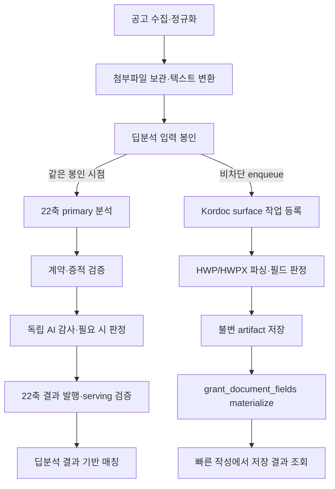

# 딥분석과 공고 첨부파일 선분석 운영 가이드

> 기준일: 2026-08-05
> 대상: 제품·운영·개발 담당자
> 목적: 공고 수집부터 22축 매칭과 빠른 작성까지, 실제 코드가 언제 무엇을 분석하는지 한 문서에서 설명한다.

## 1. 두 분석의 역할

창업노트에는 서로 다른 결과물을 만드는 두 분석이 있다.

| 구분 | 22축 공고 딥분석 | Kordoc 공고 첨부파일 선분석 |
|---|---|---|
| 질문 | 이 기업이 이 공고에 신청 가능한가? | 이 지원서의 어느 칸을 빠르게 채울 수 있는가? |
| 입력 | 공고 본문, 첨부파일에서 추출한 텍스트, 원문 위치 증적 | HWP/HWPX 지원서 바이너리와 editable region |
| 출력 | 22축 조건, 근거, 자동 검수·판정, 매칭용 기준 | 필드 후보, 문서 좌표, 필드 맵, 빠른 작성용 저장 결과 |
| 주 소비자 | 랜딩 `/matches`, 대시보드, 공고 상세 | `/grants/[grantId]/workspace` 빠른 작성 |
| 실패 영향 | 매칭 대상으로 승격하지 않는다 | 공고 매칭은 유지하고 빠른 작성만 제한한다 |

두 분석은 함께 시작할 수 있지만 같은 작업은 아니다. 한쪽 실패가 다른 쪽의 유효한 결과를 지우거나 실패로 바꾸면 안 된다.

## 2. 전체 흐름

### 2.1 수집과 입력 준비

1. K-Startup·기업마당 수집기가 공고와 첨부파일 메타데이터를 갱신한다.
2. 첨부파일을 R2에 보관하고 HWP/HWPX/PDF 등에서 분석 가능한 텍스트와 프리뷰를 만든다.
3. 입력 준비 worker가 본문과 첨부 목록·텍스트를 같은 source revision에 묶는다.
4. 필수 첨부 누락, 변환 실패, 입력 상한 초과 등은 봉인을 차단한다.

봉인된 입력의 SHA가 모델 결과의 기준이다. 이후 원문이 바뀌면 이전 결과는 current가 아니라 stale로 판정한다.

### 2.2 22축 딥분석

딥분석 worker는 활성 공고의 최신 source revision을 큐에 등록하고 lease한 뒤 다음 단계를 수행한다.

1. 공고 본문과 첨부 텍스트를 최상위 모델에 전달한다.
2. 지역·업력·업종·규모·매출·고용·대표자 조건·인증·결격 등 22축을 모두 판정한다.
3. 응답 계약, 22축 완결성, 인용 근거와 원문 span을 deterministic validator가 검증한다.
4. 별도 AI 감사가 누락·과잉 조건·근거 충돌을 확인한다.
5. deterministic finding은 코드 규칙으로 판정하고, 의미상 애매한 항목만 adjudication 또는 사람 검토로 보낸다.
6. 통과한 결과만 `grant_criteria` 및 serving projection에 발행한다.
7. 랜딩 매칭은 이 발행된 딥분석 결과만 사용한다. 분석 중·실패·미승격 공고는 일반 사용자에게 후보처럼 노출하지 않는다.

단계별 영수증은 `grant_deep_analysis_stage_receipts`에 남고, 모델·토큰·비용·원본 artifact는 run과 R2 산출물로 추적한다.

### 2.3 Kordoc 첨부파일 선분석

딥분석 입력이 봉인되면 22축 primary 호출과 동시에 해당 공고의 빠른 작성 대상 HWP/HWPX surface를 전용 큐에 등록한다. 등록 실패는 관제에 남기지만 유효한 22축 분석을 실패시키지 않는다.

등록 조건은 다음과 같다.

- 공고가 사용자에게 보이는 `visible` 상태다.
- 공고가 `open` 또는 `upcoming`이고 분석 기준상 만료되지 않았다.
- surface가 `file_template`이며 실제 형식이 HWP/HWPX다.
- 프리뷰 또는 기존 필드 결과가 준비되어 있다.
- R2 archive key와 64자리 source SHA가 존재한다.
- 사람이 보호한 필드가 없고 동일 분석 버전의 최신 결과가 아직 없다.

Kordoc worker는 문서를 파싱하고 모델로 후보 필드를 판정한다. 결과는 먼저 content-addressed artifact로 저장한 뒤, 짧은 DB transaction에서 source SHA를 다시 확인하고 자동 필드만 `grant_document_fields`에 반영한다. 사용자가 workspace에 들어왔을 때는 이 materialized 결과를 읽는 것이 정상 경로다.

workspace의 즉시 분석 POST는 신규·누락·오래된 결과를 복구하는 fallback이다. 사용자 진입 시마다 유료 분석하는 것이 정상 운영 정책은 아니다.

## 3. 운영과 로컬 실행의 차이

| 항목 | 운영 API 자동화 | 로컬 구독 분석 |
|---|---|---|
| 실행 위치 | Cloud Run Job + Scheduler | 개발자 Mac의 `/dev/analysis-lab` 또는 CLI |
| 모델 결제 | Anthropic API 토큰 사용량만큼 추가 과금 | Claude 구독 한도 사용, 별도 API 토큰 과금 없음 |
| 자동화 | 수집 이후 큐 등록·claim·재시도 | 사용자가 선택 또는 일괄 실행 |
| 산출물 | 운영 DB·R2의 serving 결과 | analysis-lab artifact; 명시 승격 전까지 실험 결과 |
| transport | `api` | `claude-cli` |
| 안전 경계 | 비용 원장·lease·claim scope | 로컬 전용, OAuth/safe mode, API 자동 fallback 금지 |

“구독 분석은 토큰을 쓰지 않는다”는 표현은 API 종량제 비용이 없다는 뜻이다. Claude 구독의 사용량 창과 제한은 소비한다.

## 4. 현재 트리거 정책

### 운영

- 수집 Cron은 공고 원문과 첨부파일을 갱신한다.
- 입력 준비 Scheduler는 기존 deep job의 입력을 준비한다.
- 메인 Scheduler는 deep worker와 Kordoc worker cycle을 호출한다.
- deep worker가 active일 때만 활성 공고를 탐색해 새 deep job을 등록한다.
- Kordoc 작업은 딥분석 입력 봉인 시 enqueue되고, 전용 worker cycle에서 소비된다.
- serving monitor는 분석 결과가 실제 매칭 projection에 반영됐는지 독립적으로 확인한다.

### 로컬

- `/dev/analysis-lab`은 production에서 404인 개발 전용 관리 화면이다.
- `공고 조건 딥분석`, `지원서 왕복 실험`, `배치 운영`을 한 화면에서 관리한다.
- `pnpm dev:web`은 별도 명시가 없으면 `ANALYSIS_LAB_TRANSPORT=claude-cli`를 기본 적용한다.
- 명시적으로 다른 transport를 주면 화면은 열리지만 로컬 분석 권한 획득과 모델 실행은 거부된다.
- 배치 실행은 자동이 아니라 운영자가 대상·건수·동시성과 fan-out telemetry를 확인하고 시작한다. 구독 경로의 명목 USD는 실행 상한이 아니다.
- 로컬 단건 분석은 기본적으로 22축 딥분석만 실행한다. 배치 운영 UI는 end-to-end 검증을 위해
  `withApplicationRoundtrip=true`를 명시해 같은 공고의 Kordoc 선분석도 함께 요청하며, CLI는
  `--with-application-roundtrip`을 붙였을 때만 Kordoc lane을 실행한다.
- 로컬 결과는 analysis-lab 불변 artifact다. 기존 검수·승격 gate를 통과하기 전 운영 매칭 DB를 직접 덮어쓰지 않는다.

## 5. 2026-08-05 확인 상태

이 절은 시점 스냅샷이며 운영 변경 후 다시 확인해야 한다.

- Cloud Scheduler는 메인 worker를 5분마다 호출한다.
- 메인 deep worker 환경은 `observe_only`라 22축 신규 enqueue·claim·유료 호출을 하지 않는다.
- 같은 실행의 Kordoc worker는 `active`, claim scope `all`로 설정되어 있어 별도 제어 정본 없이는 Kordoc만 유료 처리될 수 있다.
- 따라서 “딥분석 자동화 OFF”가 두 유료 분석을 함께 의미하지 못한다. 이 불일치를 해결하는 실행 모드 제어가 필요하다.

## 6. 운영자가 확인할 화면

- `/pipeline`: 22축 딥분석 단계, 자동 검수, 예외, 발행·serving 상태
- `/notice-pipeline`: 수집·첨부 변환·surface 및 Kordoc 선분석 상태
- 로컬 `/dev/analysis-lab`: 구독 모델 대상 선택, 개별/배치 실행, 진행률과 산출물 검토

## 7. 근거 코드 위치

- 수집과 정규화: `apps/web/src/lib/server/ingestion/`
- 입력 준비: `apps/web/src/lib/server/deep-analysis/input-preparation-worker-cli.ts`
- 22축 worker: `apps/web/src/lib/server/deep-analysis/worker-cli.ts`
- 봉인 후 병렬 시작: `apps/web/src/lib/server/deep-analysis/processor.ts`
- Kordoc queue: `apps/web/src/lib/server/documents/applicationPrecomputeQueue.ts`
- Kordoc worker cycle: `apps/web/src/lib/server/documents/applicationPrecomputeWorkerCycle.ts`
- 필드 결과 발행: `apps/web/src/lib/server/documents/applicationPrecomputeMaterialization.ts`
- workspace fallback: `apps/web/src/lib/server/documents/applicationFieldAnalysis.ts`
- 로컬 분석실: `apps/web/src/app/dev/analysis-lab/`, `apps/web/src/features/dev/analysis-lab/`
- 딥분석 관제: `apps/admin/src/app/pipeline/`
