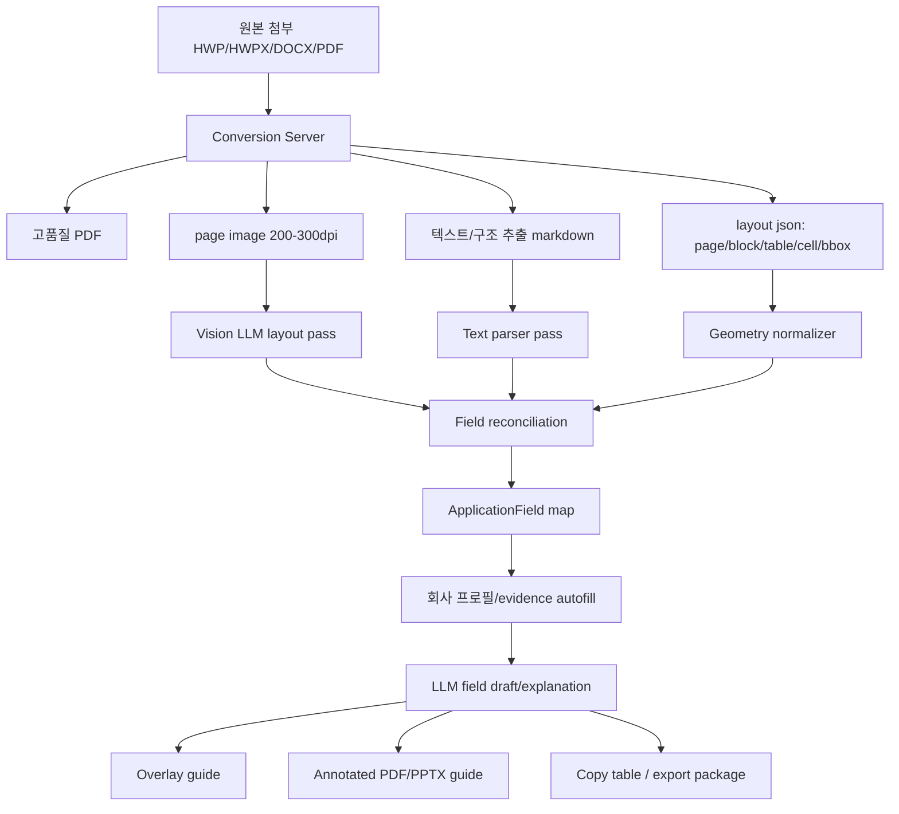

# HWP 시각 변환 기반 지원서 작성 가이드 파이프라인

작성일: 2026-07-02

## 결론

GCP에 별도 Python 변환 서버를 둘 수 있다면, `HWP 원본 직접 편집`보다 `고품질 PDF/이미지 렌더링 + LLM vision + 텍스트 파서 + overlay guide` 방식이 제품 완성도와 안정성 모두에서 더 좋다.

목표 산출물은 원본 HWP 완성본이 아니라 다음 세 가지다.

1. 웹 preview 위에 입력칸/주의칸을 표시한 interactive guide
2. annotated PDF 또는 page image guide
3. 사용자가 복사해 넣을 수 있는 항목별 입력값/해설/근거표

HWPX나 DOCX처럼 구조가 열린 포맷은 후속 단계에서 filled export를 시도한다. 구형 HWP는 변환 품질이 검증되기 전까지 원본 수정본 제공을 핵심 약속으로 두지 않는다.

## 전체 파이프라인



핵심 원칙은 `한 번 변환, 여러 번 재사용`이다. 변환 서버는 원본을 PDF/image/markdown/layout artifact로 만들고, 이후 LLM/자동채움/뷰어는 모두 저장된 artifact를 재사용한다.

## Conversion Server 책임

변환 서버는 LLM을 호출하지 않는다. 순수하게 deterministic artifact를 만든다.

입력:

```json
{
  "jobId": "uuid",
  "source": "bizinfo",
  "sourceId": "PBLN...",
  "filename": "사업계획서.hwp",
  "sourceObjectUrl": "signed-url",
  "requestedArtifacts": ["pdf", "page_images", "markdown", "layout_json"]
}
```

출력:

```json
{
  "jobId": "uuid",
  "status": "succeeded",
  "artifacts": [
    { "kind": "pdf", "url": "...", "sha256": "...", "pageCount": 8 },
    { "kind": "page_image", "page": 1, "url": "...", "width": 2480, "height": 3508, "dpi": 300 },
    { "kind": "markdown", "url": "...", "sha256": "..." },
    { "kind": "layout_json", "url": "...", "sha256": "..." }
  ],
  "quality": {
    "renderEngine": "hancom|libreoffice|pyhwp|hwpx-native|fallback",
    "textCoverage": 0.92,
    "tableDetected": true,
    "pageImageDpi": 300,
    "warnings": []
  }
}
```

성능보다 결과물을 우선하므로 변환 서버는 아래 순서로 처리한다.

1. 원본 파일 무결성 확인: sha256, 확장자, MIME, 암호화 여부
2. 포맷별 고품질 렌더링
3. PDF 생성
4. page image 생성: 기본 220dpi, 양식/작은 글자 많으면 300dpi
5. 텍스트 추출
6. table/cell/layout 추출
7. quality gate 통과 여부 판정
8. artifact 저장

## 포맷별 처리 전략

### HWP

목표는 원본과 최대한 같은 PDF/image를 만드는 것이다.

권장 엔진 우선순위:

1. 운영에서 검증된 상용/전용 HWP 렌더러
2. 한컴 또는 HWP 지원 변환 엔진을 감싼 내부 conversion worker
3. pyhwp/hwp5html 기반 텍스트/HTML 추출
4. 실패 시 원본 다운로드 + 수동 업로드/수동 변환 fallback

구형 HWP는 텍스트 추출과 시각 렌더링 품질이 분리될 수 있다. 예를 들어 텍스트는 어느 정도 추출되지만 표 위치가 깨질 수 있다. 그래서 HWP는 항상 `render quality score`가 필요하다.

### HWPX

HWPX는 XML/ZIP 기반이라 우선순위가 다르다.

1. XML 직접 파싱으로 text/table 구조 추출
2. PDF/image 렌더링으로 시각 검증
3. XML block/table id를 field position과 연결
4. 후속 단계에서 filled HWPX 생성 spike

HWPX는 장기적으로 `원본에 가까운 편집본 export` 가능성이 가장 높다.

### PDF

PDF는 원본이 이미 시각 문서이므로 OCR/layout/vision에 바로 넣는다.

- embedded text가 있으면 우선 사용
- scanned PDF면 OCR/vision으로 보강
- form field가 있으면 field name 기반 자동채움 가능성 별도 판단

### DOCX/PPTX

DOCX/PPTX는 zip/xml 구조이므로 텍스트/표/placeholder 추출이 가능하다. 단, 사용자에게 보여줄 guide는 PDF/image rendering을 기준으로 통일한다.

## LLM Vision Pass

Vision model의 역할은 `내용 작성`이 아니라 `시각 구조 이해`다.

입력:

- page image
- OCR/layout 후보
- 텍스트 parser 후보
- 이전 페이지 context

출력:

```ts
interface VisionFieldCandidate {
  page: number;
  label: string;
  kind: "text_input" | "long_text" | "checkbox" | "table_cell" | "signature" | "stamp" | "file_attach" | "instruction";
  bbox: { x: number; y: number; width: number; height: number };
  nearbyText: string;
  required: boolean | null;
  confidence: number;
  reason: string;
}
```

Vision pass는 다음을 특히 잘 잡아야 한다.

- 빈칸, 밑줄, 괄호
- 표에서 `항목 / 작성내용` 구조
- 체크박스
- 서명/날인/직인
- 첨부 목록
- 페이지 하단의 유의사항

하지만 vision bbox는 절대 단독으로 믿지 않는다. `text parser + layout json + vision`을 reconcile해서 최종 field map을 만든다.

## Text Parser Pass

현재 코드의 `extractGrantDocumentFields()`는 유지한다. 다만 역할을 바꾼다.

현재:

```txt
markdown -> field list
```

목표:

```txt
markdown/layout text -> field candidate evidence
```

즉, text parser는 빠르고 deterministic한 1차 후보 생성기다. Vision model은 놓친 시각 요소를 보강한다.

## Field Reconciliation

최종 필드는 세 결과를 합쳐 만든다.

```ts
interface ReconciledApplicationField {
  fieldKey: string;
  label: string;
  section: string | null;
  type: DocumentFieldType;
  fillStrategy: DocumentFillStrategy;
  required: boolean;
  page: number | null;
  bbox: BBox | null;
  sourceSpan: string | null;
  visualEvidence: VisionFieldCandidate | null;
  textEvidence: TextFieldCandidate | null;
  confidence: number;
  reviewRequired: boolean;
}
```

신뢰도 계산:

- text parser와 vision이 같은 label/위치를 가리키면 high
- vision만 잡은 빈칸은 medium
- text만 있고 위치가 없으면 medium
- 서명/직인/동의는 manual, high confidence여도 자동채움 금지
- 표 셀 구조가 깨지면 reviewRequired

## Autofill / Draft

자동채움은 field 단위로 한다.

```ts
interface FieldFillPlan {
  fieldKey: string;
  label: string;
  value: string | null;
  guide: string;
  evidenceRefs: EvidenceRef[];
  missingInputs: MissingFieldQuestion[];
  warnings: string[];
  confidence: number;
  humanTouch: "none" | "review" | "required";
}
```

채움 정책:

- `copy`: 기업명, 사업자번호, 소재지, 대표자 등
- `summarize`: 업종/주요사업/인증/실적 요약
- `generate`: 추진계획, 기대효과, 지원 목적
- `ask_user`: 제품 설명, 예산 산출근거, 정량 실적
- `manual`: 서명, 직인, 동의, 첨부파일

숫자/인증/실적은 evidenceRefs가 없으면 value를 만들지 않는다. 이 제한이 품질의 핵심이다.

## 사용자 산출물

### 1. Web Overlay Viewer

가장 중요한 화면이다.

```txt
좌측: 실제 양식 이미지
  - 파란색: 자동채움 가능
  - 노란색: 사용자 입력 필요
  - 회색: 수동 처리
  - 빨간색: 검토 필요

우측: 선택 필드
  - 항목명
  - 쉽게 풀이
  - 넣을 값
  - 근거
  - 복사 버튼
  - 수정/저장
```

### 2. Annotated PDF

사용자가 다운로드해서 보거나 외부와 공유할 수 있는 검토본이다.

- 원본 page image/PDF 위에 번호 마커
- 페이지 하단/옆에 번호별 입력값
- 자동채움/수동/검토 필요 상태 표시

### 3. PPTX Guide

영업/운영/휴먼 검수용으로 좋다.

- 1페이지: 공고/회사/준비요약
- 이후 페이지: 원본 이미지 + marker overlay
- 마지막: 모든 필드의 입력값/근거/누락 질문 표

PPTX는 실제 제출 파일이 아니라 가이드/검수 산출물로 포지셔닝한다.

## 품질 게이트

문서 하나가 `usable`이 되려면 아래 조건을 통과해야 한다.

```ts
interface DocumentQualityGate {
  pdfRendered: boolean;
  pageImagesRendered: boolean;
  textExtracted: boolean;
  fieldCandidateCount: number;
  visualTextAgreement: number;
  requiredFieldCoverage: number;
  manualFieldDetected: boolean;
  severeWarnings: string[];
  status: "usable" | "usable_with_review" | "manual_required" | "failed";
}
```

권장 기준:

- PDF/image 렌더링 성공: 필수
- 텍스트 추출 성공률: 70% 이상
- 필수 제출서류/작성문항 coverage: 80% 이상
- visual/text agreement: 0.65 이상
- 서명/직인/동의 필드 manual 분류: 필수

이 기준 미달이면 `자동작성 가능`이 아니라 `수동 검수 필요`로 표시한다.

## 성능 설계

성능 목표는 latency보다 throughput/quality다.

### 온라인 요청

사용자가 공고 상세를 열 때 이미 변환된 artifact를 보여줘야 한다. 원본 변환을 동기 요청으로 돌리지 않는다.

```txt
공고 수집/첨부 아카이브 시점 -> 변환 job 생성
사용자 진입 시점 -> cached artifact 조회
```

### 캐싱

키는 원본 sha256이다.

```txt
conversion_cache_key = source + source_id + filename + sha256 + converter_version
```

같은 HWP 파일은 회사가 달라도 변환/vision field map을 재사용한다. 회사별로 달라지는 것은 fill plan/draft뿐이다.

### 병렬화

- 문서 단위 병렬
- 페이지 이미지 렌더링 병렬
- vision pass는 페이지별 병렬 가능
- field reconciliation은 문서 단위 단일 pass

Cloud Run Jobs는 긴 batch 작업에 적합하고, 공식 문서 기준 task timeout을 기본 10분에서 최대 7일까지 늘릴 수 있다. 반면 request/response 서비스는 기본 5분, 최대 60분 timeout이므로 사용자 요청에 변환을 직접 묶지 않는 편이 좋다.

## GCP 배치 구성

인프라보다 결과물이 중요하다는 전제에서 최소 구성은 다음이다.

```txt
Cloud Run Service: conversion API
  - job enqueue / status / artifact manifest

Cloud Run Jobs: heavy conversion workers
  - HWP/HWPX/DOCX/PDF -> artifacts

Cloud Storage or R2: artifacts
  - original, pdf, images, markdown, layout_json

Pub/Sub or task queue
  - conversion job
  - vision job
  - reconciliation job

Postgres
  - surfaces, artifacts, fields, drafts, events
```

Document AI는 PDF/image의 OCR, layout, table extraction 보조로 쓸 수 있다. 공식 문서상 Layout Parser/Form Parser는 텍스트, 테이블, 레이아웃 정보를 추출할 수 있으므로 vision LLM 이전의 deterministic layout evidence로 적합하다.

## 실패 대응

실패를 제품 흐름에 포함한다.

| 실패 | 사용자 표시 | fallback |
|---|---|---|
| HWP PDF 변환 실패 | 원본 양식 변환 대기/수동 확인 필요 | markdown 추출, 원본 다운로드 |
| 텍스트 추출 실패 | 이미지 기반 분석만 가능 | vision pass |
| vision bbox 낮음 | 위치 검토 필요 | 우측 copy guide |
| 필드 coverage 낮음 | 자동작성 불완전 | human review queue |
| 증빙 근거 없음 | 입력 필요 | progressive question |

## 구현 순서

1. `document_artifacts` / `grant_application_surfaces` 추가
2. conversion server API contract 확정
3. HWP/HWPX/PDF -> PDF/page image/markdown/layout artifact 생성
4. page image viewer 추가
5. vision field candidate schema 추가
6. text parser + vision reconciliation
7. field overlay UI
8. field-level autofill/draft
9. annotated PDF export
10. PPTX guide export
11. HWPX filled export spike

## PoC 기준

샘플:

- 기업마당 HWP/HWPX 작성양식 30개
- PDF 양식 10개
- DOCX 양식 10개

성공 기준:

- PDF/image 렌더링 성공률 90% 이상
- 필드 후보 추출 coverage 80% 이상
- 자동채움 가능한 정형 필드 precision 95% 이상
- 서명/동의/직인 manual 분류 recall 99% 이상
- 사용자가 실제 양식에 옮겨 적을 수 있다고 판단한 문서 70% 이상

가장 먼저 검증할 질문:

1. HWP를 서버에서 얼마나 원본과 유사하게 PDF로 렌더링할 수 있는가?
2. Vision model이 표/빈칸/체크박스 bbox를 안정적으로 줄 수 있는가?
3. Text parser와 vision 결과가 충돌할 때 어느 쪽이 더 신뢰도 높은가?
4. 사용자는 annotated guide만으로 실제 제출 양식을 작성할 수 있는가?

## 참고 근거

- Google Cloud Run request timeout은 기본 5분, 최대 60분이다. 변환을 사용자 요청에 직접 묶지 않는 근거다. <https://docs.cloud.google.com/run/docs/configuring/request-timeout>
- Cloud Run Jobs는 batch task timeout을 최대 7일까지 설정할 수 있다. 긴 문서 변환/대량 재처리에 적합하다. <https://docs.cloud.google.com/run/docs/configuring/task-timeout>
- Google Document AI Layout Parser는 PDF 문서에서 텍스트, 테이블, layout element를 추출할 수 있다. <https://docs.cloud.google.com/document-ai/docs/layout-parse-chunk>
- Google Document AI Form Parser는 이미지/PDF에서 text/layout/table/key-value 정보를 추출할 수 있다. <https://docs.cloud.google.com/document-ai/docs/form-parser>
- OpenAI Structured Outputs는 JSON Schema 기반 구조화 응답을 강제할 수 있어 field extraction/fill plan 결과 검증에 적합하다. <https://platform.openai.com/docs/guides/structured-outputs>
