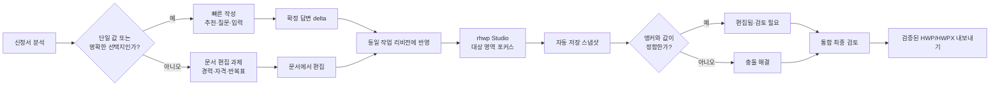

# rhwp 필드 에이전트 워크스페이스 상세 구현 계획

> **상태: Phase A~I 최소 통합·L1 구현 완료 · 서버 리비전/프로토콜 고도화(J/K)·실문서 회귀(L2) 후속 (2026-07-23)**
>
> 이 문서는 `/grants/[grantId]/workspace`를 **원본 HWP/HWPX 프리뷰 → 필드 선택 → 근거 기반 안내/대화 → 사용자 확인 → 원본 형식 내보내기**의 한 흐름으로 연결하는 실행 정본이다. 구현·검증·잔여 제한도 이 문서에 함께 갱신한다.

## 1. 목표와 성공 조건

사용자는 변환 이미지가 아닌 rhwp가 렌더링한 원본 문서를 보면서 입력 위치를 선택하고, 창업노트가 이미 가진 회사 정보와 공고 근거를 바탕으로 다음 세 가지 중 하나를 받는다.

1. 바로 확인할 수 있는 추천 값
2. 사용자가 답해야 할 1~2개의 구체 질문
3. 수치·단위·작성 범위 등 해당 칸의 작성 가이드

추천은 자동으로 문서에 반영하지 않는다. `suggested` 상태는 검토 화면에만 존재하며, 사용자가 `이 값으로 채우기` 또는 직접 수정을 확정한 뒤에만 `accepted|edited`가 되어 내보내기에 포함된다.

완료 조건은 다음과 같다.

- HWP/HWPX 원본을 회사·사용자 소유권 검증 뒤 브라우저로 전달한다.
- rhwp WASM은 작업공간에서 조건부 로드하고, 현재 페이지만 SVG로 렌더링한다.
- 기존 bbox 오버레이와 필드 카드가 같은 `selectedFieldId`를 공유한다.
- 필드 대화는 후속 턴에도 필드 문맥을 유지하고 `guidance | needs_input | proposal` 결과를 표현한다.
- 제안 값은 사용자 확인 전에는 내보내지 않는다.
- HWP는 rhwp 자기 재로드·페이지 수·바이트 길이 검증을 통과한 파일만 내려받는다.
- HWPX도 rhwp로 다시 열어 페이지 수를 비교하고, 실패하면 기존 서버 HWPX 내보내기로 안전하게 폴백한다.
- 파싱·내보내기 실패 시 기존 서버 페이지 이미지/기존 HWPX 다운로드를 유지한다.

## 2. 현재 상태와 변경 이유

이미 구현된 기반:

- 작업공간의 페이지 이미지, 정규화 bbox 오버레이, 필드 선택, 필드별 `suggested/accepted/edited/dismissed` 상태
- 프로필 시드와 사용자 확인 게이트, 동시 저장 충돌을 피하는 필드 단위 PATCH
- 공고 첨부 markdown을 이용한 Anthropic citations 채팅
- 필드 단위 LLM 제안과 근거 검증
- HWPX XML 기반 서버 내보내기
- rhwp 0.7.19 기반 개발 랩의 HWP/HWPX 파싱, 페이지 SVG, 셀 삽입, HWP 자기 검증, HWP/HWPX 내보내기

계획 작성 당시 결손(Phase A~G에서 해소):

- 실제 작업공간은 rhwp가 아니라 변환 서버의 페이지 이미지만 사용한다.
- 채팅의 `fieldContext`가 첫 턴 뒤 사라지고, 구조화된 제안/추가 질문을 UI에서 실행할 수 없다.
- HWP 다운로드는 기존 HWPX XML 채움 경로로 합류할 수 없으며, HWP 원본 보존 내보내기가 없다.
- 원본 파일을 실제 작업공간에 안전하게 전달하는 인증 API가 없다.

이 계획은 `docs/plans/2026-07-09-apply-experience-v2.md`의 ADR-1/P6을 **작업공간의 점진적 rhwp 우선 렌더링에 한해 갱신**한다. 당시 rhwp가 skeleton이었던 전제와 달리 현재 설치 버전은 페이지 렌더링·텍스트 검색·셀/폼 편집·HWP/HWPX 내보내기·HWP 자기 검증을 제공한다. 단 서버 이미지 폴백은 없애지 않는다.

## 3. 사용자 흐름

```text
작업공간 진입
  ├─ 원본 HWP/HWPX 인증 조회 성공
  │    └─ rhwp 파싱 → 현재 페이지 SVG + 같은 문서 구조에서 계산한 필드 앵커
  └─ 실패/미지원
       └─ 기존 서버 페이지 이미지 + 기존 필드 오버레이

프리뷰 필드 또는 우측 카드 선택
  └─ 같은 selectedFieldId로 양쪽 포커스 동기화
       ├─ 저장된 프로필/제안 표시
       └─ "이 항목 물어보기"
            └─ 공고 인용 답변 + 구조화 결과
                 ├─ guidance: 작성 기준 안내
                 ├─ needs_input: 답변할 질문 1~2개
                 └─ proposal: 추천 값 + 근거 + "이 값으로 채우기"

사용자 확인
  └─ 기존 field-answers PATCH → accepted|edited
       └─ rhwp EditPlan 적용
            ├─ HWP: exportHwpVerify → exportHwp
            └─ HWPX: exportHwpx → 재파싱/페이지 수 검증
```

## 4. 기술 설계

### 4.1 인증된 원본 파일 공급

`GET /api/web/document-drafts/[draftId]/source-file`을 추가한다.

- `requireCompanyAccess()`와 `getGrantDocumentDraft()`로 소유권을 검증한다.
- draft의 `sourceAttachment`를 grant source/sourceId와 `grant_attachment_archives`로 재해석한다.
- 클라이언트가 전달한 임의 R2 key는 받지 않는다.
- 매직바이트로 실제 `hwp|hwpx`를 판별하고 포맷·파일명을 응답 헤더로 제공한다.
- `Cache-Control: private, no-store`, `X-Content-Type-Options: nosniff`를 사용한다.

### 4.2 rhwp 프리뷰와 필드 포커스

- dev 전용 `rhwp-client.ts`의 WASM 단일 초기화와 안전 내보내기를 공용 `lib/rhwp`로 이동한다.
- 작업공간 전용 프리뷰는 `draftId`가 있고 사다리 (a)/(b)인 경우에만 동적 import한다.
- 문서는 한 번 파싱하고 현재 페이지만 `renderPageSvg()`로 렌더링한다. 전체 페이지 선렌더링은 하지 않는다.
- DB의 기존 bbox는 반복 라벨을 구분하는 탐색 힌트로만 사용한다. rhwp 프리뷰 위에는 rhwp가 같은
  문서 인스턴스에서 계산한 표 셀·텍스트 선택 영역만 표시한다.
- `human_review` 등 근사 bbox는 rhwp 렌더링 위에 표시하지 않는다. 구조 앵커를 확정하지 못한 필드는
  카드에서는 유지하되 문서 오버레이는 숨겨 잘못된 위치를 확신 있게 보여주지 않는다.
- 프리뷰 페이지 수와 좌표계는 rhwp 문서가 소유한다. 변환 이미지의 페이지 수가 다르다는 이유만으로
  rhwp를 버리지 않으며, rhwp 자체 렌더링과 앵커가 항상 같은 좌표계를 사용하게 한다.
- 체크박스 필드는 셀 단위 앵커와 옵션 텍스트 선택 영역을 함께 계산한다. LLM은 의미 매핑만 도울 수
  있고 좌표를 생성하거나 보정하지 않는다.
- 자동 앵커가 맞지 않으면 사용자가 `문서에서 입력 위치 다시 지정`을 누르고 rhwp 표 셀을 직접
  선택할 수 있다. 이 보정은 현재 작업공간 세션에만 적용되며 프리뷰와 같은 회차의 원본 다운로드가
  동일한 구조 셀을 사용한다. 공용 필드 DB를 일반 사용자 입력으로 덮어쓰지 않는다.
- SVG 파싱/렌더 오류, 지원하지 않는 원본, 메모리 해제 실패는 UI를 깨뜨리지 않고 `PreviewCanvas`로 폴백한다.
- 컴포넌트 unmount와 문서 교체 때 `HwpDocument.free()`를 호출한다.

### 4.3 필드 대화 에이전트

기존 `/api/web/chat`을 유지한다. 일반 공고 채팅은 변경하지 않고 `draftId + fieldContext`가 검증된 턴에만 구조화 결과를 추가한다.

```ts
type FieldAssistOutcome =
  | { status: "guidance"; fieldId: string; label: string; guidance: string }
  | { status: "needs_input"; fieldId: string; label: string; guidance: string; questions: string[] }
  | {
      status: "proposal";
      fieldId: string;
      label: string;
      guidance: string;
        proposal: { value: string; basis: string; basisKind: "announcement" | "profile" | "user" };
    };
```

- 서버는 draft 소유권, grant 일치, `fieldId + label` 연결을 재검증한다.
- 1차 응답은 기존 citations 스트림을 그대로 사용한다.
- 2차 구조화 분석은 1차 답변과 검증된 필드 메타데이터만 정규화한다.
- 제안 근거가 실제 공고/프로필에 없거나 필드가 수동 작성·중복 라벨이면 `proposal`을 내리지 않는다.
- 사용자가 대화에서 직접 제공한 사실은 `basisKind=user`와 원문 부분 문자열 검증을 통과한 경우에만 제안 근거로 쓴다.
- 구조화 결과는 AI SDK persistent `data-fieldAssist` part로 보내고 JSONB 메시지에도 선택적으로 보존한다.
- 채팅은 활성 필드 문맥을 후속 질문에도 유지하며, Sheet를 닫거나 다른 필드를 고르면 명시적으로 전환한다.
- `proposal` CTA가 눌린 때만 기존 field-answer PATCH를 호출한다.

### 4.4 rhwp EditPlan과 안전한 내보내기

내보내기는 `accepted|edited`만 대상으로 순수 EditPlan을 만든 뒤 클라이언트의 같은 `HwpDocument`에 적용한다.

우선순위:

1. 이름 있는 필드/폼 컨트롤과 확정 가능한 앵커
2. 라벨 텍스트가 있는 표 셀의 같은 행 오른쪽 빈 셀
3. 근거가 불충분하면 건너뛰고 사용자에게 미채움 사유 표시

안전 불변식:

- 기존 내용이 있는 셀을 임의로 덮어쓰지 않는다.
- 정규화 라벨 충돌은 자동 반영하지 않는다.
- 체크박스/라디오의 옵션 앵커가 확정되지 않으면 텍스트로 위장해 입력하지 않는다.
- HWP는 `exportHwpVerify().recovered === true`, 페이지 수 동일, 검증 바이트 길이 동일일 때만 다운로드한다.
- HWPX는 export 결과를 새 `HwpDocument`로 다시 열고 페이지 수가 동일할 때만 다운로드한다.
- 실패한 필드는 성공한 필드와 함께 결과 요약에 표시한다.
- 폴백 HWPX 내보내기는 기존 서버 경로를 유지한다.

## 5. 구현 단계와 파일

### Phase A — 계약과 소스 파일 경계

- `lib/server/documents/draftSourceFile.ts`: grant/archive/R2 조회와 포맷 판별
- `api/web/document-drafts/[draftId]/source-file/route.ts`: 인증 응답
- `routePolicy.ts`: 세션 라우트 등재
- 단위/라우트 정책 테스트

수용 기준: 다른 회사 draft는 404, 임의 key 입력 없음, HWP/HWPX 외 형식은 415, 응답은 private/no-store.

### Phase B — rhwp 작업공간 프리뷰

- `lib/rhwp/client.ts`: WASM 단일 초기화, 검증 내보내기, 다운로드
- `features/document-viewer/RhwpPreviewCanvas.tsx`: 현재 페이지 SVG, 오버레이, 폴백 신호
- `WorkspaceView.tsx`: rhwp 우선/이미지 폴백 연결
- dev 랩 import를 공용 모듈로 전환

수용 기준: 필드 선택 양방향 동기화, 페이지 이동/줌 유지, 실패 시 기존 이미지 정상 표시, unmount 메모리 해제.

### Phase C — 필드 대화와 실행 가능한 제안

- `lib/chat/messageContent.ts`: typed field-assist 계약/검증
- `lib/server/chat/fieldAssist.ts`: 구조화 분석과 fail-closed 검증
- `app/api/web/chat/route.ts`: 필드 턴에만 custom data part 합성
- `ChatPanel.tsx`: 활성 필드 멀티턴, 안내/질문/제안 카드
- `WorkspaceView.tsx`: 제안 확인 콜백

수용 기준: 일반 채팅 회귀 없음, 필드 후속 질문 문맥 유지, 잘못된 data part 무시, 사용자 클릭 전 내보내기 미포함.

### Phase D — rhwp 내보내기

- `lib/rhwp/editPlan.ts`: label variants, EditPlan 실행, 미채움 사유
- `features/apply-workspace/RhwpDownloadButton.tsx`: 원본 로드·적용·검증·다운로드·결과 안내
- `FieldPanel.tsx` 또는 download 영역: 원본 형식 다운로드와 HWPX 폴백

수용 기준: HWP 자기 검증 실패 차단, HWPX 재파싱 실패 차단, accepted/edited만 반영, 사용자에게 skipped 필드 공개.

### Phase E — 회귀 검증과 운영 문서

- 순수 계약·EditPlan·컴포넌트 테스트
- route policy, chat grounding, field answers, apply workspace, web typecheck/build
- 실제 서버는 사용자가 해당 워크트리에서 실행한 뒤 브라우저 E2E를 최종 확인
- 이 문서 상태와 `docs/README.md` 링크 갱신

### Phase F — 구조 앵커 v2와 객관식 입력

- `lib/rhwp/fieldAnchors.ts`: 라벨 검색 → 표 구조 → 오른쪽 입력 셀/옵션 선택 영역을 하나의
  결정적 리졸버로 통합한다.
- `RhwpPageSurface.tsx`와 `PreviewCanvas.tsx`: rhwp 페이지 수·SVG·구조 앵커를 같은 문서
  인스턴스에서 공급하고 근사 bbox 출력은 중단한다.
- `editPlan.ts`: 프리뷰와 동일한 구조 앵커를 재사용해 텍스트·안내문·단위 셀·체크박스를 편집한다.
- `FieldCard.tsx`: 체크박스의 추출 옵션을 객관식 선택 UI로 제공한다.

수용 기준:

- 라벨 셀이 아니라 실제 입력 셀에 박스가 맞는다.
- 변환 이미지와 rhwp의 페이지 수가 달라도 rhwp 프리뷰와 앵커는 함께 정상 동작한다.
- `창업자 유형` 같은 체크박스는 사용자가 옵션을 고르고, 내려받은 문서에는 선택한 옵션만 표시된다.
- `(천원)` 같은 단위 텍스트는 보존하고 값은 그 앞에 입력한다.
- 파란 안내문처럼 source span으로 확인 가능한 템플릿 안내문만 교체하며, 기존 실제 값은 덮어쓰지 않는다.
- 구조 위치를 확정하지 못하면 근사 박스를 대신 표시하거나 그 위치에 저장하지 않는다.

### Phase G — 시각 자간 라벨과 입력 문자 서식

- `lib/rhwp/fieldAnchors.ts`: `성 명`, `성  명`처럼 문자 사이 공백으로 자간을 표현한 라벨을
  `getPageTextLayout()`의 셀별 run으로 정규화해 찾는다. DB 페이지 힌트가 있으면 해당 페이지만
  조회하고, 페이지 레이아웃은 문서 인스턴스당 한 번만 캐시한다.
- 구조 앵커는 입력 셀과 함께 왼쪽 라벨 셀 인덱스를 보관한다. 저장 시 대상 셀의 원래 글꼴,
  라벨의 본문색, 셀 높이·너비와 입력값 길이를 이용해 글자 크기를 계산한다.
- 안내문은 `trim()`된 길이가 아니라 실제 셀 문단 전체 길이로 삭제한다. source span으로 확인된
  안내문뿐 아니라 파란색·회색·이탤릭 문자 모양과 `기재 시`, `선택기입`, `작성 예시` 같은 강한
  안내 표현이 함께 있는 경우도 교체 대상으로 인정한다. 일반 기존 값은 계속 덮어쓰지 않는다.
- 한글 빈 셀에 남아 있는 단일 공백도 빈 값으로 취급하고 실제 입력값으로 교체한다.
- 프리뷰에서도 rhwp가 실제 셀의 안내문 여부와 배경색을 전달한다. 확정된 일반 텍스트는 셀 높이의
  52%를 기준으로 확대·축소하며, 안내문 셀만 불투명한 원래 셀색으로 가려 파란/회색 문구가 값 뒤에
  비치지 않게 한다. 단위 셀과 객관식 원문은 가리지 않는다.

수용 기준:

- `성명(대표자)`가 원문에서 `성 명(대표자)`로 저장돼 있어도 첫 장의 오른쪽 입력 셀에 정확히 매칭된다.
- 9pt 파란 이탤릭 안내문이 있던 전화번호 셀은 안내문 전체가 사라지고, 값만 11pt 검정 일반체로 남는다.
- 웹 프리뷰에서도 전화번호 안내문은 셀 배경으로 가려지고, 확정값이 셀 크기에 비례해 표시된다.
- HWPX 내보내기 후 새 `HwpDocument`로 재개방해도 값·글자 크기·페이지 수가 유지된다.

### Phase H — 작성 과제 분류와 시각 구분

- `connectedFields`를 그대로 모두 텍스트 입력으로 취급하지 않고 `quick | studio | readonly` 작성
  과제로 분류한다. 문서 구조 판정이 1차, LLM 의미 판정은 2차 보조다.
- `PreviewCanvas.tsx`는 입력 가능한 빠른 작성 필드를 파란 실선/옅은 파랑 배경, Studio에서 작성할
  복합 영역을 보라 점선/옅은 보라 배경, 확인 완료를 초록, 읽기 전용을 무오버레이로 표시한다.
- 색만으로 상태를 구분하지 않도록 아이콘·라벨·`aria-label`을 함께 제공한다.
- `FieldPanel.tsx` 전체 목록은 `빠르게 작성`과 `문서에서 작성`을 구분해 보여주고, 전체 진행률도 두
  종류의 완료 수를 분리해 계산한다.

수용 기준:

- 사용자가 프리뷰만 보고도 클릭 가능한 칸과 직접 편집이 필요한 영역을 구분할 수 있다.
- `경력사항`, `기술/자격증/입상실적` 같은 반복 표는 일반 `Textarea`를 표시하지 않는다.
- 읽기 전용 라벨·설명 문구는 작성 항목 수와 미완료 수에 포함되지 않는다.

### Phase I — 작업공간 모드 전환과 Studio 최소 연결

- 상단 바에 `빠른 작성 | 문서 직접 편집` 모드 전환을 추가한다. 기본값은 빠른 작성이다.
- 복합 영역 카드의 주 CTA는 `문서에서 편집`이며, `해당 없음`, `나중에`를 보조 액션으로 둔다.
- `RhwpStudioSurface.tsx`는 개발 랩의 `@rhwp/editor` 초기화·정리 패턴을 제품 컴포넌트로 옮기고,
  인증된 작업 문서 바이트를 동일한 `draftId` 문맥에서 연다.
- 이 단계는 현재 0.7.19 공개 API 범위에서 문서 로드·전체 편집·검증 내보내기·수동 복귀를 먼저
  제공한다. 정확한 영역 포커스와 자동 저장은 다음 단계의 프로토콜 확장 뒤 활성화한다.

수용 기준:

- 복합 영역 CTA 한 번으로 Studio가 열리고, 원본 파일을 다시 고를 필요가 없다.
- Studio를 닫거나 빠른 작성으로 돌아가도 선택 필드·스크롤·채팅 상태가 유지된다.
- 에디터 생성 실패 시 현재 rhwp 프리뷰와 원본 다운로드 폴백은 그대로 사용할 수 있다.

### Phase J — rhwp Studio 탐색·변경 감지 프로토콜

- 자가 호스팅 Studio와 `@rhwp/editor`에 `target-navigation-v1`,
  `document-change-events-v1`, `snapshot-export-v1` capability를 추가한다.
- `focusTarget`, `getDirtyState`, `exportSnapshot`, `subscribe`를 공개 API로 제공하고, iframe은
  `MessageChannel` 세션·origin 검증을 계속 사용한다.
- 구조 앵커는 픽셀 좌표가 아니라 `pageIndex + sectionIndex + parentParagraphIndex + controlIndex +
  cellIndex`를 전달한다. 렌더링 뒤 해당 셀을 선택하고 화면 중앙에 오도록 이동한다.

수용 기준:

- `문서에서 편집` 진입 후 선택한 표 영역이 보이고 포커스된다.
- 문서 변경·저장 상태 이벤트가 부모 작업공간에 전달되며 다른 origin 메시지는 무시된다.
- 프로토콜 capability가 없는 Studio 버전에서는 전체 문서 편집으로 안전하게 폴백한다.

### Phase K — 작업 리비전·자동 저장·충돌 방지

- 원본, 빠른 작성 반영본, Studio 스냅샷을 `grant_document_revisions`로 관리하고 draft마다 하나의
  head revision을 둔다.
- Studio 자동 저장은 메모리의 dirty 상태를 1.5초 debounce하고, 서버 스냅샷은 10초 간격 또는
  모드 이탈 시 수행한다. 매 키 입력마다 HWP 전체 파일을 업로드하지 않는다.
- 스냅샷 저장은 `baseRevisionId`를 비교해 head가 바뀌었으면 `409 revision_conflict`로 실패시킨다.
- 빠른 작성 답변은 기존 필드 단위 PATCH를 유지한다. Studio 진입·최종 내보내기 직전에 head 문서에
  미반영된 확정 답변만 materialize하고 `fieldAnswersHash`를 리비전 메타데이터에 기록한다.
- Studio 종료 스냅샷에서 알려진 단일 필드 값을 다시 읽어 quick answer와 다르면 `studio` source의
  `edited` 또는 `review_required`로 조정한다. 앵커가 사라진 경우 자동 덮어쓰지 않는다.

수용 기준:

- 두 탭이 같은 draft를 편집해도 마지막 저장이 조용히 앞선 변경을 덮어쓰지 않는다.
- 브라우저 새로고침 뒤 최신 검증 스냅샷과 미완료 과제가 복원된다.
- Studio에서 수정한 단일 값에 이전 빠른 작성 값이 재적용되지 않는다.

### Phase L — 통합 검토와 최신 리비전 내보내기

- 최종 검토는 `빠른 작성 N/M`, `문서 직접 편집 N/M`, `충돌·검토 필요 N`을 따로 보여준다.
- 다운로드는 항상 최신 head revision에 남은 quick delta를 반영한 새 후보를 만들고,
  `exportHwpVerify`/재개방/페이지 수 검증을 통과한 결과만 제공한다.
- `해당 없음`은 완료로 계산하되 문서를 변경하지 않는다. `나중에`와 `review_required`는 최종
  검토에서 계속 남긴다.
- 기존 HWPX 서버 폴백은 유지하고, Studio capability 또는 스냅샷 저장이 실패해도 원본 파일을 잃지
  않는다.

수용 기준:

- 사용자가 어느 모드에서 마지막으로 편집했는지와 무관하게 다운로드는 최신 변경을 포함한다.
- 한컴오피스 재개방 경고, 페이지 수 변화, 빈 바이트가 있으면 다운로드를 차단하고 복구 경로를
  안내한다.
- 최종 화면에서 빠른 작성 완료와 Studio 작성 완료를 혼동하지 않는다.

## 6. 검증 명령

```bash
pnpm build:packages
pnpm --filter web typecheck
pnpm test:rhwp-field-agent
pnpm test:chat-grounding
pnpm test:field-answers
pnpm test:apply-workspace
pnpm verify:route-policy
NEXT_DIST_DIR=.next-build pnpm --filter @cunote/web build
```

관련 스크립트가 패키지에 없으면 동일 범위의 Vitest 파일을 직접 실행하고, 최종 문서에 실제 명령을 기록한다.

## 7. 범위 밖과 후속 과제

- 양식 개체가 아닌 임의 도형 체크박스, 이미지 체크박스: 구조 텍스트/폼 컨트롤로 확인되지 않으면
  자동 선택하지 않는다.
- 임의 도형·텍스트박스까지 의미 단위로 자동 분해하는 범용 문서 편집: rhwp Studio 자체 편집은
  Phase I~L에 포함하지만, 구조를 해석할 수 없는 임의 개체는 자동 과제로 만들지 않는다.
- 서버에서 rhwp WASM을 실행하는 내보내기: 이번 슬라이스는 브라우저 자기 검증이며, 실제 문서 corpus가 쌓인 뒤 서버 이중 검증을 검토한다.
- PDF/PPTX 원본 편집: 파싱·가이드에는 합류할 수 있으나 원본 양식 편집은 별도 엔진이 필요하다.

## 8. 구현 기록

- 2026-07-22: 메인 작업트리 `7b26092`가 clean 상태임을 확인했다. 커밋할 미반영 변경은 없었다.
- 2026-07-22: Orca worktree `rhwp-field-agent-workspace`, branch `coolwithyou/rhwp-field-agent-workspace`를 생성하고 `.env`, `.env.local`, `.env.vercel.local`을 복사했다.
- 2026-07-22: draft 소유권 기반 원본 파일 API와 route policy를 추가했다. R2 key는 클라이언트에 노출하지 않으며 매직바이트가 HWP/HWPX가 아니면 차단한다.
- 2026-07-22: 작업공간 프리뷰에 rhwp 현재 페이지 SVG를 연결했다. SVG는 DOM 주입 대신 object URL 이미지로 격리한다. 초기 버전은 페이지 수 불일치도 이미지 폴백으로 취급했으나 구조 앵커 v2에서 이 조건을 제거했다.
- 2026-07-22: 필드 채팅의 문맥을 멀티턴으로 유지하고 `data-fieldAssist` 결과를 추가했다. 공고/프로필/사용자 직접 제공 정보의 근거 검증을 통과한 제안만 CTA로 표시하며 클릭 전에는 내보내기에 포함되지 않는다.
- 2026-07-22: rhwp EditPlan은 이름 있는 누름틀(안내문 포함)과 유일한 라벨 오른쪽 빈 셀을 지원한다. 기존 값·중복 위치·중복 라벨은 덮어쓰지 않고 미채움으로 보고한다.
- 2026-07-22: 원본 형식 HWP/HWPX 내보내기와 실제 산출물 재로드/페이지 수 검증을 연결했다. HWP는 `exportHwpVerify`도 함께 통과해야 하며 HWPX는 기존 서버 내보내기를 폴백으로 유지한다.
- 2026-07-22: 실문서 검증에서 기존 `human_review` bbox가 표의 입력 셀이 아니라 행 전체/인접 라벨을
  감싸고, 변환 프리뷰(11쪽)와 rhwp 레이아웃(환경에 따라 8쪽)의 페이지 수 차이 때문에 rhwp가 항상
  이미지로 폴백하는 근본 원인을 확인했다. Phase F는 이 두 좌표계를 혼합하지 않는 구조 앵커 v2다.
- 2026-07-22: 구조 앵커 v2를 구현했다. `searchAllText`의 셀 문맥과 `getTableCellBboxes`를 조합해
  라벨 오른쪽의 실제 입력 셀을 찾고, 기존 bbox는 반복 라벨의 페이지/거리 힌트로만 사용한다.
- 2026-07-22: 객관식 원문(`□`, `☐`, `동의( )`)을 선택 UI로 변환하고 정적 체크 glyph는 선택한
  항목만 `■`로 편집한다. 단위 전용 텍스트는 보존하고 값은 앞에 삽입하며, source span으로 검증된
  안내문만 삭제 후 교체한다.
- 2026-07-22: 프리뷰가 데스크톱/모바일 DOM에 이중 mount되어 문서와 WASM 메모리가 두 벌 생기던
  구조를 단일 반응형 노드로 합쳤다.
- 2026-07-22: 4020 실문서 브라우저에서 rhwp blob 이미지 1개, rhwp 페이지 `1 / 8`, 첫 페이지
  구조 오버레이 14개를 확인했다. `창업자 유형` 입력 셀은 `left 21.9856% / top 30.4855% /
  width 67.0908% / height 2.30735%`로 표의 실제 오른쪽 셀과 일치했고, 객관식 선택 및 사용자의
  직접 셀 보정 토스트까지 확인했다. DB 저장/파일 다운로드는 사용자 데이터 변경을 피하려 브라우저
  자동화에서 실행하지 않았다.
- 2026-07-22: 첫 장의 `성 명(대표자)`는 공백 없는 `성명(대표자)` 검색이 다른 페이지의 동명
  라벨만 찾던 누락 원인을 실문서에서 재현했다. 페이지 텍스트 run을 셀 단위로 합쳐 공백·기호를
  정규화하는 구조 앵커 v3로 대상 셀 `cellIdx=2`를 확정했다.
- 2026-07-22: `연락전화번호` 입력 셀은 선행 공백이 9pt 검정, 안내문이 9pt 파란 이탤릭으로
  분리돼 있었고, 기존 `trim()` 길이 삭제가 마지막 안내문자를 남기던 원인을 확인했다. 전체 15자를
  삭제한 뒤 셀 비례 11pt·검정·일반체를 적용하도록 수정했다.
- 2026-07-22: `/tmp/cheorwon-source.hwpx` 메모리 편집·HWPX 재직렬화·재개방으로 `김창업`과
  `010-1234-5678`이 각각 정확한 셀, 11pt 검정 일반체, 8페이지로 유지됨을 확인했다. 4020 브라우저의
  전체 목록에 `성명(대표자)` 오버레이가 생성되고 선택 시 표의 정확한 빈 셀이 강조되는 것도 확인했다.
- 2026-07-22: 저장 전 프리뷰가 원본 SVG 위에 투명한 확정값을 얹어 전화번호 안내문이 비치고,
  고정 11px 텍스트가 문서 배율과 무관하게 작아지는 문제를 추가 확인했다. 실제 셀의 안내문/배경
  메타데이터와 CSS 컨테이너 단위를 연결해 일반 텍스트 값은 문서와 함께 확대·축소하고 안내문만 가린다.
- 자동 확인 완료: `build:packages`, web `typecheck`, `test:rhwp-field-agent`, `test:field-answers`,
  `test:chat-grounding`, `test:apply-workspace`, `verify:route-policy`, 격리 dist의 web production build.
- 추가 수동 회귀: HWP/HWPX 각 3개 이상 corpus로 체크 표시, 안내문 교체, 단위 보존과 무결성
  경고 부재를 반복 확인한다.
- 2026-07-23: `DocumentAuthoringTask` 분류기를 추가해 단일 텍스트·객관식·보조 장문은 빠른 작성,
  반복표·병합표·첨부/서명/도장 영역은 문서 편집 과제로 분리했다. 복합 과제에는 textarea를
  렌더하지 않고 `문서에서 편집`, `해당 없음`, `나중에`, `편집 내용 확인 완료` 흐름을 제공한다.
- 2026-07-23: 프리뷰에 빠른 작성(파란 실선), 문서 편집(보라 점선), 확인 완료(초록 실선)의
  색상·선·텍스트 단서를 함께 적용하고 전체 목록과 상단 진행률을 `빠른 작성 / 문서 편집`으로
  분리했다.
- 2026-07-23: 같은 draft 원본을 자가 호스팅 rhwp Studio에 로드하고, 명시적 저장 시 HWP/HWPX를
  재개방해 페이지 수와 바이트를 검증한 뒤 빠른 작성으로 복귀하는 최소 통합을 구현했다. Studio의
  HWPX/글꼴 확인창을 부모 로딩 오버레이가 가로막지 않도록 안내를 비차단 방식으로 바꿨다.
- 2026-07-23: 최종 다운로드는 Studio 스냅샷을 기준으로 최신 빠른 작성 delta만 안전하게 합성한다.
  이전 값과 정확히 일치할 때만 교체하고 Studio에서 직접 고친 셀은 덮어쓰지 않으며, Studio
  스냅샷이 있으면 이를 버리는 서버 폴백도 사용하지 않는다.
- 2026-07-23: 4020 실문서 브라우저에서 `빠른 작성 3/40 · 문서 편집 0/11`, 첫 페이지 빠른 작성
  오버레이 14개와 문서 편집 오버레이 2개를 확인했다. Studio 8쪽 로드, 저장 검증, 복귀,
  `편집됨 · 확인 필요` 및 `문서 편집 1/11` 전환을 확인했다. 다운로드한 HWPX는 rhwp 재개방 시
  62,286 bytes·8쪽이며 확정한 전화번호와 주민등록번호가 각각 1회 남았다.
- 2026-07-23: 같은 다운로드 HWPX를 macOS 한컴오피스 한글 Viewer로 열어 손상/변조 경고 없이
  1/8쪽이 표시되고 주민등록번호와 연락전화번호가 각각 의도한 셀에 정상 배치된 것을 확인했다.
- 현재 최소 통합의 Studio 스냅샷은 브라우저 탭 메모리에만 유지된다. 새로고침/재접속 영속화,
  다중 탭 optimistic conflict, 선택 과제의 정확한 Studio 포커스, dirty 이벤트·자동 저장은
  Phase J/K에서 서버 리비전 계약과 함께 구현한다.

## 9. 빠른 작성 ↔ 문서 직접 편집 UX 정본

Figma/FigJam 흐름도: [창업노트 · 빠른 작성–문서 편집 전환 플로우](https://www.figma.com/board/JlJbMWpqG9Gpj5XCIbwN0F/)

### 9.1 핵심 원칙

1. 사용자는 먼저 **빠른 작성**에서 답할 수 있는 작은 질문을 처리한다.
2. 표 구조·반복 행·자유 배치가 중요한 영역만 **문서 직접 편집**으로 보낸다.
3. 두 화면은 별도 파일을 만들지 않고 같은 draft의 작업 리비전을 공유한다.
4. LLM은 “무엇을 써야 하는가”와 초안을 돕고, rhwp는 “어디에 어떻게 보존할 것인가”를 책임진다.
5. 복합 영역을 억지로 한 개의 textarea로 축약하지 않는다. 원본 표 위에서 편집하는 것이 정보 손실이
   더 적다.



### 9.2 화면 구조

#### 빠른 작성 모드

- 상단: 뒤로가기, 공고명, 통합 진행, `빠른 작성 | 문서 직접 편집` 모드 전환, 문서 선택.
- 왼쪽: 현재 rhwp 프리뷰를 유지한다. 빠른 작성 필드는 파란 실선, Studio 과제는 보라 점선,
  완료 필드는 초록 체크로 표시한다.
- 오른쪽: 단일 필드는 기존 `FieldCard`를 유지한다. 복합 영역은 값 입력 대신 다음 카드를 표시한다.

```text
문서에서 직접 작성하는 항목 2개 중 1번째
경력사항
입사연월·퇴사연월·근무처·업무분야가 반복되는 표예요.

[ 문서에서 편집 ]
  해당 없음    나중에
```

#### 문서 직접 편집 모드

- 데스크톱은 Studio 75% + 과제 레일 25%를 기본으로 한다. 1280px 미만은 Studio 전면과 접히는
  과제 Sheet로 바꾼다.
- 과제 레일은 `현재 과제`, 작성 가이드, `빠른 작성으로 돌아가기`, 저장 상태만 제공한다. Studio의
  자체 편집 도구와 중복되는 입력 컨트롤을 만들지 않는다.
- 진입 시 선택 과제의 페이지·표 셀로 이동한다. 포커스 실패 시 페이지까지만 이동하고
  `위치를 정확히 찾지 못했어요`를 정직하게 표시한다.
- Studio에서 돌아오면 과제 상태를 곧바로 완료 처리하지 않고 `편집됨 · 검토 필요`로 둔다. 사용자가
  프리뷰 또는 Studio에서 확인한 뒤 `확인 완료`로 바꾼다.

### 9.3 필드/과제 분류 계약

```ts
type DocumentAuthoringMode = "quick" | "studio" | "none";

type DocumentTaskKind =
  | "atomic_text"
  | "choice"
  | "assisted_longform"
  | "repeating_table"
  | "free_layout_region"
  | "attachment_or_stamp"
  | "readonly";

interface DocumentAuthoringTask {
  taskKey: string;
  fieldId: string | null;
  label: string;
  mode: DocumentAuthoringMode;
  kind: DocumentTaskKind;
  required: boolean;
  reason: string;
  anchor: RhwpFieldAnchor | RhwpRegionAnchor | null;
  confidence: number;
  source: "structure" | "rule" | "llm";
}
```

결정 순서:

1. 이름 있는 폼 컨트롤, 단일 표 셀, 명확한 체크 옵션은 `quick`이다.
2. 셀 하나에 들어가는 서술형이라도 문단 구조가 단순하면 `assisted_longform`으로 quick에 남긴다.
3. 반복 행, 병합 셀 2개 이상, 열 머리글과 빈 행의 조합, 표 안의 이미지/도장은 `studio`다.
4. 라벨·안내·단위만 있고 입력 위치가 없는 텍스트는 `none/readonly`다.
5. 구조 판정이 불확실할 때만 LLM이 문맥상 입력 필요 여부와 task label을 보조한다. LLM은 좌표나
   셀 인덱스를 만들 수 없다.
6. 자동 분류 confidence가 기준 미만이면 `review_required`로 보내고 quick textarea를 임의로 만들지
   않는다.

### 9.4 상태 모델과 진행률

```ts
type DocumentTaskStatus =
  | "unstarted"
  | "editing"
  | "edited"
  | "review_required"
  | "confirmed"
  | "not_applicable";

interface WorkingDocumentRevision {
  revisionId: string;
  draftId: string;
  parentRevisionId: string | null;
  origin: "source" | "quick_materialization" | "studio_snapshot" | "final_export";
  format: "hwp" | "hwpx";
  sha256: string;
  pageCount: number;
  fieldAnswersHash: string;
  verified: boolean;
  createdAt: string;
}
```

- `confirmed`와 `not_applicable`만 완료로 계산한다.
- `edited`는 사용자가 문서에서 내용을 넣었지만 아직 검토하지 않은 상태다.
- 상단 통합 진행은 `완료한 과제 / 실제 작성 과제`를 유지하되, 상세에는 quick/studio 하위 수치를
  함께 보여준다.
- 기존 `dismissed`는 quick 필드에서만 `나중에` 의미로 유지한다. Studio 과제는 별도 상태를 써서
  `해당 없음`과 `나중에`를 구분한다.

### 9.5 저장 구조

초기 UI 분류는 DB 마이그레이션 없이 서버 projection으로 시작한다. 실제 Studio 저장을 붙일 때 아래
두 테이블을 추가한다.

```text
grant_document_revisions
  id, draft_id, parent_revision_id, origin, format
  artifact_storage_key, sha256, byte_size, page_count
  field_answers_hash, verification_json, created_by, created_at

grant_document_task_states
  draft_id, task_key, kind, mode, status
  anchor_json, anchor_fingerprint, revision_id
  updated_by, updated_at
  UNIQUE(draft_id, task_key)
```

- 원본 바이트는 source revision 1개로 등록한다.
- 빠른 작성 PATCH는 지금처럼 `fieldAnswers`에 저장하고 문서 바이트를 매번 재직렬화하지 않는다.
- Studio 진입 또는 최종 내보내기 시 `fieldAnswersHash`가 head와 다를 때만 미반영 확정값을 적용한
  `quick_materialization` revision을 만든다.
- Studio 자동 저장은 전체 바이너리 snapshot이므로 R2에 저장하고 DB에는 메타데이터만 둔다.
- revision artifact는 draft/company 소유권 검증 뒤에만 읽고, 임의 storage key를 API 입력으로 받지
  않는다.

### 9.6 API 계약

```text
POST /api/web/document-drafts/:draftId/studio-sessions
  body: { taskKey, baseRevisionId? }
  -> { sessionId, headRevisionId, sourceFileUrl, task, capabilities }

POST /api/web/document-drafts/:draftId/studio-snapshots
  multipart: file, sessionId, taskKey, baseRevisionId, format, verification
  -> 201 { revisionId, sha256, pageCount, taskState }
  -> 409 { code: "revision_conflict", currentRevisionId }

PATCH /api/web/document-drafts/:draftId/task-states/:taskKey
  body: { status, revisionId? }
  -> { taskState, progress }

GET /api/web/document-drafts/:draftId/source-file?revision=head
  -> 최신 검증 revision bytes. revision 미지정 시 기존 원본 동작과 호환.
```

서버 불변식:

- 모든 API는 현재 `requireCompanyAccess`와 draft 소유권 검증을 재사용한다.
- snapshot의 `baseRevisionId`가 현재 head와 다르면 저장하지 않는다.
- 클라이언트 verification은 UI 피드백에 쓰되 서버는 magic byte, 크기, sha256, format 일치를 다시
  확인한다. 서버 rhwp 이중 검증은 후속 hardening으로 둔다.
- `taskKey`는 서버가 만든 task 목록에 있어야 하며, 클라이언트가 보낸 임의 앵커를 영구 저장하지
  않는다. 수동 보정은 별도 검토 상태를 거친다.

### 9.7 rhwp Studio 호스트 계약

현재 `@rhwp/editor@0.7.19` 공개 API는 `loadFile`, `pageCount`, `getPageSvg`,
`getRendererDiagnostics`, `exportHwp`, `exportHwpx`, `exportHml`, `getHmlSaveState`,
`exportHwpVerify`, `destroy`까지다. 제품 흐름에는 다음 확장이 필요하다.

```ts
interface RhwpEditorTarget {
  pageIndex: number;
  sectionIndex?: number;
  parentParagraphIndex?: number;
  controlIndex?: number;
  cellIndex?: number;
}

interface RhwpSnapshotResult {
  format: "hwp" | "hwpx";
  bytes: Uint8Array;
  pageCount: number;
  dirty: boolean;
  verification: HwpVerifyResult | null;
}

editor.focusTarget(target: RhwpEditorTarget): Promise<{ focused: boolean }>;
editor.getDirtyState(): Promise<{ dirty: boolean; changeSeq: number }>;
editor.exportSnapshot(): Promise<RhwpSnapshotResult>;
editor.subscribe("documentChanged" | "selectionChanged" | "saveStateChanged", listener): () => void;
```

프로토콜 규칙:

- `target-navigation-v1`, `document-change-events-v1`, `snapshot-export-v1` capability를 handshake에서
  협상한다.
- 이벤트 envelope에도 기존 `version + sessionId`를 넣고, 연결된 `MessagePort`에서만 수신한다.
- `loadFile`이 바뀔 때마다 `documentEpoch`를 증가시켜 이전 문서 이벤트를 무시한다.
- `exportSnapshot` 도중 문서가 바뀌면 같은 `changeSeq`인지 확인하고, 다르면 한 번 재시도한다.
- 기존 0.7.19 호스트는 capability 미지원으로 판단해 `loadFile + exportHwp/exportHwpx` 최소 흐름으로
  폴백한다.

### 9.8 컴포넌트 변경표

| 파일 | 책임 |
|---|---|
| `features/apply-workspace/WorkspaceView.tsx` | `quick/studio` 모드, 선택 task, head revision, dirty/conflict 상태의 단일 오케스트레이터 |
| `features/apply-workspace/WorkspaceModeToggle.tsx` | 상단 모드 전환과 저장 중 이탈 가드 |
| `features/apply-workspace/FieldPanel.tsx` | quick/studio 과제 분리, 전체 목록과 완료 화면의 이중 진행 |
| `features/apply-workspace/FieldCard.tsx` | atomic/choice/assisted_longform 전용. studio task에는 textarea를 렌더하지 않음 |
| `features/apply-workspace/StudioTaskCard.tsx` | `문서에서 편집`, `해당 없음`, `나중에`, 검토 완료 액션 |
| `features/apply-workspace/RhwpStudioSurface.tsx` | editor 생명주기, 파일 로드, focus, dirty event, snapshot export |
| `features/document-viewer/PreviewCanvas.tsx` | quick/studio/confirmed 상태 토큰과 범례, 색상 외 아이콘 단서 |
| `lib/server/documents/documentAuthoringTasks.ts` | 구조 우선 task 분류와 LLM 보조 결과 병합 |
| `lib/server/documents/documentRevisions.ts` | head 조회, optimistic snapshot 저장, 검증 메타데이터 |
| `lib/rhwp/editorClient.ts` | Studio URL/config, capability 협상, 0.7.19 폴백 래퍼 |
| `WorkspaceFooter.tsx` | 최신 head + quick delta로 최종 검증 내보내기 |

`WorkspaceView`가 계속 오케스트레이션을 소유하고, `FieldPanel`, `ChatPanel`, `PreviewCanvas`, 다운로드
경로의 현재 저장 계약을 재사용한다. Studio를 별도 라우트로 만들지 않아 선택 필드와 채팅 세션이
끊기지 않게 한다.

### 9.9 구현 순서와 티켓

1. **H1 — 분류기와 계약 (완료)**: `DocumentAuthoringTask` 타입, 구조 규칙, fixture 단위 테스트.
2. **H2 — 시각 상태 (완료)**: Preview overlay 토큰, 범례, 전체 목록 quick/studio 구분, 접근성 단서.
3. **I1 — StudioTaskCard (완료)**: 복합 영역 textarea 제거, 전환/해당 없음/나중에 상태.
4. **I2 — Studio 최소 임베드 (완료)**: 개발 랩 초기화 코드를 공용 래퍼로 이동, 같은 draft 원본 로드,
   수동 저장/복귀.
5. **J1 — rhwp 프로토콜**: 자가 호스팅 Studio와 `@rhwp/editor`의 capability, target focus, event API.
6. **K1 — revision 저장소**: Drizzle migration, R2 artifact, optimistic head 교체, route policy.
7. **K2 — 자동 저장·재조정**: debounce snapshot, mode leave flush, atomic field 재추출과 conflict UI.
8. **L1 — 통합 검토·내보내기 (최소 통합 완료)**: 이중 진행, 탭 내 최신 snapshot materialize,
   HWP/HWPX 재개방 검증과 안전한 폴백 경계.
9. **L2 — 실제 문서 회귀 묶음**: 철원군 신청서 포함 HWP/HWPX fixture, 브라우저·한컴 수동 체크리스트.

의존성은 `H1 → H2/I1 → I2 → J1/K1 → K2 → L1 → L2`다. H2와 I1은 병렬 가능하지만,
`WorkspaceView.tsx` 충돌을 피하려 최종 조립은 한 작업자가 맡는다.

### 9.10 테스트 전략

- **분류 단위 테스트**: 단일 셀, 체크박스, 단순 장문, 반복 행, 병합 셀, 이미지/도장, 읽기 전용.
- **컴포넌트 테스트**: 색상뿐 아니라 아이콘/텍스트가 있고, studio task에 textarea가 없으며 CTA와
  키보드 포커스 순서가 올바른지 확인한다.
- **프로토콜 테스트**: capability 협상, 잘못된 origin/session 거부, 늦은 이벤트 무시, export 중 변경
  재시도, legacy 폴백.
- **리비전 경쟁 테스트**: 동일 base에서 두 snapshot을 저장해 하나만 성공하고 다른 하나가 409인지
  실제 PostgreSQL transaction으로 확인한다.
- **문서 회귀 테스트**: quick 값을 materialize → Studio에서 반복표 편집 → snapshot 재로드 → quick
  복귀 → 최종 export 순서로 값·페이지 수·안내문 제거·체크 표시를 확인한다.
- **브라우저 테스트**: 1440px 2열, 1024px 축소, 390px Sheet, 키보드만으로 모드 전환·과제 선택·복귀.
- **한컴 수동 테스트**: HWP/HWPX 각 3개 이상을 열어 손상 경고, 글꼴/자간, 병합 셀, 반복 행,
  체크박스, 이미지 위치를 확인한다.

### 9.11 관측성과 롤아웃

- feature flag: `NEXT_PUBLIC_RHWP_STUDIO_WORKSPACE`와 서버측 `RHWP_STUDIO_SNAPSHOT_ENABLED`를
  분리한다. UI 노출과 snapshot write를 독립적으로 끌 수 있어야 한다.
- 기록 이벤트: `studio_task_opened`, `studio_focus_succeeded`, `studio_focus_failed`,
  `studio_snapshot_saved`, `studio_revision_conflict`, `studio_task_confirmed`, `final_export_verified`.
- 문서 원문·입력값은 telemetry에 보내지 않는다. draft/task/revision의 비식별 ID와 timing, bytes,
  pageCount, capability만 기록한다.
- 1단계는 내부 dev 계정, 2단계는 HWP/HWPX 양식이 있고 구조 앵커 confidence가 높은 공고,
  3단계는 전체 지원 문서로 확장한다.
- capability 미지원, snapshot write 비활성화, 저장 실패 시 사용자는 기존 빠른 작성·검증 다운로드를
  계속 쓸 수 있다.

### 9.12 완료 정의

- 프리뷰에서 quick/studio/완료 상태가 시각·텍스트로 명확히 구분된다.
- 복합 표는 textarea가 아니라 `문서에서 편집`으로 진입한다.
- Studio가 동일 draft의 최신 작업 리비전을 열고 선택 영역으로 이동한다.
- 자동 저장과 모드 복귀가 데이터 손실 없이 동작하고 revision 충돌은 사용자에게 드러난다.
- Studio 수정 뒤 quick 필드와 복합 과제가 정합하게 재검토된다.
- 최종 HWP/HWPX는 최신 head와 quick delta를 모두 포함하며 rhwp 재개방 검증을 통과한다.
- 한컴오피스 수동 개방 corpus에서 손상 경고가 없고 표·문자 서식이 유지된다.
