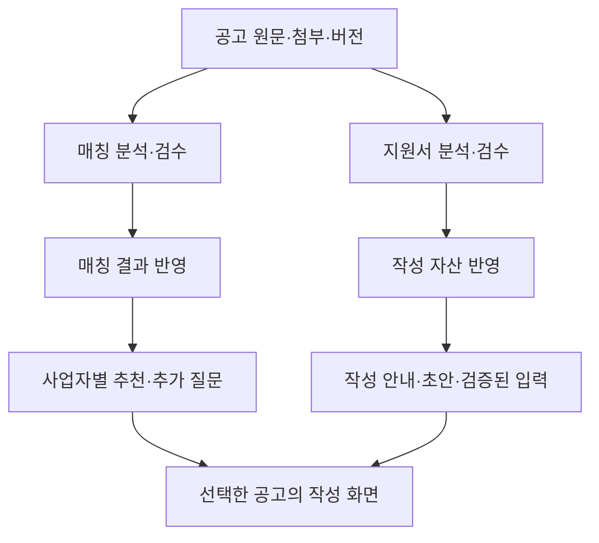

# 매칭·지원서 분석 분리 — 개발 기준 문서

작성일: 2026-09-17 KST
상태: 로컬 구현·오프라인 인수 및 매칭 단독20 live 실행 종료 / 독립 품질 검수·운영 반영·사용자 인수 미실행
코드 조사 기준: `bc0b4bd943487cf0135aa0fb5a53a87ac5ef5c21`

이 문서는 장기 구현의 기준이다. 각 작업은 아래 진행표에서 시작하고, 종료할 때 결정·검증 증거·다음 작업을 갱신한다.
계획, 구현 완료, 실제 모델 품질, 서비스 반영, 사용자 인수는 서로 다른 상태로 기록한다.

## 1. 합의한 제품 목표

사업주가 사업자번호와 추가 정보를 입력해 검토할 만한 공고를 추천받고, 선택한 공고의 지원서 작성을 도움받게 한다.
수백 개 공고의 모든 조건·모든 양식 분석 완료를 첫 공개의 선행조건으로 삼지 않는다.

### 9월18일 재확인: 빠른 출시를 위한 작업 기준

이 작업의 목적은 검증 체계를 확장하는 것이 아니라, 반복 수정·과도한 검증으로 지연된 서비스를 빠르게 출시하는 것이다.
매칭과 지원서 분석을 분리해 한 트랙의 실패가 다른 트랙의 공급·개선을 막지 않게 한다.
각 수정은 실제로 막힌 경로 하나를 해결하고, 해당 동작과 필수 보호를 확인하는 최소 검증으로 끝낸다.
변경 없는 전체 테스트·반복 분석·추가 검수 체계를 관성적으로 만들지 않는다.
공유 계약을 바꿀 때만 관련 집계 gate를 한 번 사용하며 같은 결과를 중복 검증하지 않는다.
성공한 결과는 재사용한다. 진행의 기준은 문서·테스트 수가 아니라 추천 가능한 공고와 도움받을 수 있는 작성 범위다.

개발 순서는 다음과 같다.

1. 검증된 매칭 결과를 실제 추천에 공급한다.
2. 선택한 공고에 작성 안내·초안과 검증된 필드 입력을 제공한다.
3. 실제 고객 수요와 실패 유형을 근거로 지원 범위를 넓힌다.
4. 트랙별 품질 기준이 안정된 뒤 모델·프롬프트·처리량을 최적화한다.

잘못된 자격 확정·탈락, 근거 없는 작성 내용, 다른 칸 덮어쓰기는 계속 차단한다.
불확실한 조건·필드가 영향을 주는 기능과 항목의 범위를 줄인다. 조건부 표시는 잘못 추출한 조건을 허용하는 수단이 아니다.

## 2. 출발점과 근거

| 관측 | 확인한 사실 | 의미 |
| --- | --- | --- |
| 9월 16일 신규30 | 통합 통과20·신청서 보류8·본문 실패2, 별도 매칭 준비도28 | 통합 성공률과 매칭 준비도를 분리해야 함 |
| 별도 기존41 검수 | 유효40 중 GO18·HOLD22, 검수 실패1 | 실제 의미 오류도 있어 독립 검수 필요 |
| 9월 16일 오전 재고 | 현재 모집545 중 매칭 serving5·작성 ready1 | 분석량과 제품 공급량의 차이가 큼 |
| 과천 입주신청서 | 위치 준비 입력28·미확정1·구조 경고12, 문서 보류로 상위 인식필드0 | 부분 지원과 전체 양식 완결 여부를 구분해야 함 |
| 현재 코드 | 일부 미확정 조건을 허용하는 conditional 판정 존재 | 모든 22축 확정을 요구한다는 진단은 부정확함 |
| 현재 실행 | 본문·신청서는 이미 병렬이나 통합 terminal 상태는 신청서 보류의 영향을 받음 | 실행 병렬화보다 계약·검증·반영 분리가 우선 |

앞선 진단에서 신규·복구35건의 원본 run SHA가 기록과 35/35 일치함을 확인했다.
위 수치는 서로 다른 모집단·관측 시각이다. 합산 성공률로 만들지 않는다.
9월 17일 실시간 DB 수량을 뜻하지 않으며, 모델 검수 HOLD 비율은 사람이 판정한 추천 오판율이 아니다.

- [신규35 실행·별도41 검수 결과](../research/2026-09-16-승인35건-분석과-41건-검수-실행결과.md)
- [실행 수치와 원본 참조](../evidence/deep-analysis/2026-09-16-approved-launch-results.json)
- [9월 16일 공급 현황](2026-09-16-가오픈-대량분석-실행계획.md)
- [기존 신청서 단독 실행 준비](../research/2026-09-16-application-only-v21-준비와-실원본검증.md)

## 3. 목표 구조



독립적인 두 개선 트랙을 같은 저장소와 기존 실행 인프라 위에 만든다.
별도 서버·새 큐·마이크로서비스 구축을 먼저 하지 않는다. 개발 트랙 분리가 두 live 작업의 동시 실행을 뜻하지 않는다.

| 구분 | 매칭 트랙 | 지원서 트랙 |
| --- | --- | --- |
| 목표 | 검토할 공고와 추가 확인 조건 제시 | 선택한 양식의 작성 도움 |
| 입력 | 지원내용·자격·제외·우대의 원문 근거 | 양식 원본·구조·작성 지침·필요한 공고 문맥 |
| 산출물 | 근거 결속 조건·미확정 조건·질문 | 문서 역할·필드·위치·선택지·수동 작성 영역 |
| 평가 단위 | 공고와 사업자 정보의 조합 | 양식과 필드·실제 저장 결과 |
| 반영 단위 | 검수된 공고별 매칭 결과 | 문서·작성 기능별 검증 자산 |
| 우선순위 | 현재 모집 중이며 목표 고객에게 유용한 공고 | 수요·마감 여유·지원 가능한 양식 |

### 3.1 공통 입력과 의존성

- 공고 ID, 원문·첨부 원본, 내용 해시, 기본 문서 변환 결과와 버전은 공유한다.
- 매칭도 신청서 첨부에 적힌 자격조건을 읽을 수 있다. 파일을 물리적으로 나누지 않고 소비 목적을 나눈다.
- 텍스트 추출은 공통 입력 준비이고, native 입력 위치·편집 가능성 분석은 지원서 책임이다.
- 결과마다 실제 소비한 입력과 계약 버전을 남긴다. 관련 없는 트랙의 변경만으로 성공 결과를 무효화하지 않는다.
- 문서별 의존성 증거가 없는 역사 결과는 현행의 넓은 첨부 변경 검증을 유지한다. 영향 범위를 추정해 생략하지 않는다.
- 모집기간·노출 상태는 분석 캐시와 별개로 서비스 조회 시 확인한다.

### 3.2 상태와 실패 범위

실행 상태, 분석 품질, 서비스 반영 상태를 분리한다. 기존 타입을 우선 재사용하고 불필요한 상태 체계를 추가하지 않는다.

| 매칭 | 지원서 | 제품 동작 |
| --- | --- | --- |
| 검수·반영 완료 | 미분석·보류 | 추천 가능, 준비된 작성 기능만 표시 |
| 조건부로 검수·반영 | 준비 완료 | 자격 확인 사항과 작성 도움을 함께 제공 |
| 검토 필요·미반영 | 양식 분석 완료 | 작성 자산 보존, 매칭 추천 적격으로 자동 전환하지 않음 |
| 검수·반영 완료 | 일부 필드 검증 | 검증된 필드와 직접 작성할 부분을 구분 |

지원서는 작성 안내·초안 지원, 필드 입력 지원, 양식 전체 커버리지를 구분한다.
불확실한 필드는 쓰지 않는다. 겹치는 위치·선택지 그룹·계산식에 의존성이 있으면 관련 그룹을 함께 보류한다.
원본 파싱이나 문서 구조를 신뢰할 수 없으면 문서 전체 쓰기를 보류한다.
부분 지원을 전체 작성 완료로 표시하거나 직접 작성할 부분을 숨기지 않는다.

### 3.3 검수·반영·재사용

자격 반대 해석, 중요한 제외조건 누락, 근거 없는 범위 확대는 매칭 공급을 막는다.
우대·설명 정보의 문제도 실제 추천·질문·작성에 미치는 영향을 검토한다. 잘못된 내용을 그대로 노출하지 않는다.
오류를 교정하거나 그 주장에 의존하는 기능을 비활성화한 새 결과를 검증한 뒤 사용한다.

지원서 오류는 해당 작성 기능을 막고 무관한 매칭 결과를 다시 생성하지 않는다.
독립 검수는 유지하며 자기 검증을 독립 인수로 세지 않는다.
매칭과 작성 자산을 각각 적용·보류·복구할 수 있도록 기존 원문 검증·publication lock·반영 원장을 활용한다.
부분 복구가 다른 트랙의 새 결과를 덮어쓰지 않는지 검증한다.

## 4. 모델 역할

아래는 개발·운영 에이전트 배치이며 실제 공고 분석 모델 지정과 구분한다.

| 역할 | 모델 | 범위 |
| --- | --- | --- |
| 제품 방향·공유 계약 설계 | `(astra-high)` | 완료 기준, 분리 계약, 중요한 정책 결정 |
| 매칭 핵심 구현 | `(sol-xhigh)` | 단독 실행·조건 처리·검수·추천 반영 |
| 지원서 핵심 구현 | `(sol-xhigh)` | 독립 실행·필드·native 위치·저장 |
| 공통 입력·버전·재사용 구현 | `(sol-xhigh)` | 원문 결속·역사 호환·변경 영향 |
| 화면·상태 연결 | `(sol-high)` | 확정된 상태표에 따른 UI·안내 |
| 집계·감시 도구 | `(sol-high)` | 상태 수집·오류 분류·중복 사건 억제 |
| 일반 독립 코드 검토 | `(sol-high)` | 변경 범위·정상/반례·회귀 확인 |
| 의미·문서 안전성 인수 | `(astra-high)` | 자격 오판·다른 칸 쓰기·공유 계약 검토 |
| 일상 운영·진행 관리 | `(astra-medium)` | 작업 배정·증거 확인·기존 절차 실행·보고 |
| 문서·인계 정리 | `(sol-medium)` | 확정된 사실·결과·링크 정리 |
| 변화 없는 감시 | 모델 없음 | 스크립트로 상태 비교, 사건 발생 시 운영자 호출 |

`sol-*`는 `gpt-5.6-sol`, `astra-*`는 `gpt-6-astra`, 접미사는 reasoning effort다.
공식 모델 안내와 세션 가용 목록을 확인한 배치안이다. 실제 절감률이 측정된 조합은 아니다.
정확한 조합을 사용할 수 없는 환경에서는 임의로 대체하지 않고 가용 조합을 보고한다.

- [Sol 모델 안내](https://developers.openai.com/api/docs/models/gpt-5.6-sol)
- [Astra 모델 안내](https://developers.openai.com/api/docs/guides/latest-model)

운영 총괄은 astra-medium 한 명이다. astra-high는 설계·중요 쟁점·인수에만 참여한다.
구현자는 정의된 작업 하나를 소유하고, 공유 계약 확정 후 파일 소유가 겹치지 않는 작업만 병렬화한다.
동일 핵심 문제가 두 번의 수정·검증 주기에도 남으면 최소 재현·기대 동작·시도 결과를 astra-high로 전달한다.
이는 자동 모델 재실행 횟수나 새 실행 권한을 정의하는 규칙이 아니다.

실제 공고 분석의 Claude 구독 모델과 검수 모델·transport·effort는 기존 manifest를 따른다.
구조 분리와 모델 교체를 동시에 진행하지 않는다. 경량화는 같은 정답셋의 품질·총 토큰·재시도량을 비교한 뒤 결정한다.

## 5. 작업 순서와 진행표

| ID | 작업 | 구현 / 판단 | 완료 기준 | 상태 |
| --- | --- | --- | --- | --- |
| P0-0 | 상태·의존성·재사용 계약 확정 | astra-high | 트랙별 영향표·호환 원칙·오프라인 인수 사례 확정 | 설계 완료(D007) |
| P0-1 | 매칭 단독 실행·검수 | sol-xhigh / astra-high | 신청서 모델 호출0, 결과·검수 입력·종료 증거 생성 | live20 종결: publishable6·원천 변경13·마감1 / 독립 검수 미실행 |
| P0-2 | 매칭만 서비스 반영 | sol-xhigh / astra-high | 신청서 held여도 검수된 추천 공급, 작성 준비도 과장 없음 | 반영 경로 구현·회귀 완료 / 실제 반영 미실행 |
| P1-1 | 지원서 독립 실행·재사용 | sol-xhigh / astra-high | 본문 모델 호출0, 매칭 결과 불변, 문서별 결과 생성 | 구현·exact 부모 재사용 회귀 완료 / live 미실행 |
| P1-2 | 부분 작성 지원 | sol-xhigh / astra-high | 검증된 입력·미지원 안내·저장·재열기 통과 | 구현·native 회귀·안전성 코드 인수 완료 / 실제 파일 사용자 인수 미실행 |
| P1-3 | 사용자 화면 연결 | sol-high / astra-medium | 추천·확인 질문·작성 범위와 서버 상태 일치 | 기존 경로 재사용 / 연결 회귀3개 통과 / 인증 여정 미실행 |
| P2-1 | 운영 집계·재개 분리 | sol-high / astra-medium | 트랙별 상태·반영량·원인별 재개 대상 확인 | local 트랙 집계·보류 목록 구현 완료 / 운영 반영량·재개 인수 미실행 |
| P2-2 | 제한된 베타 인수 | astra-medium / astra-high | 실제 사업자 여정·목표 고객별 공급 기준 통과 | 미실행 / exact live 실행·반영 범위 확인 필요 |

P0-0 이후 매칭·지원서 평가셋을 준비할 수 있다. P0-1→P0-2를 먼저 연결해 추천 공급 경로를 완성한다.
지원서 개선은 공유 계약 확정 후 별도 진행하며 매칭 출시의 일괄 선행조건으로 두지 않는다.
초기 분리에서 22축 체계·프롬프트·confidence 임계·분석 모델을 동시에 변경하지 않는다.

### P0: 매칭 단독 실행과 공급

시작 위치:

- [manifest](../../apps/web/src/lib/server/analysis-lab/launch-batch-artifacts.ts)
- [current inventory CLI](../../apps/web/src/lib/server/analysis-lab/current-inventory-launch-cli.ts)
- [launch 실행](../../apps/web/src/lib/server/analysis-lab/launch-batch-production.ts)
- [분석 실행](../../apps/web/src/lib/server/analysis-lab/analyze.ts)
- [기능별 준비도](../../apps/web/src/lib/server/analysis-serving/analysisFeatureReadiness.ts)
- [독립 검수](../../apps/web/src/lib/server/analysis-lab/independent-review-packet.ts)
- [매칭 결과 반영](../../apps/web/src/lib/server/analysis-lab/analysis-launch-promotion.ts)

초기 조사 당시 일반 formal/current-inventory manifest 생성은 신청서 분석 포함을 요구했다.
D007 구현에서 matching-only, application-only, 기존 결합 모드의 의미와 호환 enum·CLI를 확정했다.
일부 특수 경로의 본문 단독 실행을 일반 경로의 지원 완료로 간주하지 않는다.
아직 구현하지 않은 명령을 실행 가능한 명령으로 문서화하지 않는다.

신청서 stage 미실행을 명시하고 failed/held나 양식 없음으로 추정하지 않는다.
정상·조건부·본문 실패·원문 변경·재시도·종료 증거와 검수 입력을 오프라인으로 검증한다.
원문·권한·손상된 증거의 거부 조건을 유지한다.

트랙별 material version을 구분해 지원서 planner 변경만으로 매칭 결과를 무효화하지 않는다.
공용 파서·원문 선택·조건 계약 변경은 실제 영향을 받는 양쪽을 재검증한다.
핵심 제품 인수 사례는 매칭 검수 통과·신청서 held인 공고가 추천에 나타나고 작성 준비도를 과장하지 않는 것이다.
사업자 추가 응답이 조건부를 통과 또는 제외로 바꾸는 왕복도 확인한다.

D007 구현 계약:

| 모드 | 실행·재사용 | 작성 상태 |
| --- | --- | --- |
| `primary_and_application` | 기존 결합 실행. mode 부재의 역사 기본값 유지 | 실제 작성 receipt로 판단 |
| `matching_only` | 일반 formal/current-inventory 본문 실행, 작성 실행·재사용 없음 | 작성 status/count는 null, 준비됨으로 간주하지 않음 |
| `application_only` | 완료 부모의 exact primary artifact·projection 재사용, 작성만 실행 | 새 작성 receipt로 판단, 본문 호출0 |

원문·첨부·공용 package runtime 결속은 양쪽에 유지한다. 매칭 단독 실행에는 작성 planner/version 검사를 적용하지 않는다.
기존 특수 `authoring_guide_adoption`과 역사 receipt reader는 새 일반 모드의 기본값으로 재해석하지 않는다.
관측 요약은 실행 권한·검수 통과·서비스 반영 증거가 아니며, 각 상태를 따로 표시한다.

구현된 준비 명령(아래 placeholder는 실제 exact 대상으로 바꿔야 하며 이 작업에서는 실행하지 않음):

```bash
pnpm lab:launch:prepare-current -- --grant-ids=<uuid,...> --concurrency=2 --analysis-mode=matching_only
pnpm lab:launch:prepare -- --series=<series> --sequences=<from-to> --analysis-mode=matching_only --concurrency=2
pnpm lab:launch:prepare -- --reseal-current-inventory=<sha> --source-manifest=<sha> --source-grant=<sha> --terminal-receipt=<sha> --selected-sequences=<n,...> --analysis-mode=application_only --concurrency=1
```

첫 매칭 공급에는 매칭 단독 모드를 사용하고, 완료된 매칭 부모의 작성 작업에는 세 번째 명령을 사용한다.
`--application-only`는 호환 옵션이며 `--analysis-mode`와 동시에 지정하지 않는다.
prepare는 실행이 아니다. exact manifest 확인 이후 기존 grant/launch 절차를 따른다.

운영 status의 기존 `summary`는 전체 실행 종결 수치로 유지하고, 추가 `trackSummary`를 함께 읽는다.
`matching.reused`는 ready/conditional 중 재사용한 부분집합이므로 총계에 더하지 않는다.
`attentionGrantIds`는 기능별 보류 검토 목록이지 자동 재시도 목록이나 실행 권한이 아니다.
본문 실패·작성 성공처럼 전체 failed에도 기능별 증거가 있는 경우 각 트랙의 결과를 보존한다.
미요청은 notRequested, 미관측은 unknown/unverified이며 양식 없음(notApplicable)과 다르다.

### P1: 지원서 독립 실행과 부분 지원

기존 application-only와 다음 구현을 재사용한다.

- [양식 분석](../../apps/web/src/lib/server/application-analysis/analyze-document.ts)
- [필드 커버리지](../../apps/web/src/lib/server/application-analysis/field-coverage.ts)
- [작성 자산 반영](../../apps/web/src/lib/server/analysis-lab/application-field-repair-release.ts)
- [작성 준비도 overlay](../../apps/web/src/lib/server/analysis-serving/applicationRepairReadinessOverlay.ts)

현재 application-only는 완료 primary의 exact 재사용에 결속된다. 1차는 이 경로에서 본문 호출0을 보장한다.
새 매칭 단독 결과도 부모로 수용하도록 확장하고, 양식 파싱·필드 추출 자체의 테스트는 매칭 분석과 독립시킨다.
작성 근거는 원문 또는 검증된 문맥을 소비하며 미검증 본문을 사실로 사용하지 않는다.

필드별 지원은 위치뿐 아니라 입력 역할·데이터 타입·선택지·중복 위치·원문 버전·저장 결과를 검증한다.
역사 held 결과는 새 부분 지원 기준으로 재검증해 별도 증거로 소비하고 원 receipt는 보존한다.
지원서 변경·적용·복구가 매칭 조건·원문 증거·노출 상태를 덮어쓰지 않도록 검증한다.
매칭 부모가 바뀌면 오래된 작성 overlay를 자동 부착하지 않고 원문·부모 결속을 재확인한다.

## 6. 평가와 완료 기준

아래 규모는 초기 평가 설계안이며 현재 확보된 정답 수나 live 실행 대상 승인이 아니다.
기존 원문·산출물을 우선 활용한다. 개발에 사용한 사례와 별도 보관한 평가 사례를 구분한다.

| 평가 | 초기 구성안 | 확인할 것 |
| --- | --- | --- |
| 매칭 회귀 | 공고20·사업자 조합80쌍 | 지역·업력 경계, 제외/예외, OR, 우대/절차, 원문 부족 |
| 매칭 별도 평가 | 개발에 쓰지 않은 공고10 | 새로운 표현에서 잘못된 자격 확정·제외, 추천 품질 변화 |
| 지원서 회귀 | HWP6·HWPX6 | 병합 셀, 체크박스, 합본, 동명·짧은 라벨, 긴 서술 |
| 지원서 별도 평가 | 개발에 쓰지 않은 양식4 | 다른 레이아웃의 입력·저장·재열기 |
| 제품 연결 | HWP/HWPX 각1 이상 | 인증된 등록→추천→질문→작성→저장·다운로드 |

매칭은 사람이 원문과 대조한 정답을 기준으로 하고 미판정 사례를 별도 기록한다.
평가셋의 잘못된 자격 확정·제외와 기존 정상 사례 회귀는0이어야 한다. 전체 모집단 오류율0을 주장하지 않는다.
지원서는 잘못된 위치 쓰기·인접 내용 손상·미지원 영역 자동 쓰기0, 지원 표시한 기능의 저장·재열기 통과를 요구한다.
별도 평가 사례를 보고 수정했다면 이후에는 미관측 평가셋으로 보고하지 않는다.

검증 범위:

- 매칭 국소 변경은 관련 회귀·사업자 조합 평가와 필요한 typecheck. 지원서 모델 호출0.
- 지원서 국소 변경은 해당 실제 파일·필드/native 회귀와 필요한 typecheck. 본문 모델 호출0.
- 공유 실행·반영 계약은 기존 launch/release suite와 프로젝트 집계 gate.
- 문서 처리·작성 계약은 roundtrip 및 관련 document-agent 검증.
- DB 계약·트랜잭션 변경은 격리 PostgreSQL 검증. 제품 연결은 실제 인증 여정을 별도 인수.
- 문서 변경은 상대 링크·근거 파일·표기·공백·diff 검증.

동일 소스의 집계 gate가 포함하는 하위 검증은 반복하지 않는다.
검증 증거 재사용에는 관련 코드·의존성·입력·환경 결속이 필요하며 DB 상태 검사는 코드 SHA만으로 재사용하지 않는다.

## 7. 토큰과 작업 운영

1. 변화 없는 감시는 모델 없이 처리하고 완료·오류·정체·원문 변경 사건에서만 운영자를 호출한다.
2. 작업마다 목표·소유 파일·재현·정상 반례·완료 기준·기존 검증을 짧은 인계 묶음으로 전달한다.
3. 전체 대화와 모든 문서를 반복 전달하지 않는다. 원문·로그는 경로와 SHA로 참조하고 필요한 문맥을 읽는다.
4. 제외조건·예외·표 각주를 토큰 절감을 이유로 잘라내지 않는다.
5. 입력·계약·소비 적격이 같은 성공 결과는 재사용하고 바뀐 트랙만 재분석한다.
6. 결정적 코드 오류는 오프라인에서 고친다. 원문 부재·의미 오류·타임아웃·사용량 제한은 다른 재개 사유로 관리한다.
7. astra-high에는 최소 재현·쟁점·선택지를 전달한다. 같은 사건을 여러 총괄이 처음부터 다시 조사하지 않는다.
8. 구현 보고는 변경 파일·전후 동작·검증·남은 위험 중심으로 하고 긴 로그는 참조한다.

개발 작업과 실제 공고 분석의 사용량을 따로 측정한다.
모델·effort별 입력/출력 및 확인 가능한 reasoning/cache usage, 호출·재시도 수, 총시간, 인수한 결과 수를 기록한다.
관측 불가능한 CLI 사용량은 unknown으로 남긴다. 명목 API 비용을 실제 구독 지출로 보고하지 않는다.
초기 작업3개 정도를 기준선으로 삼되 동등한 범위·품질의 관측 전에는 절감률을 약속하지 않는다.

## 8. 공개와 확장 방향

첫 베타는 목표 고객에게 유용한 추천이 공급되고, 선택한 지원서의 제공 기능과 직접 작성할 부분을 이해할 수 있는 상태다.
초기 고객 범위는 기존 모집 계획을 우선 확인한다. 없으면 운영자가 후보와 공고 커버리지 결과를 제시한다.

확장 순서: 기존 검증 결과 공급 → 수요 있는 양식의 부분 지원 → 수백 건의 변경분 운영 → 모델·처리 효율 개선.
당분간 모든 양식 완전 지원, 22축 전면 재설계, 검수 모델 무제한 추가, 결함 분리 전 동시성 상향은 하지 않는다.

매칭 지표는 현행 유효 공고 대비 공급률, 목표 고객별 추천 유용성, 잘못된 확정·제외, 질문 해소율, 노출 지연이다.
지원서 지표는 지원 표시 필드 정확도, 위치 오류·손상, 수동 작성 범위, 저장 성공, 사용자 작성 시간이다.
분석 통과·검수 통과·서비스 반영·실제 사용 수를 한 수치로 합치지 않는다.

기존 immutable manifest·grant·receipt는 보존하며 cohort를 중복 합산하지 않는다.
역사 결과는 검증된 reader로 소비하고 버전 이름만 바꿔 재사용하지 않는다.
기존 승인 범위는 지속해서 적용한다. 새로운 live 실행·운영 반영·배포는 그 작업에 적용되는 승인 범위 안에서 수행한다.
이 문서 작성 자체로 새 grant·모델 호출·서비스 쓰기·공개 전환을 실행하지 않는다.

## 9. 결정 기록

| ID | 날짜 | 결정 | 이유 |
| --- | --- | --- | --- |
| D001 | 2026-09-17 | 매칭·지원서의 실행·평가·버전·반영을 분리 | 수정 루프와 실패 영향을 줄이기 위해 |
| D002 | 2026-09-17 | 매칭 공급 경로를 먼저 완성 | 분석 결과를 실제 추천으로 연결하기 위해 |
| D003 | 2026-09-17 | 지원서는 검증된 부분 지원 허용 | 일부 미확정 영역 때문에 전체 도움을 잃지 않기 위해 |
| D004 | 2026-09-17 | 구현 sol-xhigh·운영 astra-medium·중요 판단 astra-high | 역할을 고정하고 중복 고비용 판단을 줄이기 위해 |
| D005 | 2026-09-17 | 초기 구조 분리와 분석 모델 교체를 분리 | 효과와 품질 변화를 비교 가능하게 하기 위해 |
| D006 | 2026-09-17 | 사용자 요청에 따라 구현 착수, 불필요한 검증·과구현 최소화 | 변경 동작에 필요한 검증만 수행하고 같은 소스의 증거를 재사용 |
| D007 | 2026-09-17 | 기존 execution에 matching_only 추가, 기존 작성 재사용·기능별 준비도 유지 | astra-high 검토: 새 실행기·큐·범용 의존성 프레임워크 없이 기존 경로로 분리 가능 |
| D008 | 2026-09-17 | 작성 부분 지원 계약을 v22로 전진, 역사 artifact 불변 | analysis.json의 재사용·반영은 버전을 소비하므로 runtime hash만으로 새 partial 의미를 구분할 수 없음. 매칭 단독은 작성 버전에 독립 |
| D009 | 2026-09-17 | v21 완료 계약의 exact offline 읽기 보존, live 구버전 거부 유지 | astra-high 검토에서 발견한 버전 전환 회귀 수정. 과거 성공 결과를 재분석 없이 소비 |
| D010 | 2026-09-17 | 전체 failed여도 봉인된 기능별 준비도는 관측 집계에 유지 | 본문 실패·작성 성공을 unknown으로 잃지 않도록 수정. 증거 없는 실패는 계속 unknown |
| D011 | 2026-09-18 | 신규 matching-only 준비물의 raw provenance와 material source 결속 분리 | 입력·첨부 동일인 raw 변경으로 모델 착수가 막힌12건 진단에 대응. 기존 source hash·역사 계약·지원서 경로는 보존 |
| D012 | 2026-09-18 | 실패 재준비에 matching-only 모드 연결, 완료 receipt의 skipped는 제외 | 마감1건 때문에 실패13건 준비가 막히지 않게 함. 분석 파일 없는 failed는 불변 실패 receipt로 신규 준비하되 결과 재사용으로 취급하지 않음 |

결정을 바꿀 때 기존 기록을 지우지 않고 새 행에 변경 이유·영향·근거를 추가한다.
과거 실패와 분석 receipt는 이 문서의 진행 상태 갱신과 별도로 보존한다.

## 10. 현재 작업과 다음 세션 인계

현재: 사용자 승인 후 매칭 단독20 실행 종료. publishable6(ready1/conditional5), 원천 결속 변경 failed13, 마감 skipped1. [9월18일 실행 결과](../research/2026-09-18-매칭단독20-실행결과.md)에 receipt와 runtime 반환을 기록했다.
진단: [실패13건 원천 결속 변경](../research/2026-09-18-매칭단독13-원천결속-변경진단.md). 입력/첨부13건 동일,12건 rawHash 단독 변경 재현,seq0 추가 변경 미확정. 모델 실패와 착수 전 차단을 구분한다.
후속 구현: 신규 matching-only inventory에 versioned material source binding을 추가했다. 공고 필드·첨부 projection은 유지하고 rawHash만 별도 provenance로 남긴다. 실제 입력/첨부는 기존 모델 착수 전 검사로 결속하며, 과거 inventory와 지원서/통합 실행은 strict sourceRevision 검사를 유지한다.
후속 검증: 구현 `(sol-xhigh)`의 코드6파일 변경에 `pnpm lab:launch:test`와 `pnpm --dir apps/web typecheck` PASS. 전체 suite·모델 호출·서비스 쓰기는 실행하지 않았다. `codebase-design` 원칙에 따라 기존 source binding 모듈을 확장하고 새 실행 계층은 만들지 않았다.
다음: 필요한 실패 대상의 현행 결속을 준비하고 해당 실행 승인 범위 안에서 진행한다. 성공6건은 보존하며 새 live 실행·독립 검수·서비스 반영은 이번 코드 수정에 포함하지 않는다. 기존 exact19 잔여 seq0와 별도다.
실제 작업 모델: 공유 설계·독립 검토 `(astra-high)`, 실행·재사용·반영·부분 작성 구현 `(sol-xhigh)`, 관측 집계·CLI 수치 경계 `(sol-high)`.
후속 준비는 운영 `(astra-medium)`이 읽기 전용 후보 조회와 manifest 봉인을 수행했다. 실제 공고 분석 모델은 호출하지 않았다.

구현 인수 당시 소스: HEAD `bc0b4bd943487cf0135aa0fb5a53a87ac5ef5c21` + 제품 변경20파일. 후속 준비에서 동일 변경을 `fd6526fb4c1bd5c0345007ab5f8a05066e13df7a`로 로컬 커밋했다.
제품 diff SHA-256: `7362c12aa46454cbe65a5e3735d892b790f169e6dbff517fd578b5aa14d3276e`.
산출 명령: `git diff --binary -- apps/web/src | shasum -a 256`.
기준 문서도 같은 구현 커밋에 포함했다. 기존 미추적 운영 문서·도구는 수정하지 않았다. push·배포 없음. 후속 준비·ack 문서 기록은 별도 변경으로 남겼다.

P0-1 인수 체크:

- [x] 매칭 단독의 신청서 미실행 분기·null 상태를 코드/fixture로 검증. 실제 모델 계측은 미실행.
- [x] 정상·조건부·본문 실패 및 기능별 준비도·검수/release 소비 회귀 통과.
- [x] 원문 변경·권한 위반·손상된 증거의 거부 회귀 통과.
- [x] 기존 결합 실행·application-only·v21 포함 역사 receipt 읽기 회귀 통과.
- [x] 기존 성공 재호출·운영 데이터 변경 없는 오프라인 증거 확보.

작업 종료 시 다음 형식으로 이 절과 진행표를 갱신한다.

```text
작업 ID / 담당 모델 / 검토 모델:
변경 파일과 소스 기준:
완료한 동작 / 미완료 동작:
검증 명령·결과·증거 경로:
재사용한 증거와 결속 조건:
결정 기록 ID / 남은 쟁점:
실제 모델 호출·서비스 반영·배포 수행 여부:
다음 한 작업:
```

현재 확보한 화면 연결 증거(Node v24.20.0, pnpm 10.30.1):

- `annotateWriteSupport.test.ts`: authoring held/unverified의 자동 작성 과약속 방지 통과.
- `workspaceDataSelection.test.ts`: 작성 데이터 선택과 원본 편집 폴백 통과.
- `WorkspaceView.render.test.tsx`: 작성 화면 렌더·부분 지원 안내 회귀 통과.

위 세 파일은 `pnpm exec tsx --tsconfig apps/web/tsconfig.json <파일>`로 실행했다.
관련 화면/선택/표시 코드가 바뀌지 않으면 이 증거를 재사용한다. 실제 로그인·저장·다운로드 인수와는 구분한다.

현재 미실행: 신규 트랙 모델 품질 평가, 토큰 절감률 측정, 서비스 반영, 사용자 인수.

### 2026-09-17 구현 인수 기록

검증 환경: Node `v24.20.0`, pnpm `10.30.1`.

| 검증 | 결과·범위 |
| --- | --- |
| `pnpm lab:launch:test` | PASS. 모드·capability·새 matching-only 부모 재사용·상태·역사 호환 |
| `pnpm lab:release:test` | PASS. 독립 검수·매칭 반영·작성 precompute·serving 결속 |
| `pnpm lab:roundtrip:test` | PASS. 부분 coverage·HWP/native binding·planner·재사용·canary 회귀 |
| `pnpm test:document-agent` | PASS. HWP/HWPX transaction·anchor·native command·필드 manifest·저장 경계 |
| `pnpm typecheck`의 package build/freshness·루트 tsc | PASS. 웹 테스트 fixture의 null 타입 오류로 최초 aggregate는 중단 |
| 수정 후 `pnpm --filter @cunote/web typecheck` 및 `pnpm --filter @cunote/admin typecheck` | 모두 PASS. 변경 없는 앞선 package/root 단계는 재실행하지 않음 |
| `analyze-prepared.test.ts` | PASS. 기존 primary-reuse 분기 |
| `application-precompute.test.ts` | PASS. 부분 지원 reference와 준비도 |
| `documents/applicationPrecomputeMaterialization.test.ts` | PASS. 안전 입력만 materialization, 미확정 입력 제외 |
| 앞서 기록한 UI 연결3개 | PASS. 관련 UI 코드 무변경으로 증거 재사용 |
| 최종 `git diff --check`·문서 상대 링크/형식 | PASS. 상대 링크15개, 코드 블록·제목 간격·줄 끝 공백 확인 |

독립 검토: astra-high가 v21 offline 소비 회귀와 failed target의 기능별 집계 누락을 발견해 수정했다.
부분 작성은 병합 물리 범위·accepted 간 중복·미해결 범위 겹침을 제외하고, 알 수 없는 위치·span·선택 그룹은 문서 보류한다.
입력 confidence 임계와 native writer를 완화하지 않았다. astra-high 최종 코드 검토에서 추가 blocker 없음.

새 큐·별도 서비스·DB 스키마·전면 UI·분석 모델 교체·자동 재시도 엔진은 추가하지 않았다.
전체 저장소 test suite는 실행하지 않았고 변경된 공유 계약과 작성 경로의 기존 집계 gate만 사용했다.
DB 쓰기/트랜잭션 계약을 바꾸지 않았으므로 격리 PostgreSQL 여정은 미실행이다.
실제 기관 파일의 인증된 작성→저장→다운로드→외부 재열기와 새로운 live 모델 품질은 이 오프라인 인수에 포함되지 않는다.
따라서 실제 공급률·작성 성공률·토큰 절감률·런칭 준비 완료를 아직 주장하지 않는다.
