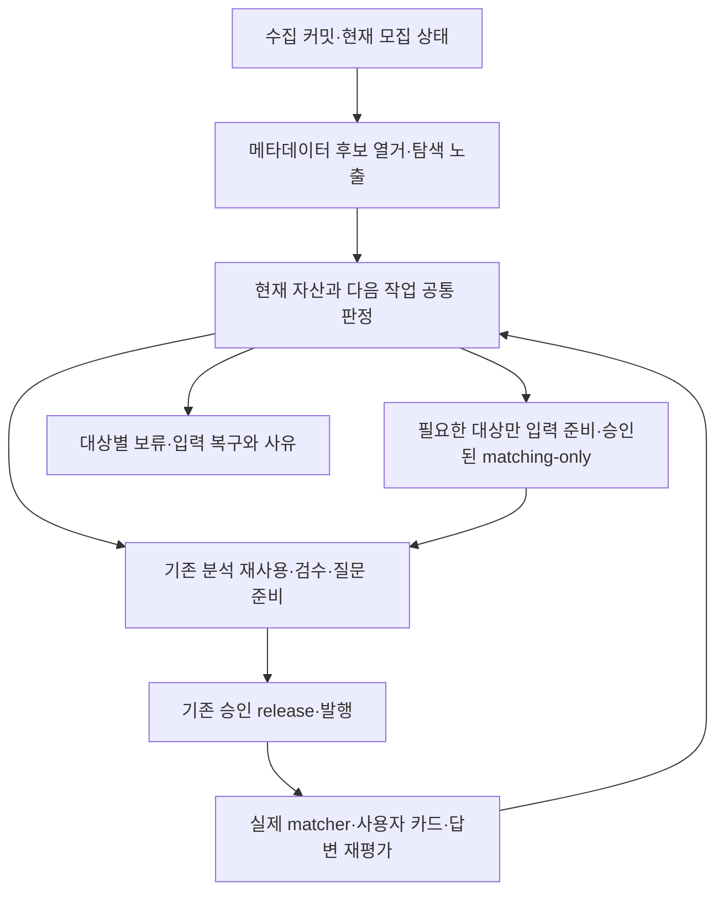

# 매칭 공급 — 근본 원인 재평가와 통합 개선 계획

작성: 2026-09-24 KST. 상태: **P0 결산·P1 통합 후보 구현 검증 중. 0087~0091 운영 DB schema 적용, 모델 실행·서비스 배포 없음**.

이 문서는 조건 공급 전환과 매칭·분석 개선 작업의 다음 실행을 합친 정본이다. 기존 조치 6b나 R3-3을 자동 재개하지 않는다. 과거 계획·receipt·검증 기록은 근거로 보존하며, 다음 작업의 우선순위는 이 문서를 따른다. 계획 작성은 기존 exact 실행 권한을 확대하지 않는다.

## 1. 평가 결론

**기존 방향의 핵심은 유지하되, 다음 작업을 ‘후보 준비의 안정성 → 판정과 실행의 통일 → 실제 공급 → 병목 한 곳 개선 → 반복 운영’으로 줄인다.**

지금까지의 작업은 실패한 것이 전부도 아니고, 운영만 켜면 끝나는 상태도 아니다. 매칭과 지원서 분리, 조건부 후보, 답변 저장·공유, 승인 발행·복구는 재사용할 자산이다. 그러나 분석 후보를 준비하는 경로, 새 공급 planner, 실제 실행 환경, 제품의 후보 조회가 하나의 운영 흐름으로 묶이지 않았다. 로컬 검증이 늘어도 서비스 공급이 따라오지 않는 이유다.

이번 세션의 조치 1~6a는 주로 **분석 자산 이후의 검수·질문·발행 연결**을 개선했다. 후보 선정 안정성이나 현재 모집단의 분석 처리량·공급 지연 개선을 입증하지 않았다. 앞선 “로컬에서 진행 가능한 구현은 마쳤다”는 보고는 이 하위 범위에 한정한다. 지금 필요한 일에는 후보 준비의 오류 격리와 campaign/supply 판정 통합이 남아 있다.

첫 운영 목표는 사업자가 현재 공고를 탐색하고, 근거가 있는 조건으로 추천받으며, 필요한 회사 사실에 답하면 결과가 저장·갱신되는 것이다. 신규 공고가 다음 수집에서도 같은 절차로 공급돼야 한다. 새 공고마다 에이전트가 코드를 고치거나 옛 문서를 찾아 실행 순서를 재구성해야 한다면 완료가 아니다.

## 2. 확인 범위와 증거의 한계

### 두 세션의 상태를 합친 기준

| 범위 | 현재 확인 | 해석 |
| --- | --- | --- |
| main | `/Users/ffgg/noten.works/cunote`, `d7958c6` 위 별도 dirty 변경 | 매칭 UI·repository·schema·OpenAPI 변경을 보존해야 함 |
| 조건 전환 | `/private/tmp/cunote-condition-transition`, `f2247e6` 위 커밋·미커밋 구현 | HEAD만 복제하면 조치 1~6a와 신규 파일이 빠짐 |
| 이전 인계 | 9월 24일 조건 공급 평가 인계의 중단 시점 기록 | 당시 공백 중 일부는 이후 구현으로 해소됨. 현재 결함 목록으로 그대로 사용하지 않음 |
| 이번 구현 | 9월 23일 조건 공급 구현 핸드오프의 조치 1~6a 및 조치 4 후속 | 실제 publisher·formal release 파일·DB writer·matcher 격리 경로, 정확한 재시도 SHA 검증 있음 |
| 검증 | 앞선 실행에서 PostgreSQL 92 migration, 웹 typecheck, 공급 준비도 suite 통과 | 사람 검수/current evidence/승인 gate는 합성 fixture. 현재 사용자 여정·운영 처리량의 증거가 아님 |
| 실행 환경 | 이 세션에서 운영 DB migration 0087~0091 적용 확인, 4010 서버는 main 소속 | schema 설치는 데이터 이관·서비스 배포·인증 화면 인수와 별개 |
| 세션 소유 | 이번 Orca 조회에서 관련 이전 구현 세션은 done, 전환 worktree에는 별도 실행 agent 없음 | 앞선 ‘다른 구현 세션이 활성이라 통합 보류’는 영구 장애가 아님. 다음 편집 직전 재확인 |

계획 작성 단계에서는 로컬 코드, 인계 문서, 기존 성능 JSON을 읽었다. 이번 실행에서 아래 P0 운영 DB를 읽기 전용으로 결산한 뒤, additive migration 0087~0091만 적용하고 다시 읽기 전용으로 공급 판정을 집계했다. 모델 호출·공급 데이터 쓰기·서비스 배포는 하지 않았다. 현재 운영의 p95와 실제 오판율은 미측정이다.

### 2026-09-24 P0 읽기 전용 현행 결산

이 표는 2026-09-24 05:02:45 UTC의 운영 DB `REPEATABLE READ READ ONLY` 조회다. 아래 항목은 서로 겹치며, 서비스 공급 판정이나 회사별 추천 수가 아니다.

| 항목 | K-Startup | BizInfo | 해석 |
| --- | ---: | ---: | --- |
| `open`·`visible` | 514 | 1,754 | 모집기간·중복 대표 필터 전 |
| 기간·중복 대표 필터 뒤 | 230 | 311 | 현재 탐색/작업 판정의 고유 공고 541건 |
| 활성 release의 `applied` promotion item 존재 | 48 | 54 | 102건은 재사용 *가능성*만 있음. exact source·receipt·현재 serving 검증 전 |
| 위 item이 없음 | 182 | 257 | 439건 중 이미 다른 criteria/검수 이력이 있는 건을 전부 신규 분석으로 셀 수 없음 |
| 적용 promotion item은 없으나 criteria 존재 | 112 | 132 | 439건 중 244건은 분석 이력을 따로 확인해야 함 |
| 위 집합에서 `needs_review` criterion 존재 | 80 | 115 | 실제 의미 보류 여부는 별도 review/receipt 확인 필요 |

현재 유효 후보의 raw 누락과 archive가 전혀 없는 선언 첨부는 집계상 0건이다. 이 집계만으로 원문/첨부 복구 1건이나 의미 모호성 보류 1건을 꾸며내지 않는다. 지난 7일 수집 event는 K-Startup 1,000건·고유 source ID 224개, BizInfo 280건·고유 120개다. event 500건은 7일 K-Startup 기간 조회에서 실제로 넘는다. 최근 24시간 event는 K-Startup 200건, BizInfo 40건이었다.

전체 541건 중 어떤 criteria든 있는 공고는 346건, `needs_review` criterion이 있는 공고는 221건이다. 이 값은 위 적용 promotion item 유무와 겹친다.

초기 조회에서 운영 Drizzle migration은 0086까지였다. 격리 PostgreSQL 검증 후 전환 코드의 additive 0087~0091 계약(`change_impact`, legacy 질문 이관, source rebind, 공급 evidence SHA)을 운영 DB에 적용하고 migration 기록·컬럼·테이블을 재확인했다. 레거시 데이터 backfill은 수행하지 않았다. Vercel의 현재 `changupnote.com` 배포는 READY이지만 CLI 배포의 Git SHA 메타데이터가 없어 정확한 소스 포함 관계를 입증하지 못했다. 전용 GCP 구성은 재인증이 필요해 Cloud Run generation은 확인하지 못했다. 런타임 DB는 paused·owner 없음·active deep/application lease 0으로 조회됐다. 이것은 새 live 모델 실행의 승인이나 운영 worker 상태 확인이 아니다.

새 loader의 초기 현행 541건 재판정은 `condition_review` 305, `source_change_review` 36, `condition_analysis` 195, `question_preparation` 5건이었다. `analysis.status`는 present 346, missing 195건이었다. 과거 102건의 nominal 최신 applied promotion을 별도 read-only verifier로 분해하면 45건은 manifest·source·parent state SHA를 통과했고, 57건은 현재 Kordoc version gate에서 manifest 검증이 거절됐다. 57건 모두 parent state SHA는 일치했고, 거절 이유는 과거 불변 release의 v9 RHWP evidence를 현재 신규 release admission에 대입한 것이었다. 현재 admission은 그대로 유지하고 역사 serving 판독에서만 v9를 허용하는 최소 수정을 후보 코드에 반영했다. 그 뒤 같은 운영 DB를 읽기 전용 재판정한 결과 A/B/C/D는 3/26/275/237건, 다음 작업은 `reuse_ready` 3, `question_preparation` 26, `condition_review` 275, `source_change_review` 42, `condition_analysis` 195건이었다. 실제 인증 serving 인수는 아직 별개다. 첫 7일 작업 347건은 inactive 144, source_review 200, 승인 release 대기 1, 승인 모델 실행 대기 2건이었다. 이후 2026-09-17T00:00Z~09-24T06:00Z 기간 재조회에서는 K-Startup 229/BizInfo 120, 총 349건 중 inactive 145, source_review 201(`condition_review` 169, `source_change_review` 32), 승인 release 대기 1, 승인 모델 실행 대기 2건이었다. 두 시점의 작업 cohort는 현행 541건과 모집단이 다르다.

기존 9월 14일 세 분석 artifact의 target wall은 61.574·124.106·66.970초, primary pass는 60.982·123.547·66.687초, repair는 0회였다. 이력 표본의 요청 queue 대기는 1ms 미만이었지만 현재 입력 준비·독립 검수·승인 발행·첫 서비스 조회 시간은 계측되지 않았다. P2 대표 6건은 위 541건 중 현행 근거를 추가 검증해 선택한다. 재사용 후보는 공식 PASS 풀에서 현재 결속을 실측했고, 수집원별 신규 분석 대상은 선정 중이다. 복구/모호성 사례는 미관찰이다.

기존 발행이 없는 `condition_review` 225건 중 148건은 로컬 publishable run 파일이 있다. 불변 launch receipt→run SHA와 독립 검수를 따라가면 27개 고유 공고(K-Startup 20/BizInfo 7)에 공식 PASS가 있다. 이 가운데 3건(K 1/B 2)을 기존 `loadAnalysisLaunchPromotionCohort`로 현재 입력·첨부·source와 재검증한 결과 모두 conditional로 통과했다. 148건 전체를 재사용 가능이라고 계산하지 않는다. 조사한 독립 검수 실패의 주요 유형은 matching projection exact 결속 불일치 82쌍이다. 재사용 대상 2건은 이 공식 통과 풀에서 exact 선정한다.

### 서로 다른 ‘후보’를 분리한다

| 후보 단계 | 질문 | 실패를 셀 때의 분모 |
| --- | --- | --- |
| 수집·탐색 후보 | 현재 모집·노출·중복 조건에 맞는 공고가 조회되는가? | 해당 snapshot의 고유 공고 |
| 분석 작업 후보 | 기존 자산을 재사용할지, 입력 복구·검수·신규 분석 중 무엇을 할지 정했는가? | 탐색 후보 중 작업 판정 대상 |
| 서비스 공급 후보 | 검수·현행성·발행 계약을 만족하는가? | 검수/발행 처리 대상 |
| 회사별 추천 후보 | 이 회사의 확정 정보와 조건을 비교하면 무엇이 남는가? | 해당 회사에 실제 평가한 공고 |

`discovery`는 공고를 탐색할 수 있다는 뜻이며 적격 추천의 증거가 아니다. 반대로 발행 증거가 없다고 과거 분석이 없다고 결론내리지 않는다. 실제 적합 공고가 없으면 0건도 올바른 결과일 수 있다. ‘0건 + 단계별 사유 없음’, ‘준비 실패로 전체 중단’, ‘확인 가능한 후보 누락’을 제품 결함과 구별해 조사한다.

## 3. 근본 원인 평가

### A. 공고 한 건의 실패를 격리하기 전에 전체 입력 준비를 요구한다 — 현재 코드로 확인

[`readCurrentEligibleMatchingTargets`](../../apps/web/src/lib/server/analysis-lab/current-inventory-launch-production.ts)는 open/visible·기간·중복 필터 뒤 **전체 후보**에 `prepareLabAnalysis`를 동시성 2의 `Promise.all`로 실행한다. 해당 루프에는 대상별 catch가 없다. 하나의 입력 준비 예외가 함수 전체를 reject할 수 있다. 모델 실행 뒤의 target 실패 격리만으로 이 앞단 문제가 해결되지는 않는다.

또한 [`prepareMatchingInventoryCampaign`](../../apps/web/src/lib/server/analysis-lab/matching-inventory-campaign-production.ts)은 이 전체 준비가 끝난 뒤 이력·readiness를 읽고 분류한다. DB/R2를 읽는 준비 비용을 선정 이전에 지불하는 구조다. 이 비용이 현재 총 지연의 몇 %인지는 아직 측정하지 않았다.

**조치:** 싼 메타데이터 후보 열거 → 자산/작업 분류 → 선택된 대상의 입력 준비 순서로 바꾼다. 단건 준비 실패는 사유를 보존해 격리하고 나머지를 계속한다. 현재 입력 SHA가 필요한 최종 실행 admission은 생략하지 않는다. 공통 인증·저장소 장애는 매 후보의 실패로 수백 번 반복하지 않고 공유 장애로 중단한다.

### B. 같은 공고의 다음 작업을 서로 다른 경로가 결정한다 — 현재 코드로 확인

새 [`grantSupply.ts`](../../apps/web/src/lib/server/productReadiness/grantSupply.ts)는 로컬 run·검수·manual 선택을 포함해 발행 준비까지 판단한다. campaign은 [`readCurrentMatchingNextWork`](../../apps/web/src/lib/server/analysis-lab/matching-inventory-campaign-production.ts)에서 DB readiness의 action을 읽고 별도 역사 분류를 더한다. 새 supply plan을 직접 소비하지 않는다. legacy 이력은 일괄 `quality_held`, input/attachment/contract 차이는 `source_changed`와 실행 가능 후보로 분류되는 경로도 남아 있다.

이 분류가 항상 틀렸다는 뜻은 아니다. **기존 자산 검수/재변환으로 해결되는 변경과 모델 신규 실행이 필요한 변경을 두 경로에서 동일하게 증명하지 못한다**는 것이 문제다. readiness의 `loadCurrentValidPromotions`도 탈락 후보를 제외하고 일부 검증 실패를 null로 반환하므로, 새 로컬 자산 조회 보강만으로 모든 탈락 이유가 복원되지는 않는다.

**조치:** 기존 supply/next-work 계약을 공통 판정으로 삼고 campaign·수집 후 보고·단건 CLI가 이를 소비하게 한다. 공유 판정은 증거 입력을 받아 결정하고, 각 환경의 loader가 증거를 제공한다. 새 상태 머신이나 두 번째 실행 원장을 만들지 않는다. 현행성/승인/lease 검증은 기존 실행 경계에서 유지한다.

### C. 실제 변경과 재처리 범위가 단계마다 다르다 — 과거 실증과 현재 잔여 위험

[매칭 단독 13건 진단](../research/2026-09-18-매칭단독13-원천결속-변경진단.md)은 모델 호출 전 source 검사 차단이었다. 입력·첨부는 13/13 동일했고 12건은 rawHash 치환으로 차이를 재현했다. raw 필드가 실제로 모두 무해했다는 증거는 아니다. 이후 matching-only material binding이 구현됐고, 현재 source impact v2와 rebind도 존재한다. 이 수정을 다시 새로 만들지 않는다.

현재도 launch·검수·발행·질문·serving이 각자 결속을 확인한다. 한 단계의 재사용 허용이 다음 단계까지 이어지는지를 확인해야 한다. 해시 비교를 없애거나 전체 raw 변경을 무시하는 방식은 새 제외조건 누락을 만들 수 있다.

**조치:** 관측값, 모집 상태, 조건 문구, 첨부, 회사 답변, 변환 계약 변경을 공통 회귀 사례로 유지한다. 영향이 입증된 단계만 재처리하고 입증 불가면 원문 검수로 보낸다. 정상 source rebind 전체 자동화를 첫 신규 공급의 선행조건으로 두지 않되, stale 자격 확정 차단은 필수로 둔다.

### D. 모델 지연·대기·재작업·미발행 시간이 하나의 ‘분석시간’으로 보고됐다 — 지표와 실행 단위 문제

과거 [8월 속도 기록](../research/2026-08-13-딥분석-처리속도-트랙-리뷰-정리.md)의 평균 57분은 신청서 분석·많은 호출·슬롯 대기가 포함된 당시 배치다. 현재 matching-only 속도로 사용할 수 없다.

[9월 11일 기준선](2026-09-11-신규공고-분석시간-단축-구현계획.md)의 세 건은 target wall 57.6~150.1초, 추가 보정 124.4초가 배치 wall의 36.6%였다. 이번에 main의 `spike-out/remeasure-20260914/target-performance.json`을 직접 집계하면 세 건의 target wall은 61.57·124.11·66.97초, 모델 보정은 각 0회다. 이 JSON 집계는 기존 산출물의 수치 확인이며 최신 실행·품질 보증이나 독립 검수/발행까지의 총시간이 아니다.

[`validated-primary.ts`](../../apps/web/src/lib/server/analysis-lab/validated-primary.ts)에는 보정 상한 2회, exact/semantic no-progress 종료, 패스별 시간·오류 기록이 이미 있다. 기존 처리속도 개선을 없는 것으로 가정해 다시 구현하지 않는다. 첫 패스 자체의 의미 오류, 검수 HOLD, 입력 준비·검수·발행 대기시간은 별도로 남는다.

**조치:** 기존 timestamp·passes·request events에서 단계별 시간을 한 번 결산한다. 가장 큰 실제 지연 한 곳을 고친다. 같은 입력의 전체 재생성, 반복 준비, 과도한 출력 중 무엇이 지배적인지 확인한 뒤 선택한다. 모델 교체·동시성 확대·새 부분보정 포맷을 동시에 도입하지 않는다.

### E. 의미 품질과 불확실성의 처리 책임이 다르다 — 품질 기준을 낮춰 해결할 수 없음

실제 원문의 OR/AND·필수/우대·제외·범위·기준일 오해가 과거 검수에서 확인됐다. 반면 회사 정보 누락과 신청서 필드 보류는 별개다. 이미 conditional 정책과 matching/authoring 분리는 구현돼 있다. ‘22축을 모두 알아야 해서 실패한다’는 단일 원인 설명은 부정확하다.

**조치:** 확인된 조건은 사용하고, 회사가 답할 수 있는 사실만 질문한다. 원문 모호성은 검수 책임으로 남긴다. 신규 공통 사실 정의는 검수 근거가 있어야 하지만, 구조화 조건만으로 공급 가능한 공고까지 새 공유 키·사람 정의 등록을 요구하지 않는다. 기존 formal 독립 검수는 유지하고 실제 사람이 필요한 의미 결정만 별도 작업으로 둔다.

### F. 실행 환경과 운영 책임이 연결되지 않았다 — 현재 가장 큰 제품화 공백

수집 publisher는 공급 작업을 반환하지만 후속 분석·검수·발행의 지속 실행자는 아니다. `grantSupply`의 자산 조회는 로컬 `spike-out/analysis-lab`에 의존한다. cloud 수집 환경에서는 unavailable을 정확히 반환해도 후속 처리 주체가 없으면 공급은 멈춘다. 이번의 단건 실행 CLI는 승인 release 소비자이며 release 준비·실제 의미 검수를 모두 자동화한 도구가 아니다. 로컬 human-reviewed 자산만으로 formal release를 새로 준비하는 경로도 아직 없다.

[9월 19일 실제 공급](../research/2026-09-19-매칭-실제공급-적용.md)은 기존 결과 44건을 추가 모델 호출 0으로 적용했다. 당시 44/44 공급 evidence 검증이 있었지만 현재 유효 건수는 아니며 인증 화면 인수도 별도다. **공급 능력 일부는 이미 있는데 일상 운영 흐름으로 고정되지 않은 것**으로 평가한다.

**조치:** 자산을 보유한 실행 환경과 공급 담당자를 하나로 고정하고, 다음 수집에서도 같은 기존 명령 흐름으로 처리한다. 로컬 구독 경로와 운영 API worker를 섞지 않는다. `observe_only` 해제나 사용자 요청 시 live 모델 호출은 이 계획의 자동 후속 작업이 아니다.

## 4. 기존 작업의 유지·축소 판정

| 묶음 | 판정 | 이번 통합에서 할 일 |
| --- | --- | --- |
| matching-only·conditional·discovery·실제 matcher | 유지 | 현재 경로를 먼저 인수. 후보를 완전 A까지 숨기지 않고 discovery를 적격으로 승격하지 않음 |
| 기존 launch·독립 검수·release·publication lock | 유지 | 한 운영 흐름으로 연결. 동일 승인 범위의 actor/child 단계를 사용자 재승인으로 늘리지 않음 |
| 공급 자산 선택·질문 수요·정확한 SHA 재시도 | 유지·단순화 | 조치 1~6a를 재구현하지 않고 campaign이 같은 결정을 사용하도록 정리 |
| 전체 후보 입력 준비·이력 처리 | 우선 수정 | 단계 순서, 대상별 오류 격리, bounded paging, 현재 자산 재사용의 설명 가능성 |
| 회사 사실 공유 | 기존 기능 보존, 확대 분리 | 의미·범위·기준일 계약 유지. 첫 실제 신규 공급에 4개 신규 공통 정의 생성을 강제하지 않음 |
| 원문 영향·source rebind | 필요한 안전성 유지, 자동화 확대 분리 | 현행성 차단·답변 보존 필수. 모든 변경 유형의 writer 완성은 후순위 |
| 레거시 질문 전체 이관 | 별도 작업으로 보류 | 실제 선택 공고의 기존 답변/reader가 요구할 때만 해당 범위 처리 |
| 신청서·Kordoc·RHWP 개선 | 독립 트랙 | 매칭 공급의 선행 gate에서 제외. 매칭에 필요한 첨부 자격 문맥은 계속 읽음 |
| Jev/새 모델·범용 queue·새 관제/승인 계층 | 현재 범위에서 제외 | 기존 경로의 실제 병목 증거 없이는 도입하지 않음 |
| 76개 문서 아카이브 | 보존·별도 변경 묶음 | 제품 코드 통합과 분리, 재정리 작업 확대 금지 |

‘첫 통합에서 제외’는 기존 파일 삭제나 답변·receipt 폐기를 뜻하지 않는다. 현재 serving reader가 legacy migration/source rebind 테이블을 참조하므로 0088~0090을 이름만 보고 빼면 안 된다. 최소 코드 묶음의 실제 import·schema 의존성을 따라 additive migration을 포함하되, 테이블 설치와 레거시 데이터 이관 실행을 구분한다. 0091의 공급 SHA는 과거 item에 추정 backfill하지 않는다.

## 5. 목표 운영 흐름

이 그림은 새 서버나 queue의 설계가 아니다. 기존 수집 이벤트/현재 DB, 공급 판정, launch, 검수, release, matcher를 잇는 운영 경로다. 다음 원칙을 구현한다.

- **사용자 조회는 저장된 근거와 matcher로 응답한다.** 분석/검수 모델이 끝날 때까지 요청을 붙잡지 않는다.
- **공통 판정 하나, 증거 loader는 환경별로 둔다.** 로컬 자산 unavailable은 새 모델 실행 사유가 아니다. 운영 수집은 커밋과 재발견 가능한 ID/이벤트를 남기고, 자산을 가진 공급 실행 환경이 뒤를 처리한다.
- **첫 운영 모드는 관리형 공급으로 고정한다.** 기존 로컬 구독 실험실에서 담당 운영자가 승인 범위 안의 campaign/검수/release를 진행하고 운영 서비스는 발행된 결과를 사용한다. 로컬 기기를 무인 production worker로 간주하지 않는다. 운영 창·담당자·장애 알림·백업/복구가 없는 상태는 운영 완료가 아니다.
- **완전 자동 공급은 별도 결정점이다.** 실제 유입량·적체와 요구 공급시간이 관리형 처리능력을 넘으면 기존 API worker의 bounded 운용을 검토한다. 그때 model/비용/배포/운영 승인 범위를 명시한다. 새 worker 플랫폼 구축을 첫 결과의 선행 과제로 두지 않는다.
- **원장과 재시도는 기존 것을 사용한다.** 같은 입력·단계의 성공을 보존하고 실패한 단계만 이어간다. 반복 보류는 원인별 담당과 다음 행동을 갖는다. 승인 대기·사람 검수 대기 역시 숨기지 않고 경과시간에 포함한다.

## 6. 필요한 작업만 남긴 실행 순서

한 세션이 통합 책임을 지고 한 번에 한 작업 묶음을 수행한다. 이전 파트별 모델 배정이나 자동 위임을 승계하지 않는다. 별도 구현 위임이 필요하면 새 범위와 파일 소유를 정한 뒤 판단한다.

### P0 — 현재 실패를 한 번만 결산하고 최소 통합 후보 고정

**산출물:** 이 문서에 붙이는 한 개의 현재 상태표와 적용 파일 목록. 새 전수조사 시스템은 만들지 않는다.

1. main·전환 폴더·최근 배포 소스의 포함 관계와 실제 DB migration 상태를 읽기 전용 확인한다. 다른 세션이 완료됐더라도 dirty 변경을 버리지 않는다. [통합 지도](../research/2026-09-22-조건공급-R0-통합지도.md)의 8개 동시 dirty 경로뿐 아니라 커밋된 변경과 main dirty가 겹치는 경로를 함께 대조한다.
2. 같은 시각의 탐색 후보·공급 후보·회사별 결과를 구별해 집계한다. 기존 artifact를 조회해 다음 작업을 지정하고 `분석 없음/조회 불가/검수 대기/미발행/실제 의미 오류`를 구분한다. 실패를 모두 분석 없음으로 합치지 않는다.
3. 기간 이벤트 조회는 500건 상한을 올려 넘기지 않는다. 안정된 정렬과 다음 페이지/커서로 읽고 source ID 중복을 제거한다. 대상 수와 이벤트 수를 분리하며 재시작 뒤 누락 여부를 확인한다. 현 코드에 없는 pagination은 P1의 작은 구현 항목이다. schema 미적용으로 조회가 실패하면 schema 차이를 먼저 기록하고 0건으로 집계하지 않는다.
4. 기존 stage timestamp와 성능 JSON으로 준비/슬롯대기/primary/repair/독립검수/발행대기 시간을 결산한다. 값이 없는 구간만 최소 계측을 추가할 목록에 넣는다. DB·원문·artifact 전체를 별도 보고서에 복사하지 않는다.

**종료:** snapshot 고유 대상 전부가 하나의 다음 작업 또는 명시적인 조회 실패 사유를 갖는다. 현재 실패 유형의 우선순위와 첫 실제 대상 6건의 선택 이유를 정한다. 역사적 537/502/342/44건은 현재 분모로 쓰지 않는다. 전수 이력 수리가 끝날 때까지 첫 대상 선정을 미루지 않는다.

### P1 — 후보 준비와 공급 판정을 하나로 연결

**수정 중심:** `current-inventory-launch-production.ts`, `matching-inventory-campaign-production.ts`, `matching-inventory-campaign.ts`, `grantSupply.ts`/CLI 및 필요한 loader.

1. 후보 열거와 무거운 입력 준비를 분리한다. 선택·재사용 판정에 필요한 증거만 읽고, 실행할 대상의 원문·첨부 결속은 봉인 직전 다시 확인한다. 본문/첨부를 읽지 않은 메타데이터만으로 의미 불변을 확정하지 않는다.
2. 단건 원문/R2/검증 실패는 해당 대상의 결과로 남기고 정상 대상을 계속 준비한다. 공통 인증/lease/저장소 장애는 공유 중단으로 구분한다. cursor/대상별 진행 결과는 기존 artifact·보고 구조 안에서 재사용한다.
3. campaign과 supply CLI에 같은 증거를 주었을 때 동일한 최소 다음 작업이 나오게 한다. contract 변경만으로 전체 모델 재실행을 예정하지 않는다. 재변환으로 해결 가능한지 확인하고, 의미적으로 재사용할 수 없을 때만 신규 실행 대기로 보낸다. legacy도 자동 발행하지 않되 필요한 검수/호환 확인 사유를 유지한다.
4. 운영 수집 경로의 로컬 파일 의존을 명시적으로 끊거나 비필수 진단으로 한정한다. 공급 실행 환경에서 자산 선택과 재개를 수행한다. 기존 formal 경로로 첫 공급이 가능하면 human-only release 신규 경로 개발은 보류한다. 선택 대상 때문에 반드시 필요할 때만 그 연결을 구현한다.

**필수 검증:** 대상 1건 입력 실패+정상 2건 계속, 공통 장애 중단, 500건 초과 이벤트의 페이지 경계·중복·재시작, 같은 증거의 campaign/supply 일치, 기존 성공 자산의 모델 호출 0. 실제 writer와 의미 계약을 바꾸지 않은 부분에 전체 제품 suite를 반복하지 않는다.

**종료:** 후보 준비가 전체 실패하거나 ‘다음 작업 표시 후 소유자 없음’으로 끝나지 않는다. 보류를 포함한 대상 합계가 보존되고, 선택된 정상 대상은 기존 검수/발행 명령으로 이어진다.

### P2 — 최소 소스를 통합해 실제 6건으로 공급 경로 인수

**소스:** main의 기존 기능 변경과 전환의 필요한 hunk를 소유자 확인 후 하나의 통합 후보에 반영한다. 전체 merge·문서 이동 일괄 stage는 하지 않는다. 통합한 소스·package runtime·migration 목록을 고정한다. 기존 테스트 결과는 같은 소스/계약 범위만 재사용한다.

**대상 제안:** 재사용 가능한 기존 분석 2건, 각 수집원에서 새로운 분석이 필요한 공고 1건씩, 원문/첨부 복구 1건, 실제 모호성 보류 1건. 모두 P0의 현재 모집단에서 고른다. 해당 유형이 없으면 억지로 대체·재분석하지 않고 미관찰로 적는다. 6건은 동작 인수이며 모집단 품질 통계가 아니다.

- 기존 자산 2건은 추가 primary 호출 없이 필요한 검수/질문/발행으로 간다.
- 신규 2건은 matching-only → 기존 독립 검수 → 승인 release → 실제 serving까지 같은 절차를 탄다. 합성 승인 원장을 실제 운영 증거로 사용하지 않는다.
- 입력 복구와 의미 보류는 정확한 다음 작업으로 남고 정상 공고의 공급을 막지 않는다. 의미 보류를 성공으로 집계하지 않는다.
- 대표 회사 사례에서 실제 후보 조회·조건 비교·인증 카드·답변 저장·수정·철회 결과를 대조한다. 잘못된 탈락/확정과 미확인 표시를 확인한다. 공유 로직을 바꾸지 않았다면 기존 네 공고 격리 증거를 재사용하고 새 공통 사실 정의를 일부러 만들지 않는다.
- 새 사용자 답변을 보존한 채 새 공급 실행/노출을 중단할 수 있어야 한다. 파괴적인 rollback 실험은 격리 환경에서 하고 운영에서는 승인된 제한 복구만 수행한다.

**검증 순서:** 관련 판정 테스트 → 통합 schema/실제 DB writer 격리 검증 → 실제 source/receipt 확인 → 승인된 제한 발행 → 해당 소스의 인증 화면. 기존 4010 main 서버로 다른 브랜치 UAT를 대신하지 않는다. 사용자 실행 서버 규칙을 따르되 그 대기가 P0/P1 구현을 막지는 않는다.

**종료:** 실제 신규 공고가 서비스 후보에 들어오거나 정당한 보류 이유로 종결되고, 사용자 답변이 저장·재평가된다. 코드 통과와 운영 적용을 각각 기록한다. exact 모델/서비스 쓰기 승인이 필요한 시점에는 준비된 대상·산출물·허용 상한만 확인하며, 같은 material 범위의 재시도마다 새 승인을 만들지 않는다.

### P3 — 관측된 최대 병목 하나를 줄인다

P0/P2의 결과로 아래에서 하나만 선택한다. 모델 단계가 주요 병목이 아니면 모델을 바꾸지 않는다.

| 실제 지연 원인 | 먼저 바꿀 것 | 보존해야 할 것 |
| --- | --- | --- |
| 입력 준비·반복 I/O | 선택 후 준비, 동일 입력/변환 자산 재사용, 중복 로드 제거 | 새 조건·제외·첨부 누락 탐지 |
| 슬롯/실행 대기 | 기존 transport 동시성 범위 안에서 공고·내부 호출량 정렬 | 구독 window·lease·대상 소유 |
| primary 출력/repair | 불필요 중복 출력과 결정적 정리 누락 수정, 기존 no-progress 활용 | 조건 의미·coverage·독립 검수 |
| 실제 의미 오류·검수 반복 | 우세한 오류 유형 하나의 추출/정규화/검수 계약 수정 | 정답 없는 문구를 임의 확정하지 않음 |
| 검수/발행 대기 | 기존 결과를 작은 단위로 다음 단계에 넘기고 담당/운영 주기 고정 | exact source·approval·답변 보존 |

**종료:** 동일한 지원 범위와 품질 기준으로 단계 시간·총 공급시간·추가 호출 수의 개선을 제시한다. 실패를 빨리 반환한 것을 성공 공급 속도 개선으로 계산하지 않는다. 기존 실패 사례는 회귀용, 이후 신규 표본은 일반화 확인용으로 구분한다. 두 차례 수정 후에도 같은 원인이 남으면 같은 예외 패치를 이어 붙이지 않고 해당 경계의 설계를 다시 결정한다.

### P4 — 한 번의 canary를 반복 운영으로 전환

새 수집분의 재발견 → 같은 판정 → 승인 범위의 실행/검수/발행을 담당 운영자가 같은 명령 순서로 수행한다. 프로세스 재시작과 하루 뒤 수집에서도 완료 결과를 재사용하고 누락 없이 이어가야 한다. 수동으로 새 상태를 조작하거나 새 에이전트 구현이 매번 필요하면 미완료다.

**산출물:** 기존 runbook에 실제 사용한 명령 순서, 담당자, 운영 시간·빈도, 중단/재개 조건, 잔여 backlog와 가장 오래 기다린 작업만 기록한다. 별도 모니터 시스템을 만들지 않는다. 읽기 집계는 모델 없이 수행한다.

**종료:** 두 수집원에서 두 번 이상의 실제 공급 주기와 재시작 복구를 확인한다. 그 후 신규 50건·최소 7일 관찰을 확대 판단에 사용한다. 이 관찰 기간을 첫 실제 공급이나 작은 결함 수정의 선행 gate로 옮기지 않는다. 관리형 처리능력이 지속 유입을 감당하지 못하면 운영 API worker 전환 범위를 결정한다.

## 7. 성공 기준과 중단 기준

### 시간과 품질을 함께 센다

`수집 커밋 → 후보 판정 → 입력 준비 → 실행 대기 → primary/repair → 독립 검수 → 승인/발행 → 서비스 첫 조회`를 구별한다. 병렬 stage의 합을 wall time에 다시 더하지 않는다. 승인·사람 검수 대기를 포함한 전체 경과시간과 순수 처리시간을 둘 다 보고한다. 없던 timestamp를 추정값으로 채우지 않는다.

초기 운영 목표 제안은 아래와 같다. **현재 달성 수치가 아니다.** P0에서 입력 크기·첨부 종류·운영 시간·유입량을 명시해 확정한다. 충족할 수 없다면 지원 범위/운영 용량을 바꾸고 미달을 기록한다.

| 지표 | 첫 목표/판정 |
| --- | --- |
| 누락 없는 작업 결산 | snapshot 대상 100%에 다음 작업/제외/조회 실패 사유, 중복·미분류 0 |
| 기존 자산 재사용 | 재사용 사례 primary 모델 호출 0, 성공 단계를 재실행하지 않음 |
| 신규 matching-only 처리 | 지원 범위의 모델 착수→primary 종결 p50 3분 이내·p95 10분 이내 제안. 검수/발행은 별도 계측 |
| 실제 공급 지연 | 운영 창 안에서 준비된 기존 자산 p95 10분, 신규 일반 공고 p95 60분 이내 제안. 보류/승인대기는 제외 건수와 전체 경과시간을 함께 보고 |
| 사용자 재평가 | 모델 호출 없이 저장·재평가, 내부 처리 p95 3초 이내 제안. 외부 사업자 조회는 별도 |
| 품질 | 대표 인수의 잘못된 자격 확정·확정 탈락·다른 의미 답변 전파·답변 소실 0. 소표본 무오류를 전체 오판율 0으로 주장하지 않음 |
| 운영 지속성 | 처리량이 유입량을 감당하고 가장 오래된 미처리 작업이 계속 증가하지 않음. 모델 terminal 수 대신 실제 발행 수/시간도 보고 |

6건 인수에서는 개별값·중앙값·최댓값을 보고하며 p95를 안정된 성능 증거로 주장하지 않는다. 확대 표본에서도 표본 수·두 수집원·입력 크기·미관찰 유형을 함께 남긴다. 실제 회사별 후보 누락/오판은 대표 회사와 공고의 사람이 확인한 비교 사례로 평가한다. 높은 publishable 비율이나 모델 confidence만으로 추천 정확성을 대신하지 않는다.

### 과잉 구현을 막는 실행 규칙

1. 각 변경은 **막힌 공고/단계 → 관측된 원인 → 최소 수정 → 사용자 결과** 한 줄로 설명돼야 한다. 설명할 수 없으면 현재 범위에서 뺀다.
2. P0 결산은 한 번 만들고 이후 바뀐 대상/증거만 갱신한다. 과거 전체 코호트·검수를 반복하지 않는다.
3. 새 queue, registry, successor 원장, 범용 조건 언어, 별도 대시보드는 기존 구조로 표현할 수 없는 실제 반례 없이는 추가하지 않는다.
4. 공유 계약 변경 때 필요한 집계 검증은 한 번 수행한다. 삭제된 일괄 하네스는 복원하지 않는다. 모델 호출을 코드 smoke test로 사용하지 않는다.
5. 단건 입력 오류·의미 보류는 해당 대상에 한정한다. 승인/manifest 손상·공통 인증 실패·lease 상실은 실행 전체를 멈춘다. 잘못된 확정·답변 유실은 해당 노출/쓰기를 중단하고 원인을 수정한다.
6. 실제 운영 권한은 현행 AGENTS.md와 이미 승인된 exact 범위를 따른다. 과거 exact19·다른 campaign 권한을 새 대상으로 전용하지 않는다.

## 8. 이번 실행 기록과 바로 이어질 일

P0의 동일 시각 결산과 7일 공급 판정을 수행했다. P1의 기간 source ID keyset pagination, 대상별 입력 실패 격리, campaign/supply 공통 판정, 선택 후 입력 준비를 통합 후보 `/private/tmp/cunote-condition-supply-candidate`에 반영했다. 이 후보에서 웹 production build, 웹 typecheck, PostgreSQL 제품 suite, 공급 pagination PostgreSQL 테스트, 공급 준비도 suite, campaign 29개 테스트가 통과했다. 격리 테스트와 build는 실제 공급·사람 검수·운영 인증 조회의 대체 증거가 아니다.

다음 우선순위는 v9 역사 serving 호환을 7일 공급 판정과 인증 제품 조회에서 확인하고, 남은 `condition_review` 275건의 다음 처리 경계를 정하는 것이다. 로컬 publishable 파일 존재만으로 release 자산으로 간주하지 않고 source/input/attachment 및 독립 검수 결속을 검증한다. 이어 P2의 현행 실제 대상을 고르고, 필요한 범위에만 exact 실행·검수·발행을 진행한다. P3 성능 개선과 P4 반복 운영 완료 판정은 이 실제 공급 결과가 있어야 가능하다.

이 문서는 실행 원장으로 갱신한다. 이전 세션의 9월 24일 평가 인계, 9월 23일 구현 핸드오프와 [종합계획](../research/2026-09-22-조건확인-공급체계-전환-종합실행계획.md)은 상세 근거로 참조한다.
