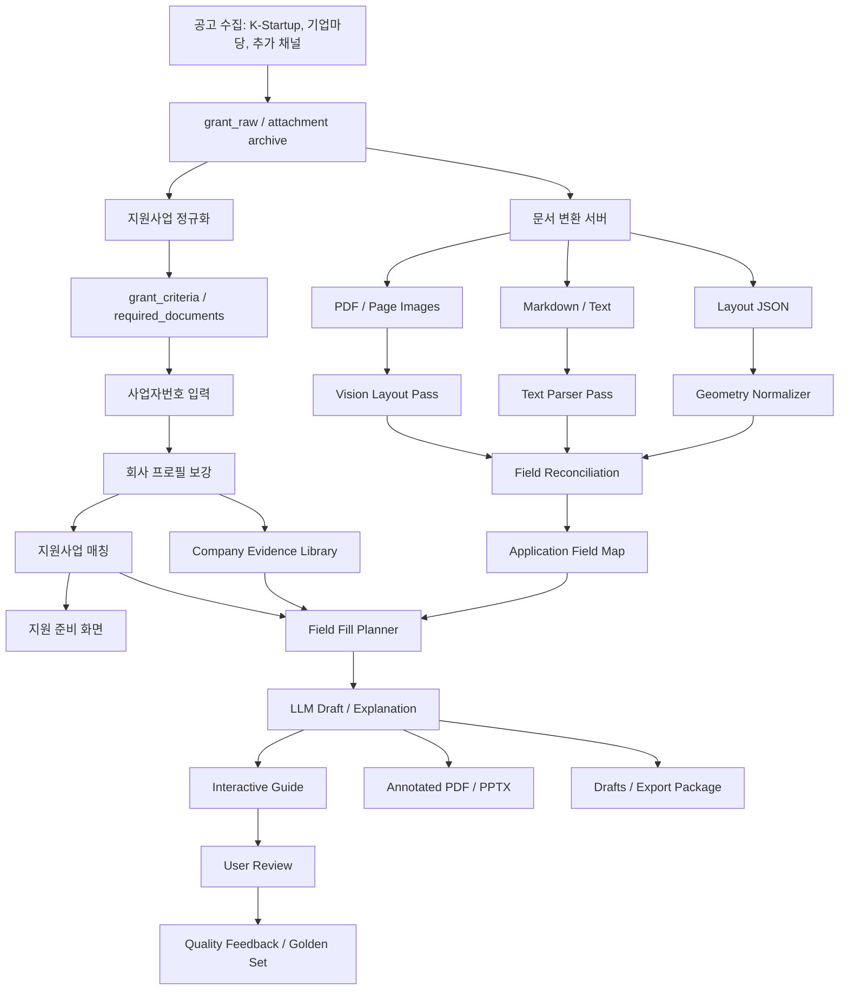
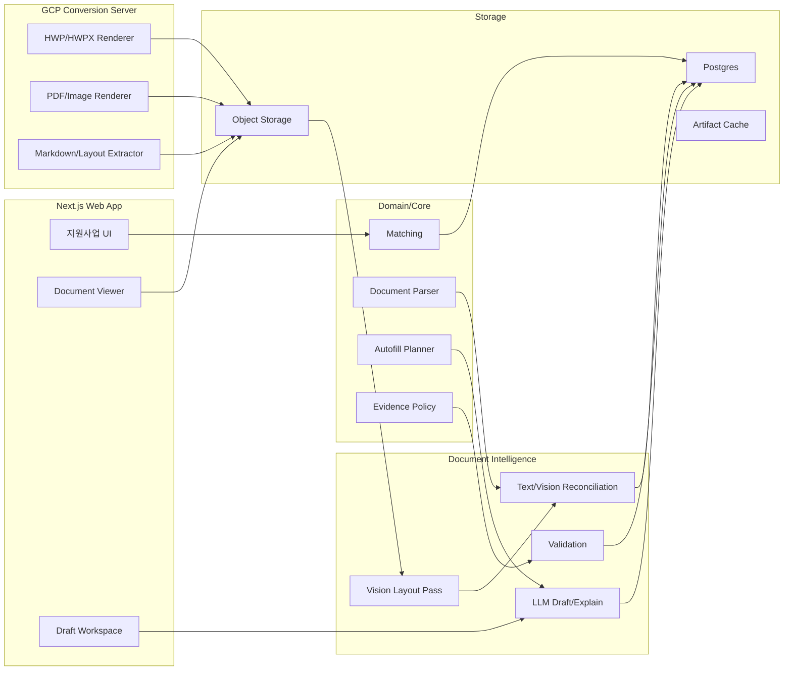

# 공공 지원사업 작성 가이드 마스터 아키텍처

작성일: 2026-07-02

## 1. 문서 목적

이 문서는 `cunote`의 핵심 비즈니스 모델을 `지원사업 발견 서비스`에서 `공공 지원사업 작성 가이드`로 확장하기 위한 단일 설계 문서다.

우리가 만들고자 하는 제품은 사업자가 사업자등록번호 하나로 신청 가능한 지원사업을 찾고, 그 지원사업의 공고/첨부양식/웹폼을 이해한 뒤, 실제 제출 전에 검토 가능한 수준의 입력값·초안·가이드를 제공하는 시스템이다.

이 문서는 다음을 하나로 묶는다.

- 우리의 의도와 설계 철학
- 궁극적으로 달성하고자 하는 목표
- 사용자에게 제공할 결과물
- 전체 파이프라인
- HWP/PDF/image/markdown/웹폼 처리 전략
- LLM vision/text 이중 판독 구조
- 자동채움 및 휴먼 터치 기준
- 기능 명세
- 데이터/API 구조
- 품질 기준과 PoC 검증 계획

## 2. 우리의 의도

공공 지원사업은 사업자에게 매우 큰 기회지만, 실제 신청 과정은 지나치게 어렵다.

사업자는 다음 문제를 동시에 겪는다.

- 내가 지원 가능한 사업을 찾기 어렵다.
- 공고문이 길고 조건이 복잡하다.
- 신청서, 사업계획서, 동의서, 증빙서류가 흩어져 있다.
- HWP 양식의 문항이 무엇을 요구하는지 이해하기 어렵다.
- 사업자 정보, 제품 설명, 실적, 예산, 기대효과를 어떻게 써야 할지 모른다.
- 포털 웹폼과 첨부 문서가 서로 다른 형식으로 요구된다.
- 제출 직전에는 법적 동의, 서명, 직인, 증빙 확인처럼 사람이 직접 판단해야 하는 단계가 많다.

우리의 의도는 이 복잡한 과정을 `검색 -> 해석 -> 준비 -> 작성 -> 검토`의 한 흐름으로 바꾸는 것이다.

우리는 사용자를 대신해 공공기관에 제출하는 자동 제출 대행사가 아니다. 우리는 사용자가 자기 사업을 더 정확하게 설명하고, 필요한 정보를 빠짐없이 준비하며, 공공 지원사업 양식에 맞춰 제출 전 검토 가능한 초안을 만들도록 돕는 작성 가이드 시스템이다.

## 3. 설계 철학

### 3.1 결과물 우선

인프라나 모델 자체가 제품 가치가 아니다. 사용자가 실제로 받는 결과물이 가치다.

우리가 최우선으로 봐야 할 결과물은 다음이다.

- 실제 원본 양식 위에 표시되는 입력 가이드
- 각 입력칸에 넣을 값
- 왜 그 값을 넣는지에 대한 쉬운 해설
- 어떤 회사 근거를 사용했는지
- 사용자가 직접 확인하거나 입력해야 할 누락 항목
- 제출 전 주의해야 할 동의/서명/증빙 체크

### 3.2 원본 편집보다 시각 가이드 우선

구형 HWP 원본을 완벽하게 수정해 되돌려주는 것은 난도가 높고 실패 리스크가 크다.

따라서 MVP의 핵심 결과물은 원본 HWP 수정본이 아니라 다음이다.

- HWP/HWPX/PDF를 고품질 PDF/page image로 렌더링
- 해당 이미지 위에 입력칸 overlay 표시
- 우측 패널에 입력값/근거/해설/복사 버튼 제공
- annotated PDF/PPTX guide export

HWPX, DOCX처럼 구조가 열린 포맷은 후속 단계에서 filled export를 시도한다.

### 3.3 텍스트와 시각을 모두 본다

문서 파싱은 한 경로에 의존하지 않는다.

- 텍스트 파서: markdown/text/table 구조를 빠르고 결정론적으로 추출
- 시각 파서: PDF/page image를 vision LLM 또는 OCR/layout parser로 읽어 빈칸, 표, 체크박스, 서명란 위치를 추출
- reconciliation: 두 결과를 합쳐 최종 field map 생성

텍스트 파서가 놓치는 시각 요소를 vision이 잡고, vision이 잘못 본 문항은 텍스트 근거가 보정한다.

### 3.4 근거 없는 자동작성 금지

LLM은 없는 사실을 만들어내면 안 된다.

특히 다음 정보는 회사 프로필, 증빙, 사용자 입력, 공고 원문 중 하나의 근거가 있어야 한다.

- 매출
- 고용 인원
- 인증
- 특허
- 수상
- 납품 실적
- 투자 유치
- 수출 실적
- 예산 산출근거

근거가 없으면 값을 생성하지 않고 `missing input`으로 돌린다.

### 3.5 휴먼 터치를 제품 구조에 포함한다

이 제품은 완전 자동화가 아니라 사람의 검토를 잘 배치하는 시스템이다.

휴먼 터치가 반드시 필요한 영역:

- 제품/서비스 설명의 사실성 확인
- 추진계획과 기대효과의 현실성 확인
- 예산표와 산출근거 확인
- 자격요건이 애매한 경우의 최종 판단
- 동의, 서약, 서명, 직인
- 증빙 파일 첨부
- 포털 최종 제출

## 4. 궁극적 목표

최종 목표는 다음이다.

> 사업자등록번호를 입력하면, 내가 신청 가능한 공공 지원사업을 찾고, 각 사업의 공고문과 제출양식을 해석해, 실제 양식 위에서 무엇을 어디에 어떻게 써야 하는지 안내하며, 사용자 사업에 맞춘 초안과 준비서류 체크리스트를 제공하는 서비스.

사용자가 경험해야 하는 최종 흐름은 다음과 같다.

```txt
사업자번호 입력
  -> 회사 정보 자동 파악
  -> 지원 가능한 사업 추천
  -> 공고별 적격/조건부/부적격 이유 설명
  -> 제출서류 자동 분류
  -> HWP/PDF/웹폼 양식 preview
  -> 입력칸 자동 표시
  -> 회사 정보와 사업 설명 기반 자동채움
  -> 부족한 항목 질문
  -> 사용자가 검토/수정
  -> annotated guide/export
  -> 사용자가 공식 포털에 직접 제출
```

## 5. 사용자 결과물

### 5.1 Interactive Document Guide

가장 중요한 화면이다.

```txt
┌──────────────────────────────┬────────────────────────────┐
│ 원본 양식 preview             │ 선택한 입력칸               │
│                              │ 항목명: 추진 계획           │
│ [파란 박스] 기업명            │ 쉬운 해설                   │
│ [파란 박스] 사업자등록번호     │ 자동 작성값                 │
│ [노란 박스] 제품 설명          │ 사용한 근거                 │
│ [노란 박스] 예산 산출근거      │ 입력 필요 항목              │
│ [회색 박스] 서명/직인          │ 복사 / 수정 / 저장          │
└──────────────────────────────┴────────────────────────────┘
```

상태 색상:

- 파란색: 자동채움 가능
- 노란색: 사용자 입력 필요
- 회색: 수동 처리 필요
- 빨간색: 검토 필요 또는 신뢰도 낮음

### 5.2 Field Fill Table

문서의 모든 입력 항목을 표로 보여준다.

| 항목 | 넣을 값 | 상태 | 근거 | 사용자 작업 |
|---|---|---|---|---|
| 기업명 | 주식회사 노튼 | 자동채움 | 회사 프로필 | 검토 |
| 사업자등록번호 | 000-00-00000 | 자동채움 | 사업자 정보 | 검토 |
| 제품/서비스 설명 | 사용자가 입력한 사업 설명 기반 문장 | 초안 | company evidence | 수정 |
| 예산 산출근거 | null | 입력 필요 | 근거 없음 | 작성 |
| 서명/직인 | null | 수동 | 양식 요구 | 직접 처리 |

### 5.3 Annotated PDF

원본 양식 이미지 또는 PDF 위에 번호 마커를 찍고, 각 번호별 입력값과 설명을 붙인 검토용 문서다.

용도:

- 사용자가 양식을 보며 따라 작성
- 운영팀/전문가가 초안 검수
- 고객 지원 시 공유

### 5.4 PPTX Guide

PPTX는 실제 제출 파일이 아니라 설명/검수/운영용 산출물이다.

구성:

1. 공고/회사/지원 가능성 요약
2. 제출서류 체크리스트
3. 원본 양식 이미지 + overlay
4. 항목별 입력값과 근거
5. 사용자가 직접 처리해야 할 항목
6. 제출 전 최종 체크리스트

### 5.5 Draft Package

다운로드 가능한 패키지:

- Markdown 초안
- 인쇄용 HTML
- annotated PDF
- PPTX guide
- 문항별 입력값 CSV/JSON
- 준비서류 manifest

## 6. 전체 구조도



## 7. 핵심 도메인 모델

### 7.1 Company Profile

이미 존재하는 회사 정보 기반이다.

현재 재사용:

- `companies`
- `company_profiles`
- `company_enrichment_cache`
- Popbill 기반 사업자 정보 보강

추가할 회사 evidence:

```ts
interface CompanyEvidenceItem {
  id: string;
  companyId: string;
  kind:
    | "product"
    | "customer"
    | "revenue"
    | "export"
    | "ip"
    | "certification"
    | "award"
    | "team"
    | "proof_file"
    | "business_goal";
  title: string;
  body: string;
  value: Record<string, unknown> | null;
  source: "self_declared" | "popbill" | "upload" | "external_api" | "admin";
  confidence: number;
  evidenceFileId?: string | null;
}
```

### 7.2 Grant

현재 재사용:

- `grants`
- `grant_criteria`
- `required_documents`
- `benefits`
- `match_state`
- `rule_trace`

역할:

- 지원 가능성 판단
- 왜 가능/조건부/불가능한지 설명
- 제출서류 목록 제공
- 준비해야 할 항목 도출

### 7.3 Application Surface

첨부 양식, PDF, 웹폼을 하나의 표준 모델로 다룬다.

```ts
interface GrantApplicationSurface {
  id: string;
  grantId: string;
  type: "file_template" | "web_form" | "freeform_instruction";
  title: string;
  format: "hwp" | "hwpx" | "docx" | "pptx" | "pdf" | "html" | "web" | "markdown" | "unknown";
  sourceUrl: string | null;
  sourceAttachment: string | null;
  extractionStatus: "pending" | "preview_ready" | "fields_ready" | "failed";
  confidence: number;
}
```

### 7.4 Document Artifact

변환 서버가 생성한 재사용 가능한 결과물이다.

```ts
interface DocumentArtifact {
  id: string;
  surfaceId: string;
  kind:
    | "original"
    | "pdf"
    | "page_image"
    | "markdown"
    | "layout_json"
    | "ocr_json"
    | "annotated_pdf"
    | "pptx_guide"
    | "filled_hwpx"
    | "filled_docx";
  page?: number;
  url: string;
  storageKey: string;
  sha256: string;
  metadata: Record<string, unknown>;
}
```

### 7.5 Application Field

실제 사용자가 채워야 하는 입력 항목이다.

```ts
interface ApplicationField {
  id: string;
  surfaceId: string;
  fieldKey: string;
  label: string;
  section: string | null;
  fieldType: "text" | "long_text" | "number" | "date" | "currency" | "checkbox" | "table" | "file" | "signature" | "stamp" | "unknown";
  fillStrategy: "copy" | "summarize" | "generate" | "ask_user" | "manual";
  required: boolean;
  sourceSpan: string | null;
  position: DocumentFieldPosition | null;
  confidence: number;
  reviewRequired: boolean;
}

interface DocumentFieldPosition {
  page?: number;
  bbox?: { x: number; y: number; width: number; height: number };
  blockId?: string;
  tablePath?: string;
  xpath?: string;
  cssSelector?: string;
}
```

### 7.6 Field Fill Plan

각 입력칸에 넣을 값과 해설이다.

```ts
interface FieldFillPlan {
  fieldId: string;
  value: string | null;
  guide: string;
  explanation: string;
  evidenceRefs: EvidenceRef[];
  missingInputs: MissingFieldQuestion[];
  warnings: string[];
  confidence: number;
  humanTouch: "none" | "review" | "required";
}
```

## 8. 파이프라인 상세

### 8.1 공고 수집

입력:

- K-Startup
- 기업마당
- 중소벤처24
- IRIS, 고용24, 수출바우처, 소진공/중진공 등 후속 채널

처리:

- 원문 저장
- 첨부 파일 아카이브
- 공고 본문 정규화
- 자격요건 추출
- 제출서류 taxonomy 매핑

출력:

- `grant_raw`
- `grants`
- `grant_criteria`
- `required_documents`
- attachment archive

### 8.2 사업자 이해

입력:

- 사업자등록번호
- Popbill/NTS/기타 사업자 데이터
- 사용자 자가 입력
- 업로드 증빙

처리:

- 사업자 기본정보 보강
- 회사 프로필 생성
- 부족한 필드 질문 생성
- 회사 evidence library 구성

출력:

- `CompanyProfile`
- `CompanyEvidenceItem[]`
- profile confidence

### 8.3 문서 변환

입력:

- HWP
- HWPX
- DOCX
- PPTX
- PDF
- 웹폼 URL

처리:

- 원본 무결성 확인
- PDF 렌더링
- page image 생성
- markdown/text 추출
- OCR/layout/table/cell 추출
- quality score 생성

출력:

- PDF artifact
- page image artifacts
- markdown artifact
- layout JSON artifact
- conversion quality

변환 서버는 LLM을 호출하지 않는다. 변환 서버는 재현 가능한 artifact 생성에만 집중한다.

### 8.4 Vision Layout Pass

입력:

- page image
- OCR/layout 후보
- parser 후보

역할:

- 빈칸 위치 탐지
- 표 셀 구조 탐지
- 체크박스 탐지
- 서명/직인/동의란 탐지
- 문항과 입력칸 연결

출력:

```ts
interface VisionFieldCandidate {
  page: number;
  label: string;
  kind: "text_input" | "long_text" | "checkbox" | "table_cell" | "signature" | "stamp" | "file_attach" | "instruction";
  bbox: { x: number; y: number; width: number; height: number };
  nearbyText: string;
  required: boolean | null;
  confidence: number;
  reason: string;
}
```

### 8.5 Text Parser Pass

현재 코드의 `extractGrantDocumentFields()`를 유지하되, 최종 결과가 아니라 후보 evidence 생성기로 역할을 조정한다.

탐지 대상:

- 표 내부 `항목 / 작성내용`
- 번호 문항
- 빈칸, 괄호, 밑줄
- 신청기업 정보
- 사업계획 섹션
- 예산/성과/실적 섹션

### 8.6 Field Reconciliation

Vision/Text/Layout 후보를 합쳐 최종 필드맵을 만든다.

신뢰도 규칙:

- text와 vision이 같은 항목을 가리키면 high
- vision만 잡은 빈칸은 medium
- text만 있고 위치가 없으면 medium
- 서명/동의/직인은 manual로 강제
- 표 구조가 깨지면 reviewRequired
- confidence가 낮은 필드는 운영 검수 큐로 보낸다

### 8.7 자동채움

필드별 fill strategy:

| 전략 | 설명 | 예시 |
|---|---|---|
| copy | 회사 프로필 정형값 복사 | 기업명, 사업자번호, 소재지 |
| summarize | 회사 evidence 요약 | 업종/분야, 인증, 실적 |
| generate | 근거 기반 문장 생성 | 추진계획, 기대효과 |
| ask_user | 근거 부족으로 질문 | 예산 산출근거, 제품 설명 |
| manual | 자동 처리 금지 | 서명, 직인, 첨부, 동의 |

### 8.8 LLM Draft / Explanation

LLM은 다음 결과를 구조화해 반환한다.

```ts
interface FieldDraftResult {
  fieldId: string;
  value: string | null;
  guide: string;
  explanation: string;
  evidenceRefs: EvidenceRef[];
  missingInputs: MissingFieldQuestion[];
  assumptions: string[];
  warnings: string[];
  confidence: number;
  reviewRequired: boolean;
}
```

LLM 호출 원칙:

- structured output 사용
- evidenceRefs 필수
- 숫자/실적/인증은 근거 없으면 null
- temperature 낮게
- prompt/model version 저장
- 결과 validator 통과 후 저장

### 8.9 사용자 검토

사용자는 다음 작업을 한다.

- 자동채움 값 확인
- 부족한 항목 입력
- 서술형 문장 수정
- 수동 처리 항목 확인
- 검토 완료 표시
- export

이 작업은 `grant_document_drafts`, `grant_document_draft_events`, `quality_feedback`에 남긴다.

## 9. 기능 명세

### 9.1 지원사업 추천

기능:

- 사업자번호 입력
- 회사 프로필 보강
- 지원 가능/조건부/불가능 분류
- 금액/마감/지원내용 요약
- 준비 난이도 표시
- 작성 가능 서류 수 표시

사용자 메시지:

- 지금 신청 가능
- 확인하면 신청 가능
- 준비하면 신청 가능
- 현재 조건으로는 어려움

### 9.2 지원 준비 탭

기능:

- 제출서류 그룹화
- 작성/발급/첨부/원문확인 분리
- 문서별 상태 표시
- 초안 가능 여부 표시
- 부족한 회사 정보 표시
- 원문 근거 표시

### 9.3 문서 Preview Viewer

기능:

- PDF/page image preview
- page navigation
- field overlay
- field status color
- 클릭 시 우측 inspector 열기
- zoom
- 필드 검색
- 상태 필터

### 9.4 Field Inspector

기능:

- 항목명
- 원문 문항
- 쉬운 해설
- 넣을 값
- 근거
- 누락 질문
- 경고
- 복사 버튼
- 수정 저장
- 검토 완료

### 9.5 Draft Workspace

기능:

- 문서별 초안 생성
- 문항별 자동채움 편집
- 섹션별 재생성
- field-level regenerate
- 사용자 수정 보존
- 저장/검토완료/export
- 품질 피드백

### 9.6 Annotated Export

기능:

- annotated PDF
- PPTX guide
- markdown package
- HTML print
- field table export
- 준비서류 manifest

### 9.7 웹폼 가이드

기능:

- 신청 링크 저장
- 포털 단계/필드 map
- selector/label 기반 입력 가이드
- 복사 가능한 값
- 첨부 체크리스트
- 제출 전 수동 확인

금지:

- 사용자 계정/인증정보 저장
- CAPTCHA 우회
- 사용자 확인 없는 동의/서약
- 자동 제출 버튼 클릭

## 10. 시스템 구성



## 11. 데이터베이스 제안

기존:

- `companies`
- `company_profiles`
- `company_enrichment_cache`
- `grants`
- `grant_criteria`
- `match_state`
- `grant_document_fields`
- `grant_document_drafts`
- `grant_document_draft_events`

추가:

```sql
grant_application_surfaces
  id uuid primary key
  grant_id uuid references grants(id)
  source text
  source_id text
  type text
  title text
  format text
  source_url text
  source_attachment text
  extraction_status text
  extraction_version text
  confidence real
  created_at timestamptz
  updated_at timestamptz

document_artifacts
  id uuid primary key
  surface_id uuid references grant_application_surfaces(id)
  kind text
  page integer
  storage_key text
  url text
  content_type text
  sha256 text
  metadata jsonb
  created_at timestamptz

company_evidence_items
  id uuid primary key
  company_id uuid references companies(id)
  kind text
  title text
  body text
  value jsonb
  source text
  confidence real
  evidence_file_id uuid
  created_by uuid references users(id)
  created_at timestamptz
  updated_at timestamptz

grant_document_field_explanations
  id uuid primary key
  field_id uuid references grant_document_fields(id)
  plain_explanation text
  eligibility_note text
  preparation_note text
  evidence_refs jsonb
  model_ver text
  prompt_ver text
  confidence real
  created_at timestamptz

web_form_field_maps
  id uuid primary key
  surface_id uuid references grant_application_surfaces(id)
  url text
  steps jsonb
  adapter text
  captured_at timestamptz
  capture_version text
```

기존 `grant_document_fields` 확장:

```sql
alter table grant_document_fields
  add column surface_id uuid,
  add column position jsonb,
  add column visual_evidence jsonb,
  add column text_evidence jsonb,
  add column review_required boolean default false;
```

기존 `grant_document_drafts` 확장:

```sql
alter table grant_document_drafts
  add column surface_id uuid,
  add column draft_plan jsonb,
  add column evidence_refs jsonb,
  add column llm_cost jsonb,
  add column review_state text default 'user_review_required';
```

## 12. API 제안

```txt
GET  /api/web/grants/:grantId/preparation
GET  /api/web/grants/:grantId/application-surfaces
POST /api/web/grants/:grantId/application-surfaces/extract

GET  /api/web/application-surfaces/:surfaceId/artifacts
GET  /api/web/application-surfaces/:surfaceId/fields
POST /api/web/application-surfaces/:surfaceId/fields/reconcile
POST /api/web/application-surfaces/:surfaceId/fields/explain

POST /api/web/application-surfaces/:surfaceId/drafts
GET  /api/web/document-drafts/:draftId
PATCH /api/web/document-drafts/:draftId
POST /api/web/document-drafts/:draftId/regenerate
POST /api/web/document-drafts/:draftId/field/:fieldId/regenerate
POST /api/web/document-drafts/:draftId/export
POST /api/web/document-drafts/:draftId/feedback

GET  /api/web/web-form-maps/:surfaceId
POST /api/web/web-form-maps/:surfaceId/capture
```

변환 서버 API:

```txt
POST /v1/conversion-jobs
GET  /v1/conversion-jobs/:jobId
GET  /v1/conversion-jobs/:jobId/artifacts
```

## 13. 품질 게이트

문서가 사용자에게 `자동작성 가능`으로 노출되려면 아래 기준을 통과해야 한다.

```ts
interface DocumentQualityGate {
  pdfRendered: boolean;
  pageImagesRendered: boolean;
  textExtracted: boolean;
  fieldCandidateCount: number;
  visualTextAgreement: number;
  requiredFieldCoverage: number;
  manualFieldDetected: boolean;
  severeWarnings: string[];
  status: "usable" | "usable_with_review" | "manual_required" | "failed";
}
```

권장 기준:

- PDF/image 렌더링 성공
- 텍스트 추출률 70% 이상
- 필수 문항 coverage 80% 이상
- visual/text agreement 0.65 이상
- 서명/동의/직인 manual 분류
- 심각한 변환 오류 없음

상태 정의:

- `usable`: 자동채움/가이드 제공 가능
- `usable_with_review`: 사용 가능하지만 검토 필요
- `manual_required`: 자동화보다 수동 검수 필요
- `failed`: 원본 다운로드 또는 운영자 처리 필요

## 14. 휴먼 터치 정책

### 반드시 사람이 확인해야 하는 것

- 제출 전 최종 문서
- 서명/직인/동의
- 포털 제출 버튼
- 첨부 파일 업로드
- 예산 산출근거
- 실적 수치
- 지원 자격이 애매한 조건

### 사용자가 입력해야 하는 것

- 제품/서비스 설명
- 지원 목적
- 추진계획의 현실적 일정
- 기대효과의 정량 목표
- 대표 실적
- 예산 항목과 단가/수량

### 운영자/전문가가 검수해야 하는 것

- low confidence field map
- 신규 양식 유형
- 자주 틀리는 공고/기관
- LLM 품질 피드백이 누적된 문항
- 고액/고위험 지원사업

## 15. 보안/신뢰 원칙

- 사업자번호, 대표자 정보, 증빙 파일은 회사 단위 권한으로 보호한다.
- LLM에는 필요한 최소 컨텍스트만 보낸다.
- 원본 문서, 변환 artifact, LLM output은 version/hash를 남긴다.
- 지원사업 제출 여부를 과장하지 않는다.
- 추천/초안/가이드는 제출 전 검토가 필요하다고 명확히 표시한다.
- 공식 포털 자동 제출은 하지 않는다.
- 사용자 동의 없는 외부 API 조회를 하지 않는다.

## 16. 운영 지표

제품 지표:

- 사업자번호 입력 완료율
- 추천 결과 도달률
- 지원 준비 탭 진입률
- 문서 preview 열람률
- 초안 생성률
- 검토 완료율
- export 비율
- 신청 링크 클릭률

문서 품질 지표:

- 변환 성공률
- field extraction coverage
- visual/text agreement
- 자동채움 가능한 필드 비율
- manual field recall
- hallucination report rate
- 사용자 수정률
- 문항별 피드백률

비즈니스 지표:

- 첫 초안 생성까지 걸린 시간
- 회사 evidence 재사용 횟수
- 공고별 신청 준비 완료 수
- 유료 전환 전 행동 수
- 고객이 실제 제출에 사용한 guide 비율

## 17. PoC 계획

### 샘플

- 기업마당 HWP/HWPX 작성양식 30개
- PDF 양식 10개
- DOCX 양식 10개
- 웹폼 링크 5개

### 검증 질문

1. HWP를 서버에서 원본과 유사한 PDF로 렌더링할 수 있는가?
2. Vision model이 입력칸/표/체크박스/서명란 bbox를 안정적으로 잡는가?
3. Text parser와 vision 결과가 충돌할 때 reconciliation이 실무적으로 맞는가?
4. 사업자 정형값 자동채움 precision이 충분한가?
5. 서술형 항목은 사용자 evidence 기반으로 쓸 만한 초안이 나오는가?
6. 사용자는 annotated guide만 보고 실제 양식에 옮겨 적을 수 있는가?

### 성공 기준

- PDF/image 렌더링 성공률 90% 이상
- 필드 후보 coverage 80% 이상
- 정형 필드 자동채움 precision 95% 이상
- 서명/동의/직인 manual 분류 recall 99% 이상
- 사용자가 실제 양식에 옮겨 적을 수 있다고 판단한 문서 70% 이상
- 근거 없는 수치/실적/인증 생성 0건

## 18. 구현 로드맵

### Phase 0. 기존 기능 고정

- 현재 `ApplicationPrep`, `DocumentDraftWorkspace`, `grant_document_fields`, `grant_document_drafts` 흐름을 기준 기능으로 고정
- deterministic draft는 fallback으로 유지
- 기존 verifier 유지

### Phase 1. Application Surface / Artifact 모델

- `grant_application_surfaces`
- `document_artifacts`
- 기존 attachment archive와 연결
- conversion job manifest 저장

### Phase 2. Conversion Server 연동

- HWP/HWPX/PDF/DOCX -> PDF/page image/markdown/layout JSON
- artifact cache
- conversion quality score
- 실패 fallback

### Phase 3. Viewer

- page image viewer
- overlay coordinate system
- field click/selection
- field inspector

### Phase 4. Vision/Text Reconciliation

- vision candidate schema
- text parser candidate schema
- reconciliation algorithm
- field confidence/review queue

### Phase 5. Evidence-grounded Draft

- company evidence library
- field fill planner
- LLM structured output
- hallucination validator
- field-level regeneration

### Phase 6. Export

- annotated PDF
- PPTX guide
- field table export
- package manifest

### Phase 7. 웹폼

- web form map
- portal별 adapter
- copy/paste guide
- 제출 전 manual guardrail

### Phase 8. 품질 운영

- golden set
- admin review queue
- model/prompt comparison
- correction analytics
- 비용/품질 dashboard

## 19. 현재 코드 재사용 지점

현재 기반:

- `apps/web/src/lib/server/serviceData.ts`: 회사/공고/매칭 로딩
- `packages/core/src/popbill/check-biz-info.ts`: 사업자 정보 조회
- `packages/core/src/company/profile-from-popbill.ts`: 회사 프로필 생성
- `packages/core/src/kstartup/*`: K-Startup 수집/정규화
- `packages/core/src/bizinfo/*`: 기업마당 수집/정규화/HWP 변환
- `packages/core/src/documents/preparation.ts`: 지원 준비 구조 생성
- `packages/core/src/documents/field-extraction.ts`: 문항/필드 추출
- `packages/core/src/documents/draft-generation.ts`: deterministic draft fallback
- `apps/web/src/lib/server/documents/grantPreparation.ts`: preparation API projection
- `apps/web/src/lib/server/documents/grantDocumentDrafts.ts`: draft 저장/수정/export/feedback
- `apps/web/src/features/apply-sheet/DocumentDraftWorkspace.tsx`: 사용자 편집 UI
- `apps/web/src/lib/server/ingestion/grantAttachmentArchive.ts`: 첨부 아카이브와 HWP markdown 변환

## 20. 비범위

MVP에서 하지 않는다.

- 모든 HWP 원본 직접 수정본 제공
- 공공 포털 자동 제출
- 사용자 계정/인증정보 저장
- CAPTCHA 우회
- 사용자 확인 없는 동의/서약/서명
- 근거 없는 실적/수치 생성
- 전문가 검수 없이 고위험 법률/세무 판단 확정

## 21. 최종 제품 정의

최종 제품은 다음 문장으로 정의한다.

> 창업노트는 사업자번호 하나로 지원 가능한 공공 지원사업을 찾고, 공고문과 HWP/PDF/웹폼 양식을 시각·텍스트로 해석한 뒤, 사업자의 실제 정보와 증거를 바탕으로 입력값·초안·해설·준비서류 체크리스트를 제공하는 공공 지원사업 작성 가이드다.

우리가 사용자의 시간을 줄이는 방식은 문서를 대신 제출하는 것이 아니라, 사용자가 어려워하는 해석과 작성 준비를 정확하고 검토 가능한 형태로 바꾸는 것이다.

## 22. 다음 실행 단위

가장 먼저 할 일은 PoC다.

1. 기업마당 HWP/HWPX 양식 30개 수집
2. GCP 변환 서버로 PDF/page image/markdown/layout JSON 생성
3. Vision field candidate 추출
4. 기존 text parser candidate와 reconcile
5. field overlay viewer prototype
6. 사업자 샘플 1개로 field fill plan 생성
7. annotated PDF/PPTX guide export
8. 사람이 실제 양식에 옮겨 적을 수 있는지 검수

이 PoC가 통과하면, 제품의 핵심 가설은 성립한다.
