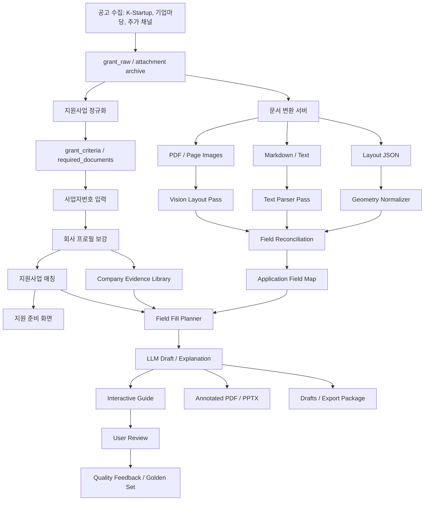
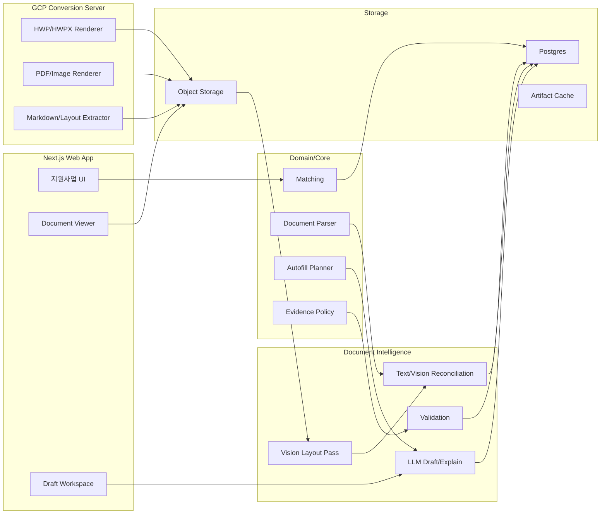

# 공공 지원사업 작성 가이드 마스터 아키텍처

작성일: 2026-07-02

## 1. 문서 목적

이 문서는 `cunote`의 핵심 비즈니스 모델을 `지원사업 발견 서비스`에서 `공공 지원사업 작성 가이드`로 확장하기 위한 단일 설계 문서다.

우리가 만들고자 하는 제품은 사업자가 사업자등록번호 하나로 신청 가능한 지원사업을 찾고, 그 지원사업의 공고/첨부양식/웹폼을 이해한 뒤, 실제 제출 전에 검토 가능한 수준의 입력값·초안·가이드를 제공하는 시스템이다.

이 문서는 다음을 하나로 묶는다.

- 우리의 의도와 설계 철학
- 궁극적으로 달성하고자 하는 목표
- 사용자에게 제공할 결과물
- 전체 파이프라인
- HWP/PDF/image/markdown/웹폼 처리 전략
- LLM vision/text 이중 판독 구조
- 자동채움 및 휴먼 터치 기준
- 기능 명세
- 데이터/API 구조
- 품질 기준과 PoC 검증 계획
- 리뷰어 피드백 학습 루프

관련 문서:

- `docs/hwp-visual-conversion-pipeline-design.md`: 변환 서버/렌더러 체인/GCP 구성/캐싱 상세. 이 문서와 함께 유지하며, 충돌 시 이 마스터 문서가 우선한다.
- `docs/research/2026-07-02-document-ai-sota.md` · `2026-07-02-hitl-loop-sota.md`: 외부 SOTA 대조 리서치. 3.3 bbox 역할 분리와 18장 lesson 게이트는 외부 근거로 재확인됨. kordoc/Upstage는 Gate 2 측정 후보, confidence 산출 정의는 13장에 반영.

## 2. 우리의 의도

공공 지원사업은 사업자에게 매우 큰 기회지만, 실제 신청 과정은 지나치게 어렵다.

사업자는 다음 문제를 동시에 겪는다.

- 내가 지원 가능한 사업을 찾기 어렵다.
- 공고문이 길고 조건이 복잡하다.
- 신청서, 사업계획서, 동의서, 증빙서류가 흩어져 있다.
- HWP 양식의 문항이 무엇을 요구하는지 이해하기 어렵다.
- 사업자 정보, 제품 설명, 실적, 예산, 기대효과를 어떻게 써야 할지 모른다.
- 포털 웹폼과 첨부 문서가 서로 다른 형식으로 요구된다.
- 제출 직전에는 법적 동의, 서명, 직인, 증빙 확인처럼 사람이 직접 판단해야 하는 단계가 많다.

우리의 의도는 이 복잡한 과정을 `검색 -> 해석 -> 준비 -> 작성 -> 검토`의 한 흐름으로 바꾸는 것이다.

우리는 사용자를 대신해 공공기관에 제출하는 자동 제출 대행사가 아니다. 우리는 사용자가 자기 사업을 더 정확하게 설명하고, 필요한 정보를 빠짐없이 준비하며, 공공 지원사업 양식에 맞춰 제출 전 검토 가능한 초안을 만들도록 돕는 작성 가이드 시스템이다.

## 3. 설계 철학

### 3.1 결과물 우선

인프라나 모델 자체가 제품 가치가 아니다. 사용자가 실제로 받는 결과물이 가치다.

우리가 최우선으로 봐야 할 결과물은 다음이다.

- 실제 원본 양식 위에 표시되는 입력 가이드
- 각 입력칸에 넣을 값
- 왜 그 값을 넣는지에 대한 쉬운 해설
- 어떤 회사 근거를 사용했는지
- 사용자가 직접 확인하거나 입력해야 할 누락 항목
- 제출 전 주의해야 할 동의/서명/증빙 체크

### 3.2 원본 편집보다 시각 가이드 우선

구형 HWP 원본을 완벽하게 수정해 되돌려주는 것은 난도가 높고 실패 리스크가 크다.

따라서 MVP의 핵심 결과물은 원본 HWP 수정본이 아니라 다음이다.

- HWP/HWPX/PDF를 고품질 PDF/page image로 렌더링
- 해당 이미지 위에 입력칸 overlay 표시
- 우측 패널에 입력값/근거/해설/복사 버튼 제공
- annotated PDF/PPTX guide export

HWPX, DOCX처럼 구조가 열린 포맷은 후속 단계에서 filled export를 시도한다.

### 3.3 텍스트와 시각을 모두 본다

문서 파싱은 한 경로에 의존하지 않는다.

- 텍스트 파서: markdown/text/table 구조를 빠르고 결정론적으로 추출
- layout 파서: OCR/layout 엔진(Document AI Layout/Form Parser 등)이 블록/표/셀/빈칸의 bbox를 결정론적으로 추출
- vision LLM: bbox 생성이 아니라 의미 해석을 담당 — 문항과 입력칸 연결, 필드 종류 판정, layout이 놓친 시각 요소 지목
- reconciliation: 세 결과를 합쳐 최종 field map 생성

좌표(bbox)의 1차 소유자는 결정론적 layout 엔진이다. vision LLM의 bbox는 모델별 편차가 커서 단독으로 신뢰하지 않으며, layout 블록에 대한 참조(anchor)와 보정 신호로만 쓴다. 텍스트 파서가 놓치는 시각 요소를 vision이 잡고, vision이 잘못 본 문항은 텍스트/layout 근거가 보정한다.

### 3.4 근거 없는 자동작성 금지

LLM은 없는 사실을 만들어내면 안 된다.

특히 다음 정보는 회사 프로필, 증빙, 사용자 입력, 공고 원문 중 하나의 근거가 있어야 한다.

- 매출
- 고용 인원
- 인증
- 특허
- 수상
- 납품 실적
- 투자 유치
- 수출 실적
- 예산 산출근거

근거가 없으면 값을 생성하지 않고 `missing input`으로 돌린다.

### 3.5 휴먼 터치를 제품 구조에 포함한다

이 제품은 완전 자동화가 아니라 사람의 검토를 잘 배치하는 시스템이다.

휴먼 터치가 반드시 필요한 영역:

- 제품/서비스 설명의 사실성 확인
- 추진계획과 기대효과의 현실성 확인
- 예산표와 산출근거 확인
- 자격요건이 애매한 경우의 최종 판단
- 동의, 서약, 서명, 직인
- 증빙 파일 첨부
- 포털 최종 제출

## 4. 궁극적 목표

최종 목표는 다음이다.

> 사업자등록번호를 입력하면, 내가 신청 가능한 공공 지원사업을 찾고, 각 사업의 공고문과 제출양식을 해석해, 실제 양식 위에서 무엇을 어디에 어떻게 써야 하는지 안내하며, 사용자 사업에 맞춘 초안과 준비서류 체크리스트를 제공하는 서비스.

사용자가 경험해야 하는 최종 흐름은 다음과 같다.

```txt
사업자번호 입력
  -> 회사 정보 자동 파악
  -> 지원 가능한 사업 추천
  -> 공고별 적격/조건부/부적격 이유 설명
  -> 제출서류 자동 분류
  -> HWP/PDF/웹폼 양식 preview
  -> 입력칸 자동 표시
  -> 회사 정보와 사업 설명 기반 자동채움
  -> 부족한 항목 질문
  -> 사용자가 검토/수정
  -> annotated guide/export
  -> 사용자가 공식 포털에 직접 제출
```

## 5. 사용자 결과물

### 5.1 Interactive Document Guide

가장 중요한 화면이다.

```txt
┌──────────────────────────────┬────────────────────────────┐
│ 원본 양식 preview             │ 선택한 입력칸               │
│                              │ 항목명: 추진 계획           │
│ [파란 박스] 기업명            │ 쉬운 해설                   │
│ [파란 박스] 사업자등록번호     │ 자동 작성값                 │
│ [노란 박스] 제품 설명          │ 사용한 근거                 │
│ [노란 박스] 예산 산출근거      │ 입력 필요 항목              │
│ [회색 박스] 서명/직인          │ 복사 / 수정 / 저장          │
└──────────────────────────────┴────────────────────────────┘
```

상태 색상:

- 파란색: 자동채움 가능
- 노란색: 사용자 입력 필요
- 회색: 수동 처리 필요
- 빨간색: 검토 필요 또는 신뢰도 낮음

### 5.2 Field Fill Table

문서의 모든 입력 항목을 표로 보여준다.

| 항목 | 넣을 값 | 상태 | 근거 | 사용자 작업 |
|---|---|---|---|---|
| 기업명 | 주식회사 노튼 | 자동채움 | 회사 프로필 | 검토 |
| 사업자등록번호 | 000-00-00000 | 자동채움 | 사업자 정보 | 검토 |
| 제품/서비스 설명 | 사용자가 입력한 사업 설명 기반 문장 | 초안 | company evidence | 수정 |
| 예산 산출근거 | null | 입력 필요 | 근거 없음 | 작성 |
| 서명/직인 | null | 수동 | 양식 요구 | 직접 처리 |

### 5.3 Annotated PDF

원본 양식 이미지 또는 PDF 위에 번호 마커를 찍고, 각 번호별 입력값과 설명을 붙인 검토용 문서다.

용도:

- 사용자가 양식을 보며 따라 작성
- 운영팀/전문가가 초안 검수
- 고객 지원 시 공유

### 5.4 PPTX Guide

PPTX는 실제 제출 파일이 아니라 설명/검수/운영용 산출물이다.

구성:

1. 공고/회사/지원 가능성 요약
2. 제출서류 체크리스트
3. 원본 양식 이미지 + overlay
4. 항목별 입력값과 근거
5. 사용자가 직접 처리해야 할 항목
6. 제출 전 최종 체크리스트

### 5.5 Draft Package

다운로드 가능한 패키지:

- Markdown 초안
- 인쇄용 HTML
- annotated PDF
- PPTX guide
- 문항별 입력값 CSV/JSON
- 준비서류 manifest

## 6. 전체 구조도



## 7. 핵심 도메인 모델

### 7.1 Company Profile

이미 존재하는 회사 정보 기반이다.

현재 재사용:

- `companies`
- `company_profiles`
- `company_enrichment_cache`
- Popbill 기반 사업자 정보 보강

추가할 회사 evidence:

```ts
interface CompanyEvidenceItem {
  id: string;
  companyId: string;
  kind:
    | "product"
    | "customer"
    | "revenue"
    | "export"
    | "ip"
    | "certification"
    | "award"
    | "team"
    | "proof_file"
    | "business_goal";
  title: string;
  body: string;
  value: Record<string, unknown> | null;
  source: "self_declared" | "popbill" | "upload" | "external_api" | "admin";
  confidence: number;
  evidenceFileId?: string | null;
}
```

### 7.2 Grant

현재 재사용:

- `grants` (`required_documents`, `benefits`는 별도 테이블이 아니라 grants의 jsonb 컬럼)
- `grant_criteria`
- `match_state` (`rule_trace`는 match_state의 jsonb 컬럼)

역할:

- 지원 가능성 판단
- 왜 가능/조건부/불가능한지 설명
- 제출서류 목록 제공
- 준비해야 할 항목 도출

### 7.3 Application Surface

첨부 양식, PDF, 웹폼을 하나의 표준 모델로 다룬다.

```ts
interface GrantApplicationSurface {
  id: string;
  grantId: string;
  type: "file_template" | "web_form" | "freeform_instruction";
  title: string;
  format: "hwp" | "hwpx" | "docx" | "pptx" | "pdf" | "html" | "web" | "markdown" | "unknown";
  sourceUrl: string | null;
  sourceAttachment: string | null;
  extractionStatus: "pending" | "preview_ready" | "fields_ready" | "failed";
  confidence: number;
}
```

### 7.4 Document Artifact

변환 서버가 생성한 재사용 가능한 결과물이다.

```ts
interface DocumentArtifact {
  id: string;
  surfaceId: string;
  kind:
    | "original"
    | "pdf"
    | "page_image"
    | "markdown"
    | "layout_json"
    | "ocr_json"
    | "annotated_pdf"
    | "pptx_guide"
    | "filled_hwpx"
    | "filled_docx";
  page?: number;
  url: string;
  storageKey: string;
  sha256: string;
  metadata: Record<string, unknown>;
}
```

### 7.5 Application Field

실제 사용자가 채워야 하는 입력 항목이다.

```ts
interface ApplicationField {
  id: string;
  surfaceId: string;
  fieldKey: string;
  label: string;
  section: string | null;
  fieldType: "text" | "long_text" | "number" | "date" | "currency" | "checkbox" | "table" | "file" | "signature" | "stamp" | "unknown";
  fillStrategy: "copy" | "summarize" | "generate" | "ask_user" | "manual";
  required: boolean;
  sourceSpan: string | null;
  position: DocumentFieldPosition | null;
  confidence: number;
  reviewRequired: boolean;
}

interface DocumentFieldPosition {
  page?: number;
  bbox?: { x: number; y: number; width: number; height: number };
  blockId?: string;
  tablePath?: string;
  xpath?: string;
  cssSelector?: string;
}
```

### 7.6 Field Fill Plan

각 입력칸에 넣을 값과 해설이다.

```ts
interface FieldFillPlan {
  fieldId: string;
  value: string | null;
  guide: string;
  explanation: string;
  evidenceRefs: EvidenceRef[];
  missingInputs: MissingFieldQuestion[];
  warnings: string[];
  confidence: number;
  humanTouch: "none" | "review" | "required";
}
```

### 7.7 Form Template

공공 양식은 표준 사업계획서처럼 기관 간·연도 간 반복된다. 검증된 field map을 재사용하기 위해 surface 위에 template 개념을 둔다. 이것이 추출 비용·품질·운영 검수 부담을 동시에 줄이는 가장 큰 지렛대다.

재사용 규칙:

- sha256 정확 일치: artifact와 field map 전체 재사용. 회사별로 달라지는 것은 fill plan/draft뿐이다 (`grant_attachment_archives.sha256` 인덱스 재사용)
- 구조 유사(제목/섹션/필드 시그니처 기반 structure hash 일치): 검수된 field map을 추출 시드로 사용하고 diff만 재검토
- 운영 검수를 통과한 field map은 template으로 승격해 이후 동일 양식의 추출을 대체한다

```ts
interface FormTemplate {
  id: string;
  title: string;
  structureHash: string;
  canonicalSurfaceId: string;
  verifiedFieldMapVersion: string | null;
  usageCount: number;
}
```

## 8. 파이프라인 상세

### 8.1 공고 수집

입력:

- K-Startup
- 기업마당
- 중소벤처24
- IRIS, 고용24, 수출바우처, 소진공/중진공 등 후속 채널

처리:

- 원문 저장
- 첨부 파일 아카이브
- 공고 본문 정규화
- 자격요건 추출
- 제출서류 taxonomy 매핑

출력:

- `grant_raw`
- `grants`
- `grant_criteria`
- `required_documents`
- attachment archive

### 8.2 사업자 이해

입력:

- 사업자등록번호
- Popbill/NTS/기타 사업자 데이터
- 사용자 자가 입력
- 업로드 증빙

처리:

- 사업자 기본정보 보강
- 회사 프로필 생성
- 부족한 필드 질문 생성
- 회사 evidence library 구성

출력:

- `CompanyProfile`
- `CompanyEvidenceItem[]`
- profile confidence

### 8.3 문서 변환

입력:

- HWP
- HWPX
- DOCX
- PPTX
- PDF
- 웹폼 URL

처리:

- 원본 무결성 확인
- PDF 렌더링
- page image 생성
- markdown/text 추출
- OCR/layout/table/cell 추출
- quality score 생성

출력:

- PDF artifact
- page image artifacts
- markdown artifact
- layout JSON artifact
- conversion quality

변환 서버는 LLM을 호출하지 않는다. 변환 서버는 재현 가능한 artifact 생성에만 집중한다.

#### 렌더러 체인

HWP 시각 렌더링이 이 파이프라인 전체의 최대 기술 리스크다. 아래 체인을 순서대로 시도하고, 어떤 엔진으로 렌더링했는지와 render quality score를 artifact metadata에 기록한다.

| 순위 | 엔진 | 용도 | 비고 |
|---|---|---|---|
| 1 | HWPX native (XML/ZIP 직접 파싱) | HWPX 구조/텍스트/렌더링 | 열린 포맷, filled export 후보 |
| 2 | 상용/전용 HWP 렌더러 또는 한컴 계열 headless | HWP -> PDF 시각 렌더링 | PoC Gate 0에서 후보 비교 후 확정 |
| 3 | LibreOffice HWP 필터 | 보조 렌더링 | 표/서식 품질 낮음, quality score로 판별 |
| 4 | pyhwp `hwp5html` (현재 `packages/core/src/bizinfo/hwp-markdown.ts`) | 텍스트/XHTML 추출 | 이미 운영 중, 시각 렌더링 불가 |
| 5 | 원본 다운로드 fallback | 렌더링 실패 시 | 텍스트 기반 가이드만 제공 |

렌더링에 실패한 문서도 사용자 결과물이 있어야 한다: 원본 다운로드 + markdown 기반 Field Fill Table(5.2) + 준비서류 체크리스트. 렌더링 실패는 내부 상태값이 아니라 별도로 설계된 UX다. 렌더링 성공률이 90%면 사용자 10명 중 1명이 이 경로를 겪는다.

#### 변환/추출 트리거와 비용 정책

- 결정론적 변환(PDF/image/markdown/layout)은 첨부 아카이브 시점에 전량 실행한다. 비용이 낮고 캐시 효율이 높다.
- vision pass + reconciliation은 티어링한다: 매칭 노출 상위 공고와 마감 임박 공고는 사전 실행, long-tail 공고는 사용자 진입 시 on-demand 실행 + 진행 상태 UI 제공.
- 캐시 키는 `sha256 + converter/extractor version`이다. 같은 파일은 회사가 달라도 artifact와 field map을 재사용한다 (7.7 Form Template).
- 문서당 vision 비용 상한과 월 추출 예산 상한을 정하고 16장의 지표로 추적한다.

### 8.4 Vision Layout Pass

입력:

- page image
- OCR/layout 후보
- parser 후보

역할 분담 (3.3의 원칙을 따른다):

- layout 엔진(결정론적): 빈칸/표 셀/체크박스의 bbox와 구조 탐지
- vision LLM: layout 블록의 의미 해석 — 문항과 입력칸 연결, 필드 종류/필수 여부 판정, 서명·직인·동의란 식별, layout이 놓친 시각 요소 지목

좌표계 규칙:

- page image 렌더링 DPI는 220(기본)/300(고밀도 양식)으로 고정하고 artifact metadata에 기록한다
- 저장 좌표는 페이지 크기 기준 0~1 상대좌표로 정규화한다 (viewer zoom, PDF pt 변환 대응)
- vision이 낸 bbox는 layout 블록에 snap 가능한 경우 layout 좌표로 치환한다

출력:

```ts
interface VisionFieldCandidate {
  page: number;
  label: string;
  kind: "text_input" | "long_text" | "checkbox" | "table_cell" | "signature" | "stamp" | "file_attach" | "instruction";
  bbox: { x: number; y: number; width: number; height: number };
  bboxSource: "layout" | "vision";
  layoutBlockId: string | null;
  nearbyText: string;
  required: boolean | null;
  confidence: number;
  reason: string;
}
```

### 8.5 Text Parser Pass

현재 코드의 `extractGrantDocumentFields()`를 유지하되, 최종 결과가 아니라 후보 evidence 생성기로 역할을 조정한다.

탐지 대상:

- 표 내부 `항목 / 작성내용`
- 번호 문항
- 빈칸, 괄호, 밑줄
- 신청기업 정보
- 사업계획 섹션
- 예산/성과/실적 섹션

### 8.6 Field Reconciliation

Vision/Text/Layout 후보를 합쳐 최종 필드맵을 만든다.

신뢰도 규칙:

- text와 vision이 같은 항목을 가리키면 high
- vision만 잡은 빈칸은 medium
- text만 있고 위치가 없으면 medium
- 서명/동의/직인은 manual로 강제
- 표 구조가 깨지면 reviewRequired
- confidence가 낮은 필드는 운영 검수 큐로 보낸다

### 8.7 자동채움

필드별 fill strategy:

| 전략 | 설명 | 예시 |
|---|---|---|
| copy | 회사 프로필 정형값 복사 | 기업명, 사업자번호, 소재지 |
| summarize | 회사 evidence 요약 | 업종/분야, 인증, 실적 |
| generate | 근거 기반 문장 생성 | 추진계획, 기대효과 |
| ask_user | 근거 부족으로 질문 | 예산 산출근거, 제품 설명 |
| manual | 자동 처리 금지 | 서명, 직인, 첨부, 동의 |

### 8.8 LLM Draft / Explanation

LLM은 다음 결과를 구조화해 반환한다.

```ts
interface FieldDraftResult {
  fieldId: string;
  value: string | null;
  guide: string;
  explanation: string;
  evidenceRefs: EvidenceRef[];
  missingInputs: MissingFieldQuestion[];
  assumptions: string[];
  warnings: string[];
  confidence: number;
  reviewRequired: boolean;
}
```

LLM 호출 원칙:

- structured output 사용
- evidenceRefs 필수. validator는 인용의 존재만이 아니라 **값↔근거 span 정렬**을 검사한다 (인용했으나 실제로 쓰지 않은 post-rationalization 차단)
- 숫자/실적/인증은 근거 없으면 null
- temperature 낮게
- prompt/model version 저장
- 결과 validator 통과 후 저장
- confidence는 logprob으로 계산하지 않는다 (structured output에서 포화하며 Claude는 미제공). 산출 정의는 13장

### 8.9 사용자 검토

사용자는 다음 작업을 한다.

- 자동채움 값 확인
- 부족한 항목 입력
- 서술형 문장 수정
- 수동 처리 항목 확인
- 검토 완료 표시
- export

이 작업은 `grant_document_drafts`, `grant_document_draft_events`, 기존 `feedback` 테이블(target_type을 draft/field로 확장)에 남긴다.

## 9. 기능 명세

### 9.1 지원사업 추천

기능:

- 사업자번호 입력
- 회사 프로필 보강
- 지원 가능/조건부/불가능 분류
- 금액/마감/지원내용 요약
- 준비 난이도 표시
- 작성 가능 서류 수 표시

사용자 메시지:

- 지금 신청 가능
- 확인하면 신청 가능
- 준비하면 신청 가능
- 현재 조건으로는 어려움

### 9.2 지원 준비 탭

기능:

- 제출서류 그룹화
- 작성/발급/첨부/원문확인 분리
- 문서별 상태 표시
- 초안 가능 여부 표시
- 부족한 회사 정보 표시
- 원문 근거 표시

### 9.3 문서 Preview Viewer

기능:

- PDF/page image preview
- page navigation
- field overlay
- field status color
- 클릭 시 우측 inspector 열기
- zoom
- 필드 검색
- 상태 필터

### 9.4 Field Inspector

기능:

- 항목명
- 원문 문항
- 쉬운 해설
- 넣을 값
- 근거
- 누락 질문
- 경고
- 복사 버튼
- 수정 저장
- 검토 완료
- 질문하기: 이 항목에 대해 응답 에이전트에게 질문 (18.2 Tier 0, anchor 자동 첨부)
- 이의 제기: 자동채움 값/해설이 틀렸다고 표시 -> user_challenge 에스컬레이션
- 답변 뱃지: 이 필드에 도착한 검증 답변 표시

### 9.5 Draft Workspace

기능:

- 문서별 초안 생성
- 문항별 자동채움 편집
- 섹션별 재생성
- field-level regenerate
- 사용자 수정 보존
- 저장/검토완료/export
- 품질 피드백

### 9.6 Annotated Export

기능:

- annotated PDF
- PPTX guide
- markdown package
- HTML print
- field table export
- 준비서류 manifest

### 9.7 웹폼 가이드

MVP 범위: 공고문에 기재된 웹폼 항목의 값 준비 가이드(복사 가능한 값 + 첨부 체크리스트)까지만 제공한다. selector 기반 field map은 포털 개편마다 깨지고 로그인 후 폼은 캡처 자체가 불가능한 경우가 많으므로, 사용량이 검증된 상위 포털 2~3개로 한정하고 capture_version 기반 stale 감지 + 재캡처 운영을 갖춘 뒤에만 확장한다. 로그인 후에만 접근 가능한 폼은 selector 캡처 대상에서 제외한다.

기능:

- 신청 링크 저장
- 복사 가능한 값
- 첨부 체크리스트
- 제출 전 수동 확인
- (후속) 포털 단계/필드 map, selector/label 기반 입력 가이드 — 상위 포털 한정

금지:

- 사용자 계정/인증정보 저장
- CAPTCHA 우회
- 사용자 확인 없는 동의/서약
- 자동 제출 버튼 클릭

### 9.8 리뷰어 워크스페이스

리뷰어가 질문에 답하고 시스템 처리 결과를 교정하는 내부 도구다. 상세 동작은 18장.

```txt
┌──────────────────────────┬────────────────────────────────────┐
│ 통합 인박스               │ 질문: "매출 규모에 뭘 써야 하나요?"    │
│ ● 질문 (SLA 4h 남음)      │ anchor: 기관X / 양식Y / 매출 필드     │
│ ● 질문 (SLA 1d 남음)      │ Tier 0 답변: 연매출 (confidence 0.4) │
│ ● 이의 제기 1건           │ 공고 원문 해당 위치 미리보기           │
│ ○ 순회: 양식 A (37개 공고) │────────────────────────────────────│
│ ○ 순회: 양식 B (21개 공고) │ [답변 작성]                         │
│ ○ repeat-error 2건       │ "공고 조건 (...)에서는 분기 매출 기준"  │
│                          │ scope: 기관X + 양식Y + label~/매출/  │
│                          │ [회신 + golden + lesson 동시 생성]    │
└──────────────────────────┴────────────────────────────────────┘
```

구성:

- 통합 인박스: 에스컬레이션 질문(SLA순, 항상 최우선) + 이의 제기 + 순회 큐(template 빈도 x 노출도 x 최근 오류율순) + hallucination report
- 시스템 처리 결과 나란히 보기: 공고 분류, 자격요건 추출, 필드맵, fill plan, guide/해설
- 답변 컴포저: 답변 작성 한 번으로 (1) 질문자 회신 (2) golden case (3) scope가 달린 lesson 후보가 함께 생성된다. 지식 등록이 별도 작업이면 쌓이지 않는다 — 답변하는 행위 자체가 지식 생성이어야 한다
- 순회 교정 액션: 값 수정, 정답 라벨 저장(golden), 조건부 지침 작성(lesson 후보)
- lesson 승격/충돌 검토 화면
- Tier 2 이관: 주관기관 문의로 넘기고 사용자에게 상태 표시
- repeat-error 리포트 (lesson이 있는데 같은 오류가 재발한 케이스)

### 9.9 질문하기 / 검증 Q&A (사용자)

기능:

- field inspector에서 항목 단위 질문 (공고/양식/필드 anchor 자동 첨부)
- 질문 입력 시 유사 검증 Q&A 먼저 제시 (deflection)
- Tier 0 즉답: 답변 + 근거(공고 원문 위치) + 적합도 라벨 표시
- confidence 노출 정책: 일반 사용자에게는 숫자가 아니라 적합도 라벨(예: 확실함 / 확인 필요 / 검증 중)로 표시한다. 숫자 confidence는 관리자/리뷰어 화면(9.8)에만 노출한다
- 검증 요청 버튼: 리뷰어 에스컬레이션, 예상 응답 시간 안내
- 미결(구현 중 결정): 검증 대기 중 해당 필드를 임시값으로 채우고 진행할 수 있게 할지 여부
- 답변 도착 알림 + 해당 필드에 답변 뱃지
- 공고/양식별 검증 Q&A(FAQ): 반복 질문의 검증된 답을 익명화해 공개
- 검증된 답변은 해당 scope의 fill plan에도 근거로 주입된다

## 10. 시스템 구성



## 11. 데이터베이스 제안

기존 테이블:

- `companies`, `company_profiles`, `company_enrichment_cache`
- `grants` (required_documents/benefits jsonb 포함)
- `grant_criteria`
- `match_state` (rule_trace jsonb 포함)
- `grant_attachment_archives` (sha256/conversion_status/converter 컬럼 보유 — artifact 캐시 키의 기반)
- `grant_document_fields`, `grant_document_drafts`, `grant_document_draft_events`

기존 품질/평가 인프라 — Phase 8이 아니라 PoC부터 재사용한다:

- `golden_set` (kind: extraction | matching — `field_map` kind 추가 필요)
- `eval_runs` (golden_ver 기준 지표 기록)
- `extraction_log` (status: auto | review | labeled — 운영 검수 큐의 기반)
- `versions` (model/prompt/parser version 관리)
- `feedback` (target_type: extraction | match — draft/field 대상 확장 필요)

추가:

```sql
form_templates
  id uuid primary key
  title text
  structure_hash text
  canonical_surface_id uuid
  verified_field_map_version text
  usage_count integer
  created_at timestamptz
  updated_at timestamptz

grant_application_surfaces
  id uuid primary key
  grant_id uuid references grants(id)
  template_id uuid references form_templates(id)
  source text
  source_id text
  type text
  title text
  format text
  source_url text
  source_attachment text
  extraction_status text
  extraction_version text
  confidence real
  created_at timestamptz
  updated_at timestamptz

document_artifacts
  id uuid primary key
  surface_id uuid references grant_application_surfaces(id)
  kind text
  page integer
  storage_key text
  url text
  content_type text
  sha256 text
  metadata jsonb
  created_at timestamptz

company_evidence_items
  id uuid primary key
  company_id uuid references companies(id)
  kind text
  title text
  body text
  value jsonb
  source text
  confidence real
  evidence_file_id uuid
  created_by uuid references users(id)
  created_at timestamptz
  updated_at timestamptz

grant_document_field_explanations
  id uuid primary key
  field_id uuid references grant_document_fields(id)
  plain_explanation text
  eligibility_note text
  preparation_note text
  evidence_refs jsonb
  model_ver text
  prompt_ver text
  confidence real
  created_at timestamptz

web_form_field_maps
  id uuid primary key
  surface_id uuid references grant_application_surfaces(id)
  url text
  steps jsonb
  adapter text
  captured_at timestamptz
  capture_version text

review_lessons
  id uuid primary key
  target text                 -- classification | criteria | field_interpretation | fill_value | guide | evaluation
  scope jsonb                 -- { institution, form_template_id, document_category, field_pattern, condition }
  instruction text            -- LLM에 주입할 교정 지침
  rationale text
  source_feedback_ids jsonb   -- 원천 feedback 링크 (불변 원본 보존)
  golden_case_ref text        -- 회귀 방지용 golden_set ref
  status text                 -- proposed | approved | retired
  lesson_ver text
  created_by uuid references users(id)
  approved_by uuid references users(id)
  created_at timestamptz
  updated_at timestamptz

field_questions
  id uuid primary key
  company_id uuid references companies(id)
  user_id uuid references users(id)
  grant_id uuid references grants(id)
  surface_id uuid references grant_application_surfaces(id)
  field_id uuid references grant_document_fields(id)
  question text
  tier0_answer jsonb          -- { answer, evidence_refs, confidence }
  status text                 -- agent_answered | escalated | reviewer_answered | expert_pending | closed
  escalation_reason text      -- low_confidence | user_challenge | reviewer_unknown
  reviewer_answer text
  answered_by uuid references users(id)
  lesson_id uuid references review_lessons(id)
  golden_case_ref text
  faq_published boolean default false
  sla_due_at timestamptz
  created_at timestamptz
  updated_at timestamptz
```

기존 `grant_document_fields` 확장:

```sql
alter table grant_document_fields
  add column surface_id uuid,
  add column position jsonb,
  add column visual_evidence jsonb,
  add column text_evidence jsonb,
  add column review_required boolean default false;
```

기존 `grant_document_drafts` 확장:

```sql
alter table grant_document_drafts
  add column surface_id uuid,
  add column draft_plan jsonb,
  add column evidence_refs jsonb,
  add column llm_cost jsonb,
  add column review_state text default 'user_review_required';
```

`surface_id` 백필 전략 — legacy 경로와 surface 경로의 이중 정체성을 방지한다:

1. 기존 `grant_document_fields`의 (source, source_id, source_attachment) 조합마다 `grant_application_surfaces` 레코드를 생성한다
2. 생성한 surface id를 기존 필드/드래프트 행에 백필한다
3. 백필 완료 후 신규 쓰기는 surface 경로만 사용한다. legacy (source, sourceId, sourceAttachment) 기반 조회는 읽기 전용으로 유지하다 제거한다
4. 기존 `parser_version`은 유지하고, reconciliation 도입 후 `extraction_version`으로 승계한다

## 12. API 제안

```txt
GET  /api/web/grants/:grantId/preparation
GET  /api/web/grants/:grantId/application-surfaces
POST /api/web/grants/:grantId/application-surfaces/extract

GET  /api/web/application-surfaces/:surfaceId/artifacts
GET  /api/web/application-surfaces/:surfaceId/fields
POST /api/web/application-surfaces/:surfaceId/fields/reconcile
POST /api/web/application-surfaces/:surfaceId/fields/explain

POST /api/web/application-surfaces/:surfaceId/drafts
GET  /api/web/document-drafts/:draftId
PATCH /api/web/document-drafts/:draftId
POST /api/web/document-drafts/:draftId/regenerate
POST /api/web/document-drafts/:draftId/field/:fieldId/regenerate
POST /api/web/document-drafts/:draftId/export
POST /api/web/document-drafts/:draftId/feedback

GET  /api/web/web-form-maps/:surfaceId
POST /api/web/web-form-maps/:surfaceId/capture
```

질문/FAQ API (18장):

```txt
POST /api/web/fields/:fieldId/questions            (질문 생성 -> Tier 0 즉답 반환)
POST /api/web/questions/:questionId/escalate       (검증 요청)
GET  /api/web/questions/:questionId
GET  /api/web/grants/:grantId/faq                  (공고/양식별 검증 Q&A)
```

리뷰어 워크스페이스 API (18장):

```txt
GET  /api/admin/inbox                              (질문 SLA순 + 이의 제기 + 순회 큐 통합)
GET  /api/admin/review-queue/:grantId/outputs
POST /api/admin/review-queue/:grantId/corrections
POST /api/admin/questions/:questionId/answer       (회신 + golden + lesson 후보 원자 생성)
POST /api/admin/questions/:questionId/refer-expert (Tier 2 이관)

GET  /api/admin/lessons
POST /api/admin/lessons                    (feedback -> lesson 후보 생성)
POST /api/admin/lessons/:lessonId/approve  (충돌 검출 + golden case 필수)
POST /api/admin/lessons/:lessonId/retire

GET  /api/admin/reports/repeat-errors
```

변환 서버 API:

```txt
POST /v1/conversion-jobs
GET  /v1/conversion-jobs/:jobId
GET  /v1/conversion-jobs/:jobId/artifacts
```

## 13. 품질 게이트

문서가 사용자에게 `자동작성 가능`으로 노출되려면 아래 기준을 통과해야 한다.

```ts
interface DocumentQualityGate {
  pdfRendered: boolean;
  pageImagesRendered: boolean;
  textExtracted: boolean;
  fieldCandidateCount: number;
  visualTextAgreement: number;
  requiredFieldCoverage: number;
  manualFieldDetected: boolean;
  severeWarnings: string[];
  status: "usable" | "usable_with_review" | "manual_required" | "failed";
}
```

권장 기준:

- PDF/image 렌더링 성공
- 텍스트 추출률 70% 이상
- 필수 문항 coverage 80% 이상
- visual/text agreement 0.65 이상
- 서명/동의/직인 manual 분류
- 심각한 변환 오류 없음

위 임계값(70%, 80%, 0.65)은 잠정치다. PoC Gate 2에서 golden set 기준으로 측정한 분포를 보고 캘리브레이션한 뒤 확정한다.

confidence 산출 정의 (2026-07-02 리서치 반영 — 스키마 곳곳의 `confidence: number`가 공유하는 계산 규약):

- logprob 기반 금지 — structured output에서 0.999+로 포화해 신호가 없고, Claude는 logprob을 제공하지 않는다
- 합성 confidence = (1) self-consistency: 동일 입력 다중 샘플의 일치도 + (2) evidence 정렬: 값이 근거 span과 실제로 정합하는지 + (3) 소스 합의: text/layout/vision 후보 간 일치 (8.6 신뢰도 규칙과 동일 축)
- 가중치와 임계값은 Gate 2에서 golden set 대비 캘리브레이션하고, 사용자 노출은 숫자가 아니라 적합도 라벨로 한다 (9.9)

상태 정의:

- `usable`: 자동채움/가이드 제공 가능
- `usable_with_review`: 사용 가능하지만 검토 필요
- `manual_required`: 자동화보다 수동 검수 필요
- `failed`: 원본 다운로드 또는 운영자 처리 필요

## 14. 휴먼 터치 정책

### 반드시 사람이 확인해야 하는 것

- 제출 전 최종 문서
- 서명/직인/동의
- 포털 제출 버튼
- 첨부 파일 업로드
- 예산 산출근거
- 실적 수치
- 지원 자격이 애매한 조건

### 사용자가 입력해야 하는 것

- 제품/서비스 설명
- 지원 목적
- 추진계획의 현실적 일정
- 기대효과의 정량 목표
- 대표 실적
- 예산 항목과 단가/수량

### 운영자/전문가가 검수해야 하는 것

- low confidence field map
- 신규 양식 유형
- 자주 틀리는 공고/기관
- LLM 품질 피드백이 누적된 문항
- 고액/고위험 지원사업

## 15. 보안/신뢰 원칙

- 사업자번호, 대표자 정보, 증빙 파일은 회사 단위 권한으로 보호한다.
- LLM에는 필요한 최소 컨텍스트만 보낸다.
- 원본 문서, 변환 artifact, LLM output은 version/hash를 남긴다.
- 지원사업 제출 여부를 과장하지 않는다.
- 추천/초안/가이드는 제출 전 검토가 필요하다고 명확히 표시한다.
- 공식 포털 자동 제출은 하지 않는다.
- 사용자 동의 없는 외부 API 조회를 하지 않는다.

## 16. 운영 지표

제품 지표:

- 사업자번호 입력 완료율
- 추천 결과 도달률
- 지원 준비 탭 진입률
- 문서 preview 열람률
- 초안 생성률
- 검토 완료율
- export 비율
- 신청 링크 클릭률

문서 품질 지표:

- 변환 성공률
- field extraction coverage
- visual/text agreement
- 자동채움 가능한 필드 비율
- manual field recall
- hallucination report rate
- 사용자 수정률
- 문항별 피드백률
- 문서당 변환/vision 비용, 월 추출 비용 (8.3 예산 상한 대비)
- template 재사용률 (7.7)

학습 루프 지표 (18.10 상세):

- Tier 0 즉답률 (deflection rate)
- 질문 -> 최종 답변 시간과 SLA 준수율
- feedback -> lesson 승격률과 소요 시간
- repeat-error rate (lesson 존재 scope에서의 동일 오류 재발률)
- lesson 적용 후 해당 scope의 사용자 수정률 변화
- golden set 성장 속도

비즈니스 지표:

- 첫 초안 생성까지 걸린 시간
- 회사 evidence 재사용 횟수
- 공고별 신청 준비 완료 수
- 유료 전환 전 행동 수
- 고객이 실제 제출에 사용한 guide 비율

## 17. PoC 계획

PoC는 Phase 1~6을 관통하는 수직 슬라이스이며, 각 관문(Gate)의 통과 기준을 만족해야 다음으로 진행한다. 산출물은 버리지 않고 Phase 구현의 초기 버전으로 승계한다. coverage/recall/agreement는 모두 golden set을 분모로 계산한다 — 정답 라벨 없이는 어떤 성공 기준도 측정할 수 없으므로 Gate 1이 측정의 전제다.

### 관문 공통 의례: 외부 대조 (External Calibration)

내부 논리로 완결된 설계는 설계자의 수준에 갇힐 수 있다. 이를 막기 위해 **모든 관문 착수 전에 외부 SOTA 대조를 의무 절차로 실행한다.** 절차와 에이전트 프롬프트 골격은 `docs/research/CALIBRATION-TEMPLATE.md`가 단일 원천이다.

- 실행 시점: 각 Gate 착수 전 · Phase 8(지식 루프) 구현 전 · 리뷰어 베타 전 · 필드 테스트 전 · 이후 분기 1회
- 대조 축: (a) 기술 축 — 해당 관문이 딛고 있는 설계 전제의 최신 연구/도구/라이브러리, (b) 제품·규제 축 — 유사 제품 사례, 규제 동향, 실패 사례
- 산출: `docs/research/YYYY-MM-DD-<주제>-calibration.md` + 판정표(유지/보강/재고) + 이 문서에 결정 반영
- 원칙: 벤치 수치는 벤더 주장으로 취급하고, **golden set 측정을 통과하기 전에는 어떤 후보도 채택하지 않는다.** 외부 대조는 후보 목록과 측정 설계의 입력이지 결정이 아니다
- 이력: 2026-07-02 1차 수행 (`document-ai-sota.md`, `hitl-loop-sota.md`) — 3.3/18장 재확인, confidence 정의·kordoc·Upstage 발굴

### 샘플

- 기업마당 HWP/HWPX 작성양식 30개
- PDF 양식 10개
- DOCX/DOC 양식 4개 (2026-07-02 하향 확정 — 아카이브 모집단 전수가 4건. DOCX는 실제 유통에서 희귀하므로 golden set도 분포를 반영한다. 신규 수집 시 추가)
- 웹폼 링크 5개 (값 준비 가이드 검증용)

관찰 기록(배치 4): 수집된 PDF 양식 10건 전부 AcroForm 필드 없음 — 공공 PDF 양식도 무구조 렌더로 취급해야 하며, 8.3의 "form field 기반 자동채움 가능성"은 모집단에서 희귀한 경로다.

### Gate 0. HWP 렌더링 스파이크 — 다른 모든 것보다 먼저

- 질문: HWP를 서버에서 원본과 유사한 PDF로 렌더링할 수 있는가?
- 방법: 8.3 렌더러 체인의 2~3순위 후보로 HWP 30개를 렌더링하고 원본과 시각 비교 (표 구조 보존 중심)
- 통과 기준: PDF/image 렌더링 성공률 90% 이상
- 실패 시: 시각 overlay를 후순위로 내리고, 현재 hwp-markdown 경로를 강화한 텍스트 기반 가이드로 MVP를 재정의한다. 나머지 Gate는 시작하지 않는다.

### Gate 1. 정답 라벨링 — 측정의 분모

- 샘플 55개 문서의 필드맵 정답(라벨/종류/위치/필수 여부/manual 여부)을 사람이 직접 라벨링한다
- 기존 `golden_set` 테이블에 kind `field_map`을 추가해 저장한다 (golden_ver v0)
- 문서당 약 30분, 총 4~5일 작업으로 추정
- 이 라벨 자산은 Phase 8 golden set으로 그대로 승계된다

### Gate 2. 추출/Reconciliation 측정

- layout 엔진 + vision + text parser 후보를 reconcile해 golden set과 비교
- 통과 기준: 필드 후보 coverage 80% 이상, 서명/동의/직인 manual 분류 recall 99% 이상
- vision bbox 단독 정확도를 layout 엔진 bbox와 비교 측정해 3.3의 역할 분리 가정을 검증한다
- 측정된 분포로 13장의 임계값을 캘리브레이션한다
- 결과는 `eval_runs`에 golden_ver와 함께 기록한다

### Gate 3. Fill/Guide 사용성

- 사업자 샘플 1개로 field fill plan + annotated PDF/PPTX guide 생성
- 통과 기준:
  - 정형 필드 자동채움 precision 95% 이상
  - 근거 없는 수치/실적/인증 생성 0건
  - 사용자가 annotated guide만 보고 실제 양식에 옮겨 적을 수 있다고 판단한 문서 70% 이상
- 서술형 항목이 사용자 evidence 기반으로 쓸 만한 초안이 나오는지 정성 평가를 병행한다

## 18. 지식 루프: 질문-응답-전파

### 18.1 설계 은유: 지원사업 담당자 조직

이 시스템은 새로운 발명이 아니라, 실제 공공 지원사업 담당자 조직이 하는 일의 소프트웨어화다.

```txt
사업체가 작성 중 모르는 것을 담당자에게 전화로 묻는다
  -> 담당자가 알면 즉시 답한다
  -> 모르거나 틀리면 상사/유관 기관에 물어 확인한다
  -> 확인된 답은 질문자에게 회신되고
  -> 다른 담당자들에게 전파되어 조직의 지식이 된다
  -> 반복되는 질문은 FAQ로 정리된다
```

대응 관계:

| 담당자 조직 | 이 시스템 |
|---|---|
| 전화 받는 담당자 | Tier 0: 응답 에이전트 (즉답) |
| 상사/선임에게 확인 | Tier 1: 리뷰어 에스컬레이션 (SLA) |
| 주관기관에 공식 문의 | Tier 2: 외부 검증 (기관 문의/전문가) |
| 질문자에게 회신 | 답변 회신 + 알림 |
| 동료에게 전파 | lesson 승격 -> scope 매칭 주입 |
| FAQ 정리 | 공고/양식별 검증 Q&A 공개 |

핵심 원칙: 이 루프는 모델 가중치 학습이 아니라 지식 루프다. 베타 기간에 실제 효과를 내는 것은 (1) 교정 지식의 검색 주입, (2) golden set 성장, (3) 프롬프트/규칙 버전 개선이며, 모델 fine-tuning은 교정 데이터가 수천 건 누적된 뒤의 선택지다 (18.8).

### 18.2 3-Tier 응답 구조

- Tier 0 (에이전트 즉답): 사용자 질문에 공고 원문 + 양식 field map + approved lesson + 검증 Q&A를 검색해 근거와 confidence를 붙여 즉시 답한다. 근거가 없으면 답을 지어내지 않고 즉시 에스컬레이션한다 (3.4와 동일 원칙).
- Tier 1 (리뷰어): low confidence 답변, 사용자가 검증을 요청한 답변, 순회에서 발견된 오류를 처리한다. SLA를 갖는다 (베타 기준 영업일 1일).
- Tier 2 (외부 검증): 리뷰어도 확신할 수 없는 질문은 주관기관 문의/전문가 확인으로 넘기고, 진행 상태를 사용자에게 투명하게 보여준다.

각 Tier의 답은 반드시 아래로 흘러내린다. Tier 1~2에서 확인된 답은 질문자에게 회신되는 동시에 golden case + lesson으로 저장되어, 다음 같은 질문은 Tier 0이 처리한다.

### 18.3 루프 구조: 수요와 공급의 이중 유입

지식 생성의 유입은 두 갈래다. 수요(사용자 질문)가 우선이고, 공급(리뷰어 순회)이 보완한다.

```txt
[수요 주도 - 우선]
사용자가 field inspector에서 질문 / 자동채움 값에 이의 제기
  -> Tier 0 에이전트 즉답 (근거 + confidence 표시)
  -> 불충분하면 Tier 1 에스컬레이션 (SLA 타이머)
  -> 리뷰어 답변 한 번 = 회신 + golden case + lesson 후보 동시 생성
  -> 반복 질문은 공고/양식별 검증 Q&A(FAQ)로 공개

[공급 주도 - 보완]
리뷰어 순회 큐 (form template 빈도 x 노출도 x 최근 오류율 순)
  -> 시스템 처리 결과 교정: 값 수정 | 정답 라벨 | 조건부 지침 작성
  -> feedback (원천 기록, 불변)

[공통 파이프라인]
  -> 큐레이션: lesson 승격 (scope + instruction + golden case, 충돌 검출)
  -> 적용: scope가 매칭되는 다음 처리부터 lesson을 컨텍스트로 주입
  -> 검증: eval_runs 회귀 측정, repeat-error rate 추적
```

수요 주도를 우선하는 이유: 사용자 질문은 "실제로 헷갈리는 지점"의 가장 정확한 신호이고, 회신이라는 제품 가치가 즉시 발생한다. 순회는 콜드 스타트(질문이 없는 초기)와 사용자가 신고하지 않는 오류를 커버한다.

### 18.4 교정의 두 갈래

리뷰어의 교정 하나는 두 산출물로 분리 저장한다.

- 정답(golden): "이 문서의 이 필드 정답은 분기 매출이다" -> `golden_set`. 측정과 회귀 방지에 쓴다.
- 지침(lesson): "기관 X의 양식 Y에서 매출 항목은 분기 기준으로 해석한다" -> `review_lessons`. 다음 처리의 품질을 즉시 바꾼다.

예: LLM이 `연매출을 입력하세요`라고 안내했는데 실제로는 분기 매출인 경우 — 리뷰어는 해당 필드의 guide를 수정하고(정답), "이러이러한 조건에서는 분기 매출을 입력해야 함"이라는 조건부 지침을 남긴다(lesson 후보). lesson은 form template 단위로 스코프되므로 같은 양식을 쓰는 모든 공고에 즉시 전파된다 (7.7). 리뷰어 1명의 교정이 공고 1건이 아니라 양식 1종을 고친다.

### 18.5 Lesson 모델과 적용 규칙

```ts
interface ReviewLesson {
  id: string;
  target: "classification" | "criteria" | "field_interpretation" | "fill_value" | "guide" | "evaluation";
  scope: {
    institution?: string;
    formTemplateId?: string;
    documentCategory?: string;
    fieldPattern?: string;   // 예: label ~ /매출/
    condition?: string;      // 자연어 조건, instruction과 함께 주입
  };
  instruction: string;
  rationale: string;
  sourceFeedbackIds: string[];
  goldenCaseRef: string | null;
  status: "proposed" | "approved" | "retired";
  lessonVer: string;
}
```

적용 규칙:

- fill planner / draft / 평가 시점에 scope가 매칭되는 approved lesson만 검색해 프롬프트에 주입한다. 전역 프롬프트에 누적하지 않는다
- 피드백의 프롬프트 직행을 금지한다. 승격(큐레이션) 단계를 거치지 않은 피드백은 지식이 아니라 노이즈다
- lesson은 반드시 golden case를 동반한다. golden case 없는 lesson은 회귀를 측정할 수 없으므로 승격 불가
- 충돌하는 lesson(같은 scope, 다른 지침)은 승격 시점에 검출해 리뷰어에게 되돌린다
- lesson 적용 여부는 draft 결과의 evidenceRefs에 기록해 추적 가능하게 한다

### 18.6 Field Question 모델

사용자 질문은 (공고, surface, field)에 anchor된 구조화 객체다. 일반 고객지원 티켓(`support_tickets`)과 분리한다 — 라이프사이클이 지식 파이프라인으로 이어지기 때문이다. 답변 알림은 기존 `notification_receipts`/`notification_settings` 인프라를 재사용한다.

```ts
interface FieldQuestion {
  id: string;
  companyId: string;
  userId: string;
  grantId: string;
  surfaceId: string | null;
  fieldId: string | null;
  question: string;
  tier0Answer: {
    answer: string;
    evidenceRefs: EvidenceRef[];
    confidence: number;
  } | null;
  status: "agent_answered" | "escalated" | "reviewer_answered" | "expert_pending" | "closed";
  escalationReason: "low_confidence" | "user_challenge" | "reviewer_unknown" | null;
  reviewerAnswer: string | null;
  lessonId: string | null;
  goldenCaseRef: string | null;
  faqPublished: boolean;
  slaDueAt: string | null;
}
```

상태 흐름:

- Tier 0 confidence가 기준 이상이면 `agent_answered`로 종료 가능. 사용자는 언제든 검증 요청으로 재개할 수 있다
- `escalated`부터 SLA 타이머가 돌고 리뷰어 인박스 최상단에 노출된다
- `reviewer_answered` 시점에 회신 알림 + golden case + lesson 후보가 원자적으로 함께 생성된다
- 같은 (template, field) anchor에 질문이 반복되면 FAQ 공개 후보로 자동 표시된다

### 18.7 세 파이프라인과 하나의 지식 레이어

`지원서 평가 에이전트`, `작성 도우미`, `응답 에이전트(Tier 0)`는 별도 시스템이 아니라 같은 지식 레이어(`golden_set` + `review_lessons` + 검증 Q&A + `versions`)를 소비하는 세 파이프라인이다.

- 평가 에이전트: 공고/양식 해석과 제출물 평가 — 자격 판단, 필드 해석, 품질 채점
- 작성 도우미: fill plan / draft / guide 생성
- 응답 에이전트: 사용자 질문 즉답 (18.2 Tier 0)

교정 지식을 lesson 한 곳에 두므로, 한 번의 리뷰어 답변/교정이 세 파이프라인을 동시에 개선한다.

### 18.8 강화 단계

| 단계 | 방법 | 발효 시점 | 조건 |
|---|---|---|---|
| L1 | lesson 검색 주입 | 즉시 (다음 처리부터) | 승격된 lesson |
| L2 | few-shot exemplar bank (검수 통과 우수 출력 재사용) | 즉시 | 리뷰어 승인 |
| L3 | 프롬프트/규칙 버전 개선 + eval 게이트 | 주 단위 | `eval_runs` 회귀 없음 |
| L4 | SFT/선호 기반 fine-tuning | 교정 수천 건 누적 후 | 별도 의사결정 |

리뷰어 베타 1개월의 목표는 L1~L3 루프가 실제로 도는 것이다. L4는 이 문서의 범위 밖에 둔다.

### 18.9 베타/필드 테스트 운영

리뷰어 베타 (1개월):

- 에스컬레이션된 질문이 항상 순회보다 우선한다 (SLA 영업일 1일)
- 순회 큐는 form template 빈도 x 사용자 노출도 순으로 정렬한다. 같은 양식의 교정은 한 번이면 되므로 템플릿 상위부터 처리하면 커버리지가 빠르게 늘어난다
- 리뷰어 처리량을 사전 산정한다: 문서당 검수 15~30분, 질문당 답변 5~15분 기준으로 1개월 커버 가능 범위를 계산하고 큐를 그 범위로 제한한다
- 주간 리듬: 교정/질문 수집 -> lesson 승격 -> eval_runs -> repeat-error 리포트
- 베타 진입 조건: 최소 루프(질문 흐름 + 리뷰어 인박스 + feedback 기록 + 수동 lesson 승격 + eval)가 구현되어 있어야 한다. 루프 없이 베타를 시작하면 피드백이 처리되지 않은 채 쌓이기만 한다

일반 사용자 필드 테스트 (6개월):

- 질문하기와 검증 Q&A(FAQ)가 지식 유입의 주 경로가 된다. Tier 0 즉답률(deflection)이 이 단계의 핵심 지표다
- 사용자 수정/피드백은 리뷰어 피드백보다 노이즈가 크다. lesson으로 자동 승격하지 않는다
- 사용자 수정률이 특정 필드/양식에 클러스터로 나타나면 리뷰어 큐에 우선 배정하는 신호로 쓴다
- hallucination report는 즉시 리뷰어 인박스 최상단으로 보낸다

### 18.10 루프 건강 지표

수요(질문) 지표:

- Tier 0 즉답률 (deflection rate): 에스컬레이션 없이 종결된 질문 비율
- 질문 -> 최종 답변 시간과 SLA 준수율
- FAQ 사전 적중률: 질문 입력 전 유사 Q&A 제시로 해소된 비율
- 동일 anchor 질문 재발률 (lesson/FAQ 전파 실패의 신호)

지식 파이프라인 지표:

- feedback -> lesson 승격률과 승격 소요 시간
- repeat-error rate: lesson이 존재하는 scope에서 같은 오류가 재발한 비율 (검색/주입 실패의 신호)
- lesson 적용 후 해당 scope의 사용자 수정률 변화 (lesson 효과의 직접 증거)
- golden set 성장 속도 (주당 라벨 수)
- eval_runs 추세 (golden_ver 별 지표 변화)

## 19. 구현 로드맵

### Phase 0. 기존 기능 고정

- 현재 `ApplicationPrep`, `DocumentDraftWorkspace`, `grant_document_fields`, `grant_document_drafts` 흐름을 기준 기능으로 고정
- deterministic draft는 fallback으로 유지
- 기존 verifier 유지

### Phase 1. Application Surface / Artifact 모델

- `grant_application_surfaces`
- `document_artifacts`
- `form_templates` (sha256/structure hash 기반 재사용, 7.7)
- 기존 attachment archive와 연결
- 기존 `grant_document_fields`/`grant_document_drafts`에 surface_id 백필 (11장 백필 전략)
- conversion job manifest 저장

### Phase 2. Conversion Server 연동

- HWP/HWPX/PDF/DOCX -> PDF/page image/markdown/layout JSON
- artifact cache
- conversion quality score
- 실패 fallback

### Phase 3. Viewer (Phase 4와 병행)

overlay할 필드는 Phase 4의 산출물이므로 P3는 preview/좌표계를, P4는 필드 공급을 맡아 병행 진행한다.

- page image viewer
- overlay coordinate system (8.4 좌표계 규칙)
- field click/selection
- field inspector

### Phase 4. Vision/Text Reconciliation (Phase 3과 병행)

- vision candidate schema
- text parser candidate schema
- reconciliation algorithm
- field confidence/review queue

### Phase 5. Evidence-grounded Draft

- company evidence library
- field fill planner
- LLM structured output
- hallucination validator
- field-level regeneration

### Phase 6. Export

- annotated PDF
- PPTX guide
- field table export
- package manifest

### Phase 7. 웹폼

- copy/paste guide (값 준비 가이드 — MVP 범위)
- 제출 전 manual guardrail
- (후속) web form map, portal별 adapter — 상위 포털 2~3개 한정, stale 감지 운영 전제 (9.7)

### Phase 8. 품질 운영 / 지식 루프

리뷰어 베타(1개월) 시작 전에 최소 루프가 완료되어야 한다 (18.9 베타 진입 조건).

- `field_questions` + 질문하기/이의 제기 UI (9.4, 9.9) + Tier 0 응답 에이전트
- 리뷰어 통합 인박스 + 답변 컴포저 (9.8) + `review_lessons` 승격 파이프라인 (18장)
- lesson 검색 주입: fill planner / draft / 평가 / 응답 파이프라인에 scope 매칭 lesson 주입
- 공고/양식별 검증 Q&A(FAQ) 공개
- golden set 확장 (PoC Gate 1의 `golden_set` kind `field_map` 라벨 자산 승계)
- admin review queue (`extraction_log` status 체계 재사용)
- model/prompt comparison (`versions` + `eval_runs` 재사용)
- correction analytics + repeat-error 리포트
- 비용/품질 dashboard

## 20. 현재 코드 재사용 지점

현재 기반:

- `apps/web/src/lib/server/serviceData.ts`: 회사/공고/매칭 로딩
- `packages/core/src/popbill/check-biz-info.ts`: 사업자 정보 조회
- `packages/core/src/company/profile-from-popbill.ts`: 회사 프로필 생성
- `packages/core/src/kstartup/*`: K-Startup 수집/정규화
- `packages/core/src/bizinfo/*`: 기업마당 수집/정규화/HWP 변환
- `packages/core/src/documents/preparation.ts`: 지원 준비 구조 생성
- `packages/core/src/documents/field-extraction.ts`: 문항/필드 추출
- `packages/core/src/documents/draft-generation.ts`: deterministic draft fallback
- `apps/web/src/lib/server/documents/grantPreparation.ts`: preparation API projection
- `apps/web/src/lib/server/documents/grantDocumentDrafts.ts`: draft 저장/수정/export/feedback
- `apps/web/src/features/apply-sheet/DocumentDraftWorkspace.tsx`: 사용자 편집 UI
- `apps/web/src/lib/server/ingestion/grantAttachmentArchive.ts`: 첨부 아카이브와 HWP markdown 변환
- `packages/core/src/bizinfo/hwp-markdown.ts`: pyhwp 기반 HWP/HWPX 텍스트 추출 (렌더러 체인 4순위로 승계)
- `grant_attachment_archives` 테이블: sha256/conversion_status/converter — artifact 캐시와 dedup의 기반
- `golden_set`/`eval_runs`/`extraction_log`/`versions`/`feedback` 테이블: PoC 측정과 품질 운영 인프라 (신규 구축 불필요, kind/target enum 확장만 필요)

## 21. 비범위

MVP에서 하지 않는다.

- 모든 HWP 원본 직접 수정본 제공
- 공공 포털 자동 제출
- 사용자 계정/인증정보 저장
- CAPTCHA 우회
- 사용자 확인 없는 동의/서약/서명
- 근거 없는 실적/수치 생성
- 전문가 검수 없이 고위험 법률/세무 판단 확정

## 22. 최종 제품 정의

최종 제품은 다음 문장으로 정의한다.

> 창업노트는 사업자번호 하나로 지원 가능한 공공 지원사업을 찾고, 공고문과 HWP/PDF/웹폼 양식을 시각·텍스트로 해석한 뒤, 사업자의 실제 정보와 증거를 바탕으로 입력값·초안·해설·준비서류 체크리스트를 제공하는 공공 지원사업 작성 가이드다.

우리가 사용자의 시간을 줄이는 방식은 문서를 대신 제출하는 것이 아니라, 사용자가 어려워하는 해석과 작성 준비를 정확하고 검토 가능한 형태로 바꾸는 것이다.

## 23. 다음 실행 단위

가장 먼저 할 일은 PoC이며, 17장의 관문 순서를 따른다.

1. Gate 0: 기업마당 HWP/HWPX 양식 30개 수집 + HWP 렌더러 후보 비교 스파이크
2. Gate 1: 샘플 55개 정답 필드맵 라벨링 -> `golden_set` (kind `field_map`)
3. Gate 2: layout/vision/text 추출 + reconcile -> golden set 대비 측정, 13장 임계값 캘리브레이션
4. field overlay viewer prototype (Gate 2와 병행)
5. Gate 3: 사업자 샘플 1개로 field fill plan + annotated PDF/PPTX guide 생성
6. 사람이 실제 양식에 옮겨 적을 수 있는지 검수

Gate 0이 실패하면 나머지를 시작하지 않고 텍스트 기반 가이드로 MVP를 재정의한다. 모든 Gate가 통과하면 제품의 핵심 가설은 성립한다.

PoC 통과 후 리뷰어 베타(1개월) 진입 조건: 18장의 최소 루프(질문하기 + Tier 0 즉답 + 리뷰어 인박스/답변 컴포저 + lesson 승격 + eval_runs)가 구현되어 있어야 한다. 루프가 없는 베타는 피드백을 쌓기만 하고 시스템을 강화하지 못한다.
