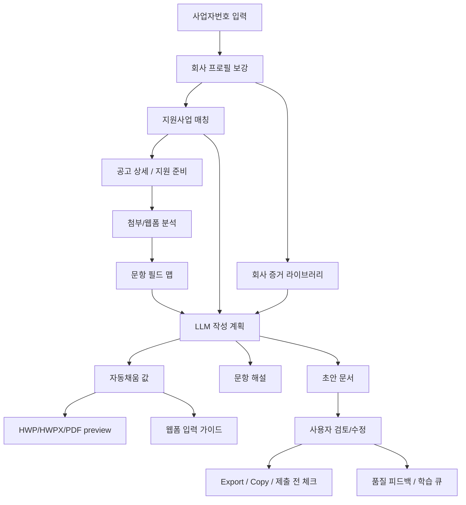

# 공공 지원사업 가이드 핵심 비즈니스 모델 설계

작성일: 2026-07-01

## 1. 결론

현재 `cunote`는 이 방향으로 전환하기에 기술적 기반이 이미 꽤 좋다. 단순 매칭 서비스에서 시작했지만, 코드베이스 안에는 이미 다음 핵심 자산이 있다.

- 사업자번호 기반 회사 프로필 보강: `Popbill -> CompanyProfile -> company_profiles`
- 공고 수집/정규화: K-Startup, 기업마당, 첨부 아카이브, HWP/HWPX markdown 변환
- 자격요건 정규화/매칭: `grant_criteria`, `match_state`, `rule_trace`
- 제출서류 taxonomy: `required_documents`, `GrantDocumentCategory`, `GrantDocumentPreparationType`
- 지원서류 준비 UX: `ApplicationPrep`, `DocumentDraftWorkspace`
- 문항/필드 추출과 초안 저장: `grant_document_fields`, `grant_document_drafts`, `grant_document_draft_events`
- export/품질 피드백/운영 지표: markdown, HTML, DOCX/PDF endpoint, `quality_feedback`

따라서 완전히 새 제품을 만드는 것이 아니라, 기존 제품의 중심을 `지원사업 발견`에서 `지원 준비/작성 대행 보조`로 옮기는 작업이다.

다만 핵심 지능층은 아직 부족하다. 현재 초안 생성은 `packages/core/src/documents/draft-generation.ts`의 deterministic template 중심이고, 필드 추출은 `packages/core/src/documents/field-extraction.ts`의 rule 기반이다. 실제 목표인 "문서를 해석하고, 사용자 사업을 이해해서, 항목별로 작성 가이드와 자동채움 값을 만드는 제품"이 되려면 LLM 기반 document intelligence layer를 추가해야 한다.

## 2. 제품 정의

최종 제품의 한 문장은 다음이다.

> 사업자등록번호 하나로 신청 가능한 공공 지원사업을 찾고, 각 공고의 지원서류와 웹 신청 양식을 해석해서, 사용자가 제출 전 검토 가능한 수준의 작성 초안/입력값/준비서류 체크리스트를 만들어 주는 지원사업 작성 가이드.

핵심 가치는 세 단계다.

1. 발견: 내가 신청 가능한 사업을 추천한다.
2. 판단: 왜 가능한지, 왜 애매한지, 무엇이 부족한지 설명한다.
3. 작성: HWP/HWPX/DOCX/PDF/웹폼 등 제출 형식에 맞춰 채울 내용과 근거를 준비한다.

우리는 자동 제출 서비스가 아니다. 특히 공공 포털의 서명, 동의, 서약, 제출 버튼은 사용자가 직접 확인해야 한다. 제품은 `초안`, `자동채움 제안`, `입력 가이드`, `준비 체크리스트`를 제공한다.

## 3. 현재 코드베이스 재사용 지도

### 3.1 사업자번호 입력과 회사 이해

현재 재사용 지점:

- `apps/web/src/lib/server/serviceData.ts`
- `packages/core/src/popbill/check-biz-info.ts`
- `packages/core/src/company/profile-from-popbill.ts`
- `company_enrichment_cache`
- `company_profiles`

현재 흐름은 사업자번호로 Popbill 사업자정보를 조회하고, 비용 관리를 위해 캐시를 재사용하며, 회사 프로필을 매칭 입력으로 만든다. 이 구조는 그대로 유지한다.

확장해야 할 회사 정보:

- 대표자 생년/성별/청년 여부
- 세부 소재지: 본사, 지사, 공장, 연구소
- 매출, 고용, 수출, 투자, 인증, 특허, 수상, 납품 실적
- 제품/서비스 설명, 고객군, 시장, 경쟁력, 지원사업 신청 목적
- 이전 지원사업 선정/수혜/중복수혜 여부
- 제출 가능한 증빙 파일 목록

설계상 `company_profiles`의 dimension/value/source/confidence 구조를 계속 쓰되, 지원서 작성에 필요한 비정형 사업 설명은 별도 evidence table을 두는 편이 좋다.

추가 DB 제안:

```sql
company_evidence_items
  id uuid primary key
  company_id uuid references companies(id)
  kind text -- product, customer, revenue, export, ip, certification, award, team, proof_file
  title text
  body text
  value jsonb
  source text -- self_declared, popbill, upload, admin, external_api
  confidence real
  evidence_file_id uuid null
  created_by uuid references users(id)
  created_at timestamptz
  updated_at timestamptz
```

이 테이블은 LLM 초안 생성의 핵심 컨텍스트가 된다. 사용자가 한 번 입력한 제품 설명/실적/강점을 여러 지원서에 재사용하는 것이 flywheel이다.

### 3.2 지원사업 데이터와 추천

현재 재사용 지점:

- `packages/core/src/kstartup/*`
- `packages/core/src/bizinfo/*`
- `apps/web/src/lib/server/ingestion/*`
- `grant_raw`
- `grants`
- `grant_criteria`
- `match_state`
- `rule_trace`

공식 소스 기준:

- K-Startup 공공데이터포털 API는 REST, JSON/XML 포맷, 창업지원 공고/사업 정보 중심이다.
- 기업마당 지원사업 API는 GET, JSON/XML, 공고 URL, 첨부파일 경로/파일명, 신청기간, 지원대상 등을 제공한다.
- 중소벤처24는 공고정보와 증명/확인서 API를 제공하지만 인증키 승인 대상과 담당자 확인이 있다.

제품 전략:

- MVP 추천 데이터는 기존처럼 K-Startup + 기업마당으로 충분하다.
- 정책자금, R&D, 고용, 수출, 지자체 자체 공고는 source adapter를 추가한다.
- 추천의 차별화는 데이터 수집량보다 `지원 가능성 설명 + 준비 가능성 + 자동작성 가능성`이다.

랭킹에는 기존 match score 외에 작성 가능성 점수를 추가한다.

```ts
interface ApplicationReadinessScore {
  eligibility: "eligible" | "conditional" | "ineligible";
  matchScore: number;
  documentReadinessScore: number; // 제출서류 추출/초안 가능/필수 증빙 보유율
  deadlinePressure: number;
  expectedValue: number;
  confidence: number;
}
```

### 3.3 제출서류 준비와 초안 UI

현재 재사용 지점:

- `packages/contracts/src/dto.ts`
- `packages/core/src/documents/preparation.ts`
- `packages/core/src/documents/field-extraction.ts`
- `packages/core/src/documents/draft-generation.ts`
- `apps/web/src/lib/server/documents/grantPreparation.ts`
- `apps/web/src/lib/server/documents/grantDocumentFields.ts`
- `apps/web/src/lib/server/documents/grantDocumentDrafts.ts`
- `apps/web/src/features/apply-sheet/DocumentDraftWorkspace.tsx`
- `grant_document_fields`
- `grant_document_drafts`
- `grant_document_draft_events`

이 부분은 그대로 제품의 중심 화면으로 승격한다. 현재 `DocumentDraftWorkspace`는 이미 문서 선택, 초안 생성, 추가 입력, 자동채움 리뷰, 저장, 검토 완료, markdown/HTML export, 품질 피드백까지 갖고 있다.

다음으로 해야 할 일은 UI를 새로 만드는 것이 아니라 `생성 엔진`을 교체하는 것이다.

현재:

```txt
company profile + 공고 summary + 템플릿 문장 -> deterministic markdown draft
```

목표:

```txt
공고 원문 + 첨부 양식 구조 + rule_trace + company profile + company evidence
-> LLM document plan
-> field-level autofill
-> section-level draft
-> evidence-linked explanation
-> user review/export
```

## 4. 핵심 아키텍처



새로 추가할 핵심 모듈:

```txt
packages/core/src/document-intelligence/
  context.ts
  schema.ts
  field-map.ts
  llm-extract.ts
  llm-draft.ts
  llm-explain.ts
  evidence-policy.ts
  validators.ts

apps/web/src/lib/server/document-intelligence/
  provider.ts
  modelRouter.ts
  documentJobQueue.ts
  documentArtifacts.ts
```

## 5. 문서 처리 방식

### 5.1 공통 개념: 원본 문서, 미리보기, 필드 맵을 분리한다

HWP든 웹폼이든 내부 표준은 동일해야 한다.

```ts
interface GrantApplicationSurface {
  id: string;
  grantId: string;
  type: "file_template" | "web_form" | "freeform_instruction";
  sourceUrl: string | null;
  sourceAttachment: string | null;
  title: string;
  format: "hwp" | "hwpx" | "docx" | "pdf" | "html" | "web" | "markdown" | "unknown";
  extractionStatus: "pending" | "preview_ready" | "fields_ready" | "failed";
  confidence: number;
}

interface GrantApplicationField {
  id: string;
  surfaceId: string;
  fieldKey: string;
  label: string;
  section: string | null;
  fieldType: DocumentFieldType;
  fillStrategy: DocumentFillStrategy;
  required: boolean;
  sourceSpan: string | null;
  position: DocumentFieldPosition | null;
  mappedCompanyField: string | null;
  llmInstruction: string | null;
  confidence: number;
}

interface DocumentFieldPosition {
  page?: number;
  blockId?: string;
  tablePath?: string;
  bbox?: { x: number; y: number; width: number; height: number };
  xpath?: string;
  cssSelector?: string;
}
```

기존 `grant_document_fields`는 유지하되, `surfaceId`, `position`, `llmInstruction`, `explanation`, `riskLevel`을 추가하는 migration을 고려한다. 위치 정보가 있어야 preview에서 하이라이트할 수 있고, 웹폼에서는 selector 기반 입력 가이드를 만들 수 있다.

### 5.2 HWP 파일

현 상태:

- `packages/core/src/bizinfo/hwp-markdown.ts`가 HWP/HWPX 첨부를 markdown으로 변환한다.
- 구형 HWP는 `pyhwp/hwp5html`을 통해 XHTML/텍스트 추출한다.
- HWPX는 압축된 XML을 풀어 텍스트를 추출한다.

현실 판단:

- HWP 원본 직접 편집은 MVP 범위로 두면 위험하다. 구형 HWP는 바이너리/OLE 계열이고, 위치/표/셀/서식 보존이 어렵다.
- HWPX는 한컴 공식 설명상 OWPML 기반 XML 포맷이고 국가표준 KS X 6101로 등록된 개방형 포맷이다. 따라서 장기적으로는 HWPX의 XML block/table 위치를 보존하면서 filled HWPX를 생성할 수 있다.
- HWP는 당장은 `preview + 위치 하이라이트 + 입력값 표 + copy guide`가 정답이다.

권장 단계:

1. HWP/HWPX/PDF를 모두 `preview artifact`로 변환한다.
   - markdown: LLM/검색용
   - image/PDF preview: 사용자 확인용
   - layout JSON: page/block/table/cell 위치용
2. 문항을 추출해 `GrantApplicationField`로 저장한다.
3. preview 위에 색상 overlay를 그린다.
   - 파란색: 자동채움 가능
   - 노란색: 사용자 입력 필요
   - 회색: 직접 서명/첨부/직인
   - 빨간색: 사실 확인 필요
4. 원본 편집이 어려우면 우측 패널에 `복사할 값`, `작성 가이드`, `근거`, `주의사항`을 보여준다.
5. HWPX인 경우만 spike로 `filled.hwpx` 생성을 시도한다.

MVP UI:

```txt
좌측: 문서 preview
  - 입력칸 색상 overlay
  - 클릭 시 해당 필드 선택

우측: 선택 필드 패널
  - 문항 원문
  - 이 항목이 묻는 뜻
  - 자동 작성 값
  - 사용한 회사 근거
  - 복사 버튼
  - 수정/저장
```

### 5.3 DOCX/PDF

현재 `draftDocxExport`, `draftPdfExport`, `draftHtmlExport`가 있으므로 export 기반은 있다.

추가 방향:

- DOCX template은 문서 XML을 직접 파싱해 placeholder/table cell을 찾아 치환 가능성이 높다.
- PDF는 원본 편집보다 preview overlay와 입력 가이드가 현실적이다.
- PDF form field가 실제 AcroForm이면 field name 기반 autofill 가능성을 별도 spike로 둔다.

### 5.4 웹폼 링크

웹폼 대응은 원본 파일과 다른 제품 설계가 필요하다.

금지/제한:

- 사용자의 공공기관 계정 정보를 저장하지 않는다.
- 사용자의 명시 확인 없이 제출 버튼을 누르지 않는다.
- CAPTCHA, 공동인증서, 간편인증, 첨부 업로드, 서명/동의는 사용자 직접 단계로 둔다.

MVP 방식:

1. 공고의 신청 링크를 `application_surface(type=web_form)`로 저장한다.
2. 운영자가/자동 브라우저가 링크를 열어 form 구조를 분석한다.
3. label, input name, placeholder, aria-label, 주변 텍스트로 field map을 만든다.
4. 사용자에게 "웹폼 입력 가이드"를 제공한다.
   - 각 항목의 복사 버튼
   - 포털 화면에서 어디에 넣는지 스크린샷/순서 안내
   - 첨부할 파일 체크리스트
5. 이후 단계에서 browser assistant를 붙인다.
   - 사용자가 브라우저에서 로그인
   - 우리 서비스가 로컬/세션 한정으로 필드 값을 제안
   - 사용자가 각 입력을 승인
   - 제출은 사용자 직접

웹폼 내부 표준:

```ts
interface WebFormFieldMap {
  url: string;
  pageTitle: string;
  steps: Array<{
    stepIndex: number;
    title: string;
    fields: Array<{
      label: string;
      selector: string | null;
      inputType: string;
      required: boolean;
      mappedApplicationFieldId: string | null;
      fillValue: string | null;
      userAction: "paste" | "select" | "upload" | "manual" | "confirm";
      caution: string | null;
    }>;
  }>;
}
```

웹폼은 포털별 adapter 전략이 필요하다.

- `kstartup`
- `bizinfo`
- `smes24`
- `iris`
- `exportvoucher`
- `local-gov-generic`
- `unknown-generic`

처음에는 adapter 2개만 만든다. `K-Startup`, `기업마당/중소벤처24 계열`부터 한다.

## 6. LLM 계층 설계

### 6.1 LLM이 맡을 일

LLM은 네 가지 일을 맡는다.

1. 문항 해석: "이 항목이 실제로 묻는 것"을 쉬운 말로 설명한다.
2. 필드 추출 보강: rule parser가 놓친 표/빈칸/문항을 구조화한다.
3. 적격성 설명: `rule_trace`와 공고 원문을 연결해 "이 사업자가 포함되는지/확인 필요한지" 설명한다.
4. 초안 작성: 회사 evidence를 근거로 항목별 작성 초안을 만든다.

LLM이 하면 안 되는 일:

- 없는 매출, 인증, 납품, 투자, 수상, 특허를 만들어내기
- 증빙 발급 사실을 단정하기
- 동의/서약/서명/날인 문구를 사용자 확인 없이 완료 처리하기
- 공고 원문에 없는 우대/배제 조건을 추정하기
- 제출 성공 가능성을 확정적으로 말하기

### 6.2 모델 추상화

특정 모델명을 코드 곳곳에 박지 않는다. 최고 성능 모델은 바뀌므로 provider/router를 둔다.

```ts
interface DocumentIntelligenceProvider {
  extractFields(input: FieldExtractionInput): Promise<FieldExtractionResult>;
  explainField(input: FieldExplanationInput): Promise<FieldExplanationResult>;
  draftField(input: FieldDraftInput): Promise<FieldDraftResult>;
  draftSection(input: SectionDraftInput): Promise<SectionDraftResult>;
}

interface ModelRoutingPolicy {
  task:
    | "cheap_classification"
    | "field_extraction"
    | "eligibility_reasoning"
    | "high_stakes_drafting"
    | "revision";
  qualityTier: "fast" | "balanced" | "best";
  maxCostKrw?: number;
}
```

초기 운영 정책:

- field extraction: structured output 지원 모델, temperature 0
- eligibility reasoning: source_span 필수, low temperature
- business plan drafting: 최고 품질 모델, evidence-grounded prompt, 긴 context
- revision: 기존 draft + user edit preservation

OpenAI API를 쓸 경우 Structured Outputs를 우선 사용한다. 공식 문서상 JSON Schema를 통해 응답 구조를 강제할 수 있고, schema adherence가 JSON mode보다 강하다. 이 제품에서는 `FieldExtractionResult`, `EligibilityExplanation`, `DraftFieldResult` 같은 구조화 결과가 핵심이므로 이 방식이 맞다.

### 6.3 출력 스키마

```ts
interface FieldDraftResult {
  fieldId: string;
  value: string | null;
  guide: string;
  explanation: string;
  evidenceRefs: Array<{
    type: "company_profile" | "company_evidence" | "grant_source" | "user_answer";
    key: string;
    quote?: string;
  }>;
  missingInputs: MissingFieldQuestion[];
  assumptions: string[];
  warnings: string[];
  confidence: number;
  reviewRequired: boolean;
}
```

`value`와 `guide`를 분리한다.

- value: 실제 칸에 넣을 문장/값
- guide: 왜 이렇게 써야 하는지, 사용자가 무엇을 확인해야 하는지

이 분리가 중요하다. 문서 직접 편집이 어려울 때도 guide만으로 제품 가치가 살아난다.

### 6.4 근거 정책

모든 LLM 산출물에는 evidenceRefs가 있어야 한다.

- 숫자/날짜/인증/실적은 반드시 company evidence나 사용자 입력이 있어야 한다.
- 공고 요구사항 해석은 source_span 또는 attachment chunk가 있어야 한다.
- 근거가 없으면 `missingInputs`로 돌린다.
- confidence가 낮으면 draft에는 포함하되 "검토 필요" 상태로 표시한다.

## 7. DB 변경 제안

기존 테이블을 최대한 살린다.

추가 테이블:

```sql
grant_application_surfaces
  id uuid primary key
  grant_id uuid references grants(id)
  source text
  source_id text
  type text
  title text
  format text
  source_url text
  source_attachment text
  preview_artifact_id uuid null
  extraction_status text
  extraction_version text
  confidence real
  created_at timestamptz
  updated_at timestamptz

document_artifacts
  id uuid primary key
  surface_id uuid references grant_application_surfaces(id)
  kind text -- original, markdown, html, pdf_preview, page_image, layout_json, filled_hwpx, filled_docx
  storage_key text
  url text
  content_type text
  sha256 text
  metadata jsonb
  created_at timestamptz

company_evidence_items
  id uuid primary key
  company_id uuid references companies(id)
  kind text
  title text
  body text
  value jsonb
  source text
  confidence real
  evidence_file_id uuid null
  created_by uuid references users(id)
  created_at timestamptz
  updated_at timestamptz

grant_document_field_explanations
  id uuid primary key
  field_id uuid references grant_document_fields(id)
  plain_explanation text
  eligibility_note text
  preparation_note text
  evidence_refs jsonb
  model_ver text
  prompt_ver text
  confidence real
  created_at timestamptz

web_form_field_maps
  id uuid primary key
  surface_id uuid references grant_application_surfaces(id)
  url text
  steps jsonb
  adapter text
  captured_at timestamptz
  capture_version text
```

기존 `grant_document_drafts` 확장:

```sql
alter table grant_document_drafts
  add column surface_id uuid null,
  add column draft_plan jsonb,
  add column evidence_refs jsonb,
  add column llm_cost jsonb,
  add column review_state text default 'user_review_required';
```

## 8. API 설계

기존 API를 확장한다.

```txt
GET  /api/web/grants/:grantId/preparation
POST /api/web/grants/:grantId/application-surfaces/extract
GET  /api/web/application-surfaces/:surfaceId/preview
GET  /api/web/application-surfaces/:surfaceId/fields
POST /api/web/application-surfaces/:surfaceId/fields/explain
POST /api/web/application-surfaces/:surfaceId/drafts
PATCH /api/web/document-drafts/:draftId
POST /api/web/document-drafts/:draftId/regenerate
POST /api/web/document-drafts/:draftId/export
POST /api/web/document-drafts/:draftId/feedback
GET  /api/web/web-form-maps/:surfaceId
```

Batch/운영 CLI:

```bash
pnpm extract:application-surfaces -- --status=open --limit=100
pnpm extract:application-fields -- --status=open --limit=100 --write
pnpm explain:application-fields -- --grant-id=<id> --write
pnpm verify:application-surfaces
pnpm verify:application-field-explanations
pnpm verify:document-intelligence
```

## 9. 사용자 플로우

### 9.1 첫 방문

1. 사용자가 사업자번호 입력
2. 회사 프로필 자동 보강
3. 추천 가능한 지원사업을 보여줌
4. 각 카드에 `지원 가능성`, `준비 난이도`, `AI 작성 가능 서류 수`, `입력 필요 항목 수`를 함께 표시

### 9.2 공고 상세

1. 공고 요약과 적격성 설명
2. 준비해야 할 서류 그룹화
3. HWP/웹폼/발급/첨부를 구분
4. 작성형 문서 선택
5. 원본 preview와 자동채움 패널 표시
6. 사용자가 누락 정보를 입력
7. LLM이 필드별 값과 해설 생성
8. 사용자가 수정/검토 완료
9. Markdown/HTML/DOCX/PDF 또는 웹폼 입력 가이드 export

### 9.3 HWP preview UX

```txt
┌──────────────────────────────┬─────────────────────────┐
│ 원본 양식 preview             │ 선택한 항목              │
│                              │ 항목명: 사업 개요        │
│ [파란 박스] 기업명            │ 뜻: 무엇을 쓰라는 건지   │
│ [노란 박스] 추진계획          │ 자동 작성값              │
│ [회색 박스] 서명/날인         │ 근거                     │
│                              │ 부족한 정보              │
└──────────────────────────────┴─────────────────────────┘
```

### 9.4 웹폼 UX

```txt
1단계. 포털 로그인은 사용자가 직접
2단계. 창업노트가 입력할 값을 항목별로 보여줌
3단계. 사용자가 복사/붙여넣기 또는 로컬 브라우저 보조 입력
4단계. 첨부파일 체크리스트 확인
5단계. 최종 제출은 사용자 직접
```

## 10. 구현 로드맵

### Phase 0. 현재 기능의 상태 확정

목표: 이미 있는 지원서류 준비 기능을 제품 중심으로 인정하고 회귀 방지.

- `DocumentDraftWorkspace`를 공고 상세의 핵심 영역으로 올린다.
- `grant-document-draft-autofill-implementation-plan.md`를 최신 상태와 맞춘다.
- 현재 deterministic draft의 한계를 UI copy에 명확히 표시한다.
- verify script를 CI 필수 게이트로 묶는다.

### Phase 1. Application Surface 모델

목표: HWP/웹폼/PDF/DOCX를 같은 내부 모델로 다룬다.

- `grant_application_surfaces`, `document_artifacts` 추가
- 기존 attachment archive를 surface로 투영
- HWP/HWPX markdown 외에 preview artifact 생성 경로 추가
- `grant_document_fields.surface_id`, `position` 추가

완료 기준:

- 기업마당 HWP 첨부 10개에서 preview + fields가 보인다.
- 필드 클릭 시 원문 근거/문항 위치를 확인할 수 있다.

### Phase 2. LLM 필드 추출/해설

목표: rule parser 결과를 LLM이 보강하고 사용자가 이해할 수 있는 설명을 만든다.

- `DocumentIntelligenceProvider` 추가
- structured output schema 추가
- field extraction result validator 추가
- `grant_document_field_explanations` 저장
- low confidence review queue 연결

완료 기준:

- 사업계획서/신청서/예산표/동의서 유형을 구분한다.
- 동의/서명/직인은 자동채움이 아니라 manual로 분류한다.
- 각 필드에 "무엇을 쓰라는지" 설명이 붙는다.

### Phase 3. Evidence-grounded Draft

목표: 회사 증거 기반으로 실제 문항별 값을 만든다.

- `company_evidence_items` UI/API 추가
- 초안 생성 input에 evidenceRefs 추가
- 숫자/인증/실적 hallucination validator 추가
- `draft_plan` 저장
- field-level regenerate 추가

완료 기준:

- 회사 설명/제품/실적/지원목표를 입력하면 여러 공고 초안에 재사용된다.
- 근거 없는 실적은 생성하지 않고 missing field로 남긴다.
- 사용자가 수정한 문장은 재생성 시 보존된다.

### Phase 4. HWP/HWPX 고도화

목표: 원본 양식 preview에서 실제 입력 위치를 하이라이트한다.

- HWP -> XHTML/PDF/image/layout extraction spike
- HWPX XML parser spike
- overlay renderer 추가
- filled HWPX 생성 가능성 검증

완료 기준:

- HWP/HWPX 20개 샘플 중 70% 이상에서 입력칸 위치 하이라이트 가능
- HWPX 샘플 중 일부는 filled HWPX export 가능
- 실패 케이스는 copy guide로 fallback

### Phase 5. 웹폼 가이드

목표: 원본 링크 신청에도 대응한다.

- `web_form_field_maps` 추가
- K-Startup/기업마당/중소벤처24 form adapter spike
- 사용자 세션 기반 copy/paste guide
- 자동 제출 금지 guardrail

완료 기준:

- 로그인 전 공개 폼 구조를 캡처할 수 있다.
- 로그인 이후 사용자가 직접 포털을 보며 입력값을 복사할 수 있다.
- 제출/서명/동의는 사용자 확인 단계로 남는다.

### Phase 6. 품질 운영

목표: 비즈니스 모델로 운영 가능한 정확도/신뢰도 체계를 만든다.

- 골든셋: 공고 100개, 문서 300개, 필드 3000개
- 지표: field extraction precision/recall, draft acceptance, manual correction rate, missing field rate
- admin review queue
- prompt/model version comparison
- 비용/latency dashboard

## 11. 성공 지표

제품 지표:

- 사업자번호 입력 후 추천 결과 도달률
- 추천 공고 상세 진입률
- 지원 준비 탭 진입률
- 문서 초안 생성률
- 초안 저장/검토 완료/export 비율
- 사용자가 직접 수정한 필드 수
- 품질 피드백률
- 신청 링크 클릭률

품질 지표:

- 필드 추출 precision/recall
- 자동채움 가능 필드 비율
- hallucination report rate
- manual correction rate
- missing field question 해결률
- 문서 category별 draft acceptance

비즈니스 지표:

- 첫 사업자번호 입력 -> 회원가입 전환
- 가입 -> 첫 초안 생성 전환
- 초안 생성 -> 유료 플랜 전환
- 공고별 지원 준비 완료 수
- 회사 evidence 재사용 횟수

## 12. 리스크와 대응

### HWP 직접 편집 리스크

위험: 원본 HWP의 표/서식/좌표/호환성을 안정적으로 보존하기 어렵다.

대응:

- MVP는 preview + copy guide + markdown/HTML/DOCX export
- HWPX만 filled export spike
- 구형 HWP는 원본 직접 편집을 약속하지 않는다.

### 웹폼 자동화 리스크

위험: 공공기관 포털 로그인, 인증, 약관, CAPTCHA, 서명, 제출 자동화는 법적/운영 리스크가 높다.

대응:

- 자동 제출 금지
- credential 저장 금지
- 사용자 승인 기반 입력 보조
- copy guide 우선
- 포털별 adapter는 제출 직전 단계까지만

### LLM hallucination 리스크

위험: 없는 실적/수치/인증을 만들어내면 서비스 신뢰가 무너진다.

대응:

- evidenceRefs 없는 숫자/실적 생성 금지
- structured output validator
- missing field 우선
- 사용자 검토 상태 필수
- quality_feedback 운영 콘솔

### 데이터 커버리지 리스크

위험: K-Startup/기업마당 외 정책자금/R&D/고용/수출 채널이 빠질 수 있다.

대응:

- source adapter 구조 유지
- 중소벤처24 공고정보 API 검토
- IRIS/고용24/수출바우처/소진공/중진공 순차 추가
- MVP는 "보조금형 지원사업 작성 가이드"로 명확히 포지셔닝

## 13. 바로 실행할 PoC

가장 빠른 검증은 "기업마당 HWP 지원서 10개"로 한다.

대상:

- 기업마당 공고 중 첨부 HWP/HWPX가 있고 작성형 문서가 있는 공고 10개
- 사업자번호는 기존 QA에 쓰던 실제/샘플 회사 1개

검증 항목:

1. 첨부 다운로드/아카이브 성공
2. markdown 변환 성공
3. 작성형 서류 분류 성공
4. 문항/필드 추출 성공
5. LLM 해설 생성 성공
6. 회사 프로필/사업 설명 기반 자동채움 성공
7. preview 또는 fallback guide 제공 성공
8. 사용자가 export 가능한 산출물 생성

성공 기준:

- 10개 중 7개 이상에서 사용자가 "이걸 보고 실제 양식에 옮길 수 있다"고 판단할 수준
- 10개 중 0개에서 근거 없는 수치/인증/실적 생성
- 10개 중 5개 이상에서 필드 위치 또는 표 셀 단위 하이라이트 가능

## 14. 현재 코드에서 첫 구현 지점

우선순위 파일:

1. `packages/contracts/src/dto.ts`
   - `GrantApplicationSurface`, `DocumentFieldPosition`, `FieldDraftResult` 추가
2. `apps/web/src/lib/server/db/schema.ts`
   - surfaces/artifacts/evidence/explanations 테이블 추가
3. `packages/core/src/documents/field-extraction.ts`
   - rule 결과에 LLM 보강을 병합할 수 있게 parser result를 분리
4. `packages/core/src/documents/draft-generation.ts`
   - deterministic generator를 fallback으로 내리고 LLM provider 경로 추가
5. `apps/web/src/lib/server/documents/grantDocumentDrafts.ts`
   - `generateDocumentDraftContent` 호출을 `DocumentIntelligenceProvider.draft*`로 교체
6. `apps/web/src/features/apply-sheet/DocumentDraftWorkspace.tsx`
   - textarea 중심에서 preview + field inspector 구조로 확장
7. `apps/web/src/lib/server/ingestion/grantAttachmentArchive.ts`
   - markdown 외 preview/layout artifact 생성 추가

## 15. 외부 근거

- K-Startup 공공데이터포털 API: REST, JSON/XML, 창업지원 공고/사업 정보를 제공한다. <https://www.data.go.kr/data/15125364/openapi.do>
- 기업마당 지원사업정보 API: GET, JSON/XML, 공고 URL, 첨부파일 경로/파일명, 신청기간, 지원대상 등을 제공한다. <https://www.bizinfo.go.kr/apiDetail.do?id=bizinfoApi>
- 한컴 HWP/OWPML 안내: HWP 5.x와 HWPML/OWPML 관련 형식 문서가 공개되어 있고, HWPX는 OWPML 계열로 다룰 수 있다. <https://www.hancom.com/support/downloadCenter/hwpOwpml>
- 한컴 HWPX FAQ: HWPX는 OWPML 기반이며 국가표준 KS X 6101로 등록된 개방형 문서 포맷이다. <https://www.hancom.com/support/faqCenter/faq/detail/2784>
- pyhwp 문서: HWP v5 processor와 hwp5html/hwp5txt 변환기가 있어 현재 코드의 변환 접근과 맞다. <https://pyhwp.readthedocs.io/en/latest/>
- OpenAI Structured Outputs: JSON Schema 기반 응답 구조 강제가 가능하므로 문항 추출/해설/초안 결과를 typed contract로 받는 데 적합하다. <https://developers.openai.com/api/docs/guides/structured-outputs>
- 중소벤처24 Open API: 공고정보와 증명/확인서 정보 API가 있으나 인증키 승인 과정이 있으므로 파트너십/운영 신청 과제로 본다. <https://www.smes.go.kr/main/dbCnrs>
